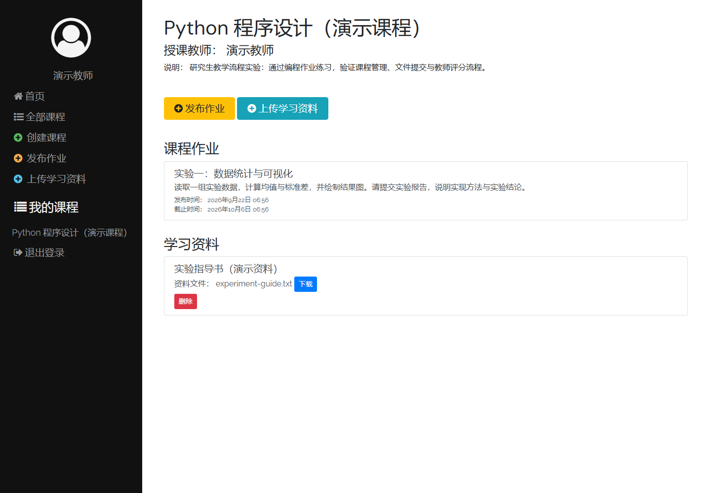
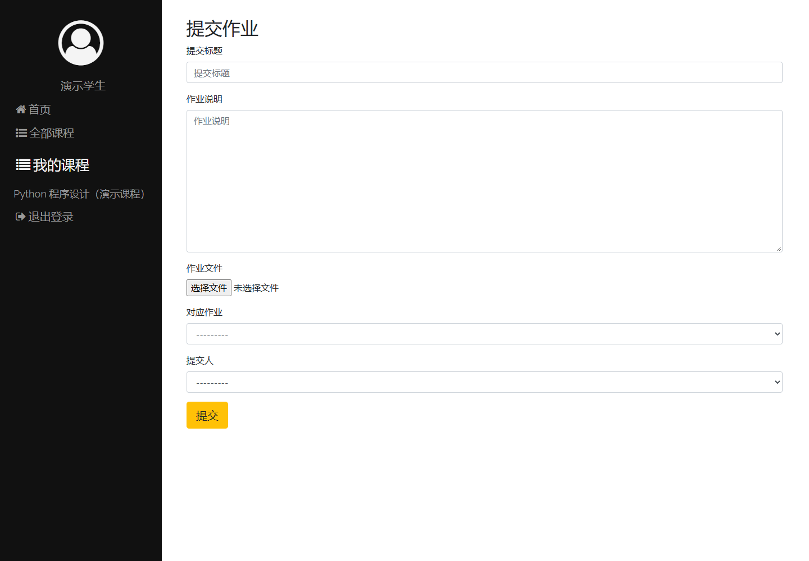
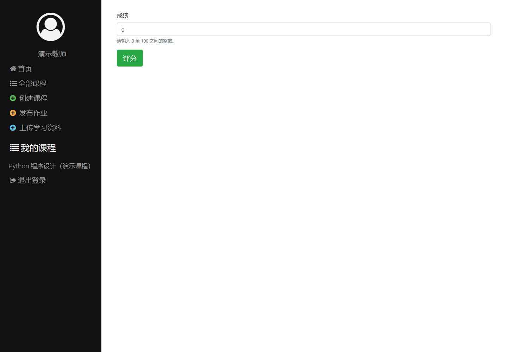

# Django LMS 实验

基于 [adityagoyal222/django-lms](https://github.com/adityagoyal222/django-lms) 进行本地部署、学习与二次开发的研究生实验项目。以课程、作业和学习资料管理为起点，逐步探索作业分析与自动批改。

## 1. 为什么选择这个项目

项目规模较小，课程、作业、用户和资源模块划分清晰，适合学习 Django 的模型、视图、模板及文件上传机制。已有教师与学生两种角色，可以围绕“教师发布作业 → 学生提交文件 → 教师评分”开展完整流程实验。

本仓库记录环境搭建、功能验证与后续修改，不将原作者的实现作为从零开发的成果。

## 2. 页面展示与使用流程

以下为当前项目真实 Django 视图和模板生成的页面截图，使用虚构的“演示教师”“演示学生”和演示课程。截图时使用独立的 SQLite 内存数据库，通过 Django 测试客户端执行操作，再由浏览器渲染页面；未修改本机 MySQL 业务数据。截图用于展示现有界面，不代表 MySQL 环境下的完整浏览器验收。

### 首页：进入学习平台

首页提供平台介绍和“查看全部课程”入口，用户可从课程页面继续注册或登录。


### 教师端：管理课程、作业与学习资料

教师创建课程后，可以查看课程说明、发布作业和上传资料。课程详情集中展示作业要求、截止时间及可下载的学习资料。



### 学生端：提交作业

学生加入课程，打开具体作业后进入提交页面，填写提交标题、说明并选择附件。页面同时提供对应作业和提交人的选择项。



### 教师端：手动评分

教师查看学生提交内容后进入评分页面，输入 0～100 的整数成绩并保存。当前为人工评分，自动批改属于后续探索方向。



### 学生端：查看评分结果

评分后，学生可在提交详情中查看提交说明、附件名称、评分状态和成绩。下图中的 92 分是演示流程录入的示例成绩。


## 3. 当前功能

| 模块 | 当前代码中的功能 |
| --- | --- |
| 用户 | 注册、登录、退出登录、个人信息展示；区分教师和学生 |
| 课程 | 创建课程、查看课程列表与详情、学生加入或退出课程 |
| 作业 | 发布、修改、删除作业；设置作业要求与截止时间 |
| 提交与评分 | 上传作业附件、查看提交详情、删除提交、教师手动评分 |
| 学习资料 | 上传、下载和删除课程资料 |
| 界面 | 已有中文导航、页面提示与表单标签 |

功能清单依据当前代码整理。虽然上游 README 提到课程删除，但本地课程路由中尚未发现该入口，因此暂不列为当前功能；个人信息展示也不等同于资料编辑。

## 4. 技术栈与目录

- Python 3.8.20、Django 3.1.3（本机 `classroom` 环境已核对）
- MySQL（当前默认数据库后端；本机服务版本本次未核验）
- HTML、CSS、Bootstrap 4、Django 模板
- Graphene-Django 2.13.0（依赖声明版本，项目已配置 GraphQL 路由）
- Windows、Conda、Git；可使用 VS Code 编辑

```text
 django-lms/
 ├── assignments/        # 作业发布、提交与评分
 ├── courses/            # 课程与选课管理
 ├── django_lms/         # Django 配置与总路由
 ├── docs/images/        # README 页面截图
 ├── resources/          # 学习资料管理
 ├── static/             # 样式与静态资源
 ├── templates/          # 公共页面模板
 ├── users/              # 用户与身份管理
 ├── manage.py           # Django 管理入口
 └── requirements.txt    # Python 依赖
```

## 5. 本地运行

以下命令在 Windows PowerShell 中执行。

### 激活环境并安装依赖

```powershell
conda activate classroom
Set-Location D:\Research\research-experiments\2026\09\django-lms
python -m pip install -r requirements.txt
```

如尚未创建环境，可先执行 `conda create -n classroom python=3.8`，再激活环境。

### 准备 MySQL 数据库

确保 MySQL 服务已启动，并创建数据库，例如在 MySQL 客户端中执行：

```sql
CREATE DATABASE IF NOT EXISTS django_lms CHARACTER SET utf8mb4;
```

当前 `django_lms/settings.py` 使用 `localhost:3306`、数据库 `django_lms`、用户 `root`。如本机配置不同，请调整对应配置项。

数据库密码从 `MYSQL_PASSWORD` 环境变量读取。在启动 Django 的同一个 PowerShell 窗口中设置；以下方式避免将密码明文写进命令历史：

```powershell
$dbCredential = Get-Credential -UserName root -Message '请输入本机 MySQL 密码'
$env:MYSQL_PASSWORD = $dbCredential.GetNetworkCredential().Password
Remove-Variable dbCredential
```

当前配置不会自动加载 `.env` 文件，也不要把真实密码写进 README 或提交到仓库。

### 检查、迁移并启动

```powershell
python manage.py check
python manage.py migrate
python manage.py runserver
```

打开 [本地首页](http://127.0.0.1:8000/)。如需要 Django 管理后台账号，可执行 `python manage.py createsuperuser`；教师与学生业务账号可在注册页面创建并选择身份。

页面依赖外部 Bootstrap、图标和字体资源，首页插图也来自外部地址；网络不可用时可能影响展示。

### 手动体验业务流程

1. 注册教师账号，创建课程并发布作业，设置未来的截止时间。
2. 退出后注册学生账号，进入全部课程并加入课程。
3. 打开作业详情，进入提交页面，填写说明并上传附件。
4. 切换回教师账号，打开作业与学生提交详情，录入成绩。
5. 切换回学生账号，在提交详情中查看评分结果。

## 6. 当前实验进度

- [x] 将开源项目整理至 `research-experiments/2026/09/django-lms`。
- [x] 配置 Python / Conda 环境；当前代码使用环境变量读取数据库密码。
- [x] 主要页面已有中文界面。
- [x] 本次执行 `python manage.py check`，结果为 0 个问题。
- [x] 在独立 SQLite 演示环境完成迁移，并通过测试客户端验证创建课程、发布作业、选课、文件提交、评分和成绩展示。
- [x] 整理页面截图、使用说明和项目来源。
- [ ] 在本机 MySQL 环境中完成完整浏览器流程复验。
- [ ] 验证删除操作、截止时间边界及不同角色的权限限制。
- [ ] 根据实验需求完善功能与交互。
- [ ] 探索自动批改与作业分析。

本次验证范围为正常教学流程，不代表全部功能和异常路径均已通过测试。

## 7. 后续计划

优先保证教师创建课程、发布作业、学生选课与提交、教师查看和评分的流程稳定，再补充角色权限、文件上传及异常场景验证。

后续在保留人工评分的基础上，设计自动批改的输入、评分标准和结果记录方式，并比较自动评分与人工评分结果。

## 8. 项目来源与许可记录

原项目：[adityagoyal222/django-lms](https://github.com/adityagoyal222/django-lms)。感谢原作者提供的学习管理系统实现。本目录是在其基础上的本地部署、中文界面适配和实验维护。

当前本地目录未发现 `LICENSE` 文件，本次查看的上游仓库首页也未显示许可证信息，因此暂不声明其采用 MIT License。后续需核实上游许可证或作者授权，并保留适用的版权与许可说明。
