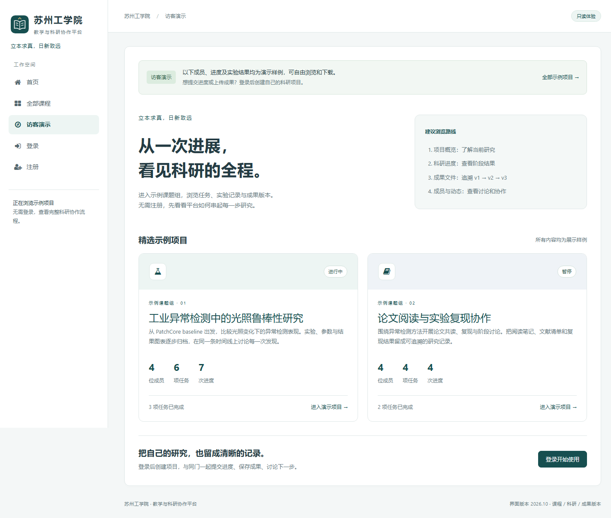
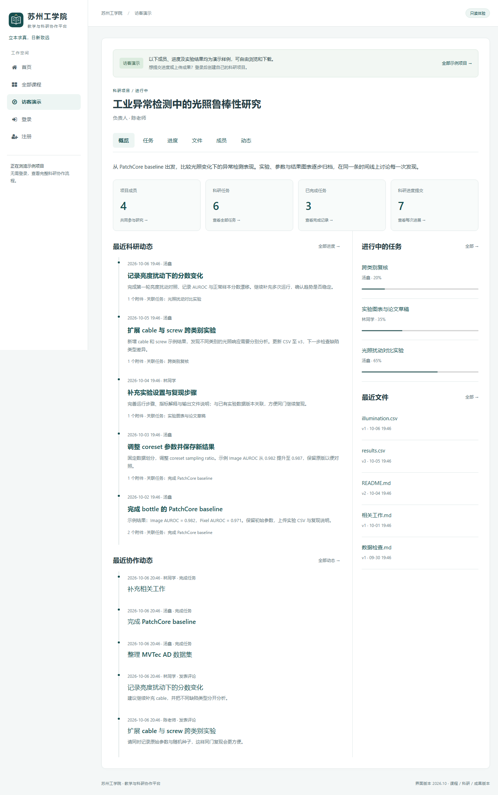
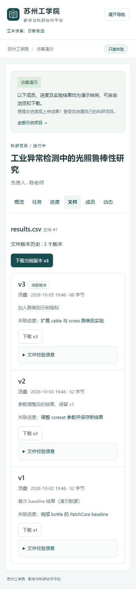

# 教学与科研协作平台

基于 [adityagoyal222/django-lms](https://github.com/adityagoyal222/django-lms) 部署与二次开发的 Django 项目，面向教师、学生和课题组成员，提供课程教学、作业反馈、科研进度记录和成果版本管理。

界面采用「苏州工学院」主题，校训为 **立本求真，日新致远**。当前版本：2026-10-06，第一版科研协作与访客演示已完成。

## 快速运行

本机已配置 `classroom` 环境，并完成 MySQL 增量迁移和演示数据初始化。在已设置数据库密码的 CMD 窗口执行：

```bat
conda activate classroom
cd /d D:\Research\research-experiments\2026\09\django-lms
python manage.py runserver
```

PowerShell 对应命令：

```powershell
conda activate classroom
Set-Location D:\Research\research-experiments\2026\09\django-lms
python manage.py runserver
```

启动后访问：

| 入口 | 地址 | 用途 |
| --- | --- | --- |
| 首页 | http://127.0.0.1:8000/ | 平台导航、注册与登录 |
| 访客演示 | http://127.0.0.1:8000/research/demo/ | 无需登录，浏览完整示例科研项目 |
| 科研项目 | http://127.0.0.1:8000/research/ | 登录后管理自己的科研项目 |
| 课程列表 | http://127.0.0.1:8000/courses/all/ | 查看课程并进入教学流程 |

保持终端打开，按 `Ctrl+C` 停止。页面未更新时按 `Ctrl+F5`；当前页脚显示「界面版本 2026.10」。如提示 `No module named 'django'`，先确认终端前缀为 `(classroom)`，不要在 `(base)` 环境直接运行。

## 访客演示

首页「访客体验 · 无需登录」和侧栏「访客演示」均可进入。提供两个完整示例项目：

| 示例项目 | 成员 | 任务 | 进度提交 | 展示内容 |
| --- | --- | --- | --- | --- |
| 工业异常检测中的光照鲁棒性研究 | 4 | 6 | 7 | PatchCore baseline、跨类别实验、CSV v1/v2/v3、README v1/v2 |
| 论文阅读与实验复现协作 | 4 | 4 | 4 | 文献清单 v1/v2、方法笔记、复现计划、阶段讨论 |

可浏览概览、任务、进度、文件、成员和动态，搜索进度，下载当前或历史版本。演示项目对访客和登录用户均只读；普通科研项目仍要求登录及成员权限。示例账号禁用且无可用登录密码，所有成员、指标和记录均为虚构展示数据。



## 当前功能

### 教学管理

- **用户与课程**：教师/学生注册登录、课程创建与编辑、成员名单、选课与退课、课程归档与恢复。
- **作业与提交**：发布要求和截止时间；学生上传、更新与撤回提交；后台校验归属、选课状态和截止时间。
- **评分与反馈**：教师手动评分和评语，修改成绩保留记录；学生查看自己的成绩与历史反馈。
- **资料与工作台**：受权限保护的资料下载、作业中心、成绩反馈中心和个人页。

已有学生提交的作业不能删除；课程采用归档保留历史。退课后个人提交和成绩仍可查看。教学作业的提交更新以当前内容为有效记录，科研成果的文件版本则逐版保留。

### 科研协作

每个科研项目包含 **概览 / 任务 / 进度 / 文件 / 成员 / 动态** 六个页面。

- **项目空间**：项目名称、简介、负责人、成员；支持进行中、暂停、已完成、已归档。
- **科研任务**：创建与分配任务、更新 0～100% 进度，任务详情展示关联的科研提交。
- **进度提交**：记录标题、说明、作者和时间，可关联任务、引用已有成果或上传多个新文件。按成员、任务和关键词筛选，时间倒序展示。
- **成果版本**：同名上传明确选择「新版本」或「独立文件」；保留版本说明、作者、时间、大小和 SHA-256。一次进度明确关联当次版本，后续更新不会改变历史下载内容。
- **讨论与动态**：进度评论；任务、文件、提交、成员等操作形成统一时间线。
- **成员进度与 Dashboard**：展示成员最近提交、本周提交、项目任务和完成数、最近成果及动态。本周按北京时间周一零点计算，成员按名单展示。

科研提交、版本、评论和动态只追加，修正时新建进度并关联原记录。归档项目只读，负责人可以恢复；暂停和已完成项目仍允许补充记录。



### 项目权限

| 角色 | 权限 |
| --- | --- |
| 项目负责人 | 管理项目、成员和任务；提交进度、上传版本、讨论与查看历史 |
| 项目成员 | 提交进度、上传文件/新版本、评论、查看历史；被分配的任务可更新进度 |
| 只读成员 | 查看项目、任务、进度、讨论和文件，下载历史版本 |
| 访客 | 浏览明确标记的示例项目，下载示例文件；不能修改示例或访问私有项目 |

科研角色按项目授权，教师身份不会自动获得其他课题组权限。成员加入通过负责人填写已注册用户名完成，当前没有邮件邀请功能。

## 一次完整科研流程

1. 负责人创建项目，在「成员」中添加已注册同门。
2. 在「任务」建立目标并指定负责人。
3. 成员完成阶段工作，点击「提交进度」，填写说明并关联任务。
4. 上传实验成果，形成文件 v1；后续同名上传选择新版本，形成 v2。
5. 在提交详情查看本次成果，在文件页下载当前版或旧版。
6. 导师发表评论，在动态及成员页了解阶段进展。
7. 任务负责人在任务页更新完成度，项目完成后归档保留记录。



## 环境与目录

当前使用 Python 3.8.20、Django 3.1.3、MySQL、Django 模板和 Bootstrap 4。静态资源保存在本地；GraphQL 入口暂时关闭。Windows 下通过 Conda 管理环境。

```text
django-lms/
├── users/                  # 现有账号、师生身份与认证
├── courses/                # 课程和选课
├── assignments/            # 作业、提交、评分与反馈
├── resources/              # 课程资料及复用的科研附件存储
├── research/               # 科研项目、任务、提交、版本、讨论、演示
│   ├── migrations/
│   ├── templates/research/
│   └── management/commands/
├── django_lms/             # 配置、路由、公共文件校验与权限
├── templates/              # 公共布局和首页
├── static/                 # 本地样式、字体、脚本与标识
├── docs/                   # 审计、验证说明与页面截图
├── manage.py
└── requirements.txt
```

科研文件复用 Resource、Django 默认 storage、MEDIA_ROOT 和已有上传校验。单个文件最大 20 MB，一次最多 10 个；支持常见文档、CSV、图片、ZIP、Python 和 Notebook，拒绝空文件及不支持的扩展名。版本使用独立存储路径，历史文件不会被覆盖。

## 首次安装

在项目目录中准备环境：

```powershell
conda create -n classroom python=3.8
conda activate classroom
python -m pip install -r requirements.txt
```

启动 MySQL，并在 MySQL 客户端创建数据库：

```sql
CREATE DATABASE IF NOT EXISTS django_lms CHARACTER SET utf8mb4;
```

默认连接为 `localhost:3306`、数据库 `django_lms`、用户 `root`，其他本机配置可调整 `django_lms/settings.py`。密码从 `MYSQL_PASSWORD` 环境变量读取；在启动服务的同一 PowerShell 窗口设置：

```powershell
$dbCredential = Get-Credential -UserName root -Message '请输入本机 MySQL 密码'
$env:MYSQL_PASSWORD = $dbCredential.GetNetworkCredential().Password
Remove-Variable dbCredential
python manage.py check
python manage.py migrate
python manage.py seed_research_demo
python manage.py runserver
```

示例初始化可重复运行，已有项目及版本不会被覆盖。教师和学生业务账号在注册页面创建；如需管理后台账号，运行 `python manage.py createsuperuser`。当前配置不会自动读取 `.env` 文件。

## 已有数据库升级与备份

本机已完成当前版本迁移。其他已有 MySQL 副本升级时，先停止业务写入，激活环境并配置数据库连接，再执行：

```powershell
python manage.py upgrade_research --apply
python manage.py seed_research_demo
```

命令先备份 MySQL 和 media、校验附件备份，再执行增量迁移并核对旧教学记录和附件校验值。备份位于忽略的 `.local/research-upgrade/`；去掉 `--apply` 只备份。MySQL 工具路径不同时可传 `--mysqldump "完整路径"`。

新增迁移包括 research/0001～0005 和 resources/0002。旧课程资料保留原路径；不删除既有数据或旧迁移。数据库、上传文件、备份、临时账号配置和缓存不进入 Git，访客示例内容通过源码中的初始化命令重建。

## 验证与开发记录

```powershell
python manage.py check
python manage.py makemigrations --check --dry-run --settings=django_lms.test_settings
python manage.py test --settings=django_lms.test_settings
```

当前 **51 项测试通过**：30 项教学回归、17 项科研流程与迁移、4 项访客演示测试。测试使用独立 SQLite 数据库和临时附件目录。

已验证科研完整浏览器流程和匿名演示浏览、历史文件内容、桌面与手机布局；本机 MySQL 迁移前后旧教学记录及附件校验值一致。完整业务浏览器验收使用独立 SQLite 演示环境，真实 MySQL 账号下的完整教学/科研流程仍待体验，尚未进行并发压力测试。

- [现有系统审计与模型方案](docs/research-upgrade-audit.md)
- [科研升级阶段、迁移和验证记录](docs/research-upgrade-phases.md)
- [访客模式、数据边界与截图](docs/guest-demo.md)
- [教学功能逻辑与验证](docs/功能逻辑与验证.md)

## 当前范围与后续

当前版本提供轻量科研进度与成果追溯，未实现 Git 分支/合并、文件内容 diff、Office 在线协作、贡献排名或自动批改。评论、进度和版本的追加保护在应用层实施；项目仍使用现有开发环境和本地开发服务。

后续优先体验真实课题组协作与 MySQL 业务流程，再按实际反馈完善交互、验证并发场景与部署配置。

## 项目来源与标识

项目在 [adityagoyal222/django-lms](https://github.com/adityagoyal222/django-lms) 基础上完成本地部署、中文界面和功能扩展。原项目的实现与本仓库二次开发范围分别保留说明。

书本图标为项目自制平台标识，并非官方校徽。当前本地目录未发现 LICENSE，尚未确认上游许可证或授权，暂不声明 MIT 等许可证。
