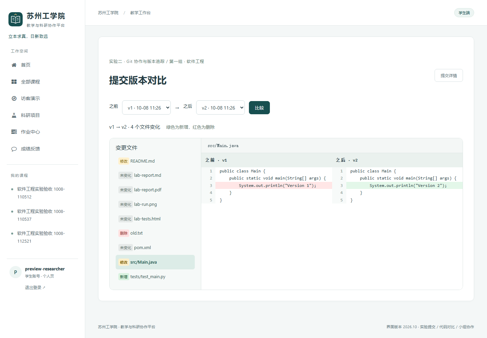
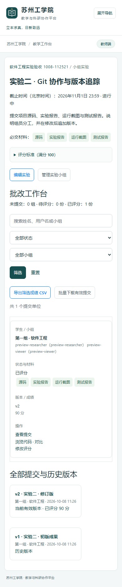

# 实验提交、代码评审与小组教学

2026-10-08 实现“方案②＋G”：提交历史、代码浏览、版本对比、报告预览、材料规范与评分表、批改工作台、小组实验。Teedy 或其他项目仍是学生实验对象，平台负责收交与批改，不要求学生用本平台替代原实验项目。

## 教师使用

1. 在课程详情进入「实验小组管理」，为已选课学生建立小组。一名学生在一门课程中加入一个实验小组，其他课程独立分组。个人实验不需要分组。
2. 发布作业，选择「个人实验」或「小组实验」，填写实验步骤和截止时间。
3. 勾选必交材料：源码、实验报告、运行截图、测试报告。不勾选则允许任意一项附件；勾选后缺项不能正式提交。
4. 如需按项评分，逐行填写 `代码正确性 | 60`、`实验报告 | 40`。名称不能重复，满分须合计 100；留空则直接填写总成绩。
5. 在实验详情「批改工作台」按姓名、用户名、小组和状态筛选，进入提交详情、代码浏览或版本对比。
6. 对当前有效版本评分。小组实验可为每位组员填写个人调整分，最终个人成绩限制在 0～100。评分项、小组分、调整分及评语均保留改分历史。
7. 导出当前筛选范围的 CSV 成绩（小组展开为个人行），或批量下载有效提交附件。

已有任何提交后，提交方式、必交材料和评分表锁定；标题、文字要求和截止时间仍可调整。若需改变考核规则，请另发实验。首次小组实验提交后，小组名称与名单锁定，避免改变历史成绩归属。学生退课后仍能查看自己参与的历史成果；小组中有成员退课时，须先重新加入课程才能继续代表全组提交。

## 学生使用

1. 进入课程实验，查看要求、评分项和截止时间。小组实验先确认教师已分组。
2. 填写提交标题、本次完成内容、修改说明；小组实验在说明中记录分工，任一在课组员可代表提交。
3. 分别上传源码 ZIP／单文件、报告、截图及测试报告。每个栏目支持多个附件；同一次上传的附件名称须唯一。
4. 保存生成 v1。点击「在线查看代码与报告」，从文件目录选择源码或报告；代码有语法高亮、行号和行号链接。
5. 后续保存生成 v2、v3 等，不覆盖旧版。默认保留上一版附件，同名新附件替换对应附件；取消「保留上一版附件」后须重新上传完整材料。
6. 点击「对比提交版本」，选择任意两个同一实验、同一学生／小组的版本。查看新增、删除、修改文件及左右逐行差异。
7. 学生和组员在提交详情、成绩反馈中心查看评分；小组个人调整分计入个人展示成绩。

截止前允许对已评分成果追加版本，原评分留在原版本，新版本进入待评分。当前有效版本作为最终提交；未评分的当前版本可撤回，但历史成果仍保留，且不会自动重新启用上一版。已评分版不能撤回。归档课程停止提交、撤回、建组和评分，仍可查看与下载记录。

## 预览、差异与限制

| 类型 | 行为 |
| --- | --- |
| Java、Python、C/C++、JS、HTML、CSS、SQL、XML、YAML 等文本源码 | 在线高亮；两版逐行对比 |
| ZIP 项目 | 只读文件目录，按内部路径匹配；统一折叠单层公共根目录；不解压到磁盘、不执行 |
| Markdown | 安全子集预览（标题、粗体、行内代码、列表、代码块），可展开源码；不执行原始 HTML／嵌入内容 |
| PDF、PNG、JPG | 经权限与格式校验后在线预览；差异页标记新增、删除或更换 |
| HTML 测试报告、Notebook | 作为文本源码查看，不执行脚本或 Notebook 单元格 |
| Word、Excel、PowerPoint 等 | 提供下载；暂不提供格式转换 |

- 单个上传附件最多 20 MB，一次提交最多 20 个附件、上传合计 50 MB。
- 一次提交展开后最多 1000 个文件、合计 50 MB；拒绝危险路径、重复路径、符号链接、加密 ZIP、空 ZIP 和异常压缩比。打包源码时排除 `.git`、虚拟环境、依赖目录和构建产物。
- 文本预览最多 512 KB、5000 行；逐行对比每侧最多 2000 行，两侧文本合计不超过 256 KB。超过限制提供说明，仍可下载原件。
- 批量下载最多 500 个附件、合计 200 MB；大范围请先筛选。打包使用临时缓冲文件，内容不写入公开 media 地址。
- 预览、差异、历史下载均仅向提交参与者和本课程教师开放；学生看不到其他学生／小组的私有成果。访客科研演示权限不扩大到教学实验。
- 二进制文件按实际内容校验是否变化；不做图片视觉对比、PDF 段落对比或自动识别重命名。

## 数据与升级

复用原 `Assignment`、`SubmitAssignment`、`GradeRecord`。每次提交新增一条 SubmitAssignment，`current_slot=1` 标记当前有效版，旧版置空但不删除。附件保存 UUID 独立路径；保留附件可共享同一存储文件，清理逻辑检查全部附件引用。参与者、评分标准、评分细项及个人调整均保存快照。

新增 CourseGroup、GroupMember、SubmissionAttachment。课程级事务锁串行处理成员调整、提交和评分；数据库约束保证每学生每课程一组、每小组每实验仅一个有效提交。提交内容在模型与默认查询集中禁止覆盖或删除，关联学生和作业使用 PROTECT 外键，后台提交记录只读。

增量迁移：assignments/0006～0008。旧提交按原时间顺序补充版本号和参与者，原有效版本、附件路径、成绩、评分记录及时间保持不变；旧记录已被覆盖的内容无法恢复。旧单附件无需移动即可浏览或下载。

更新环境并迁移：

```powershell
conda activate classroom
python -m pip install -r requirements.txt
python manage.py upgrade_research --apply
python manage.py runserver
```

`upgrade_research` 名称沿用既有备份命令，当前也支持本次实验升级：完整备份 MySQL 和 media，执行增量迁移后对升级前列进行校验，新增列不会造成误报。本机升级已完成。备份位于忽略的 `.local/research-upgrade/`，不进入 Git。

## 验证

- 77 项测试通过：原 51 项回归及新增 26 项实验测试，包括真实 HTTP 表单、权限、历史保护、ZIP 边界、原件下载、差异、组员成绩、导出和历史迁移。
- 独立 SQLite、虚构账号、无头 Edge 完成教师建组／发布 → 学生提交 v1 → 源码与报告预览 → v2 → 差异 → 教师评分与导出 → 非提交组员查看个人成绩流程。
- 桌面 1440 与手机 390 宽度检查；手机批改列表按卡片排列，代码表和差异表在各自容器内滚动，不造成整页横向溢出。浏览器流程无 JavaScript 异常、无 HTTP 错误。
- 本机 MySQL 备份后迁移，旧教学列和附件 SHA-256 校验一致。浏览器业务流程使用独立 SQLite；尚未做真实 MySQL 多人并发压测。





本次未包含行级批注、Git 仓库自动同步、自动执行代码、相似度分析和 Sprint 过程记录。
