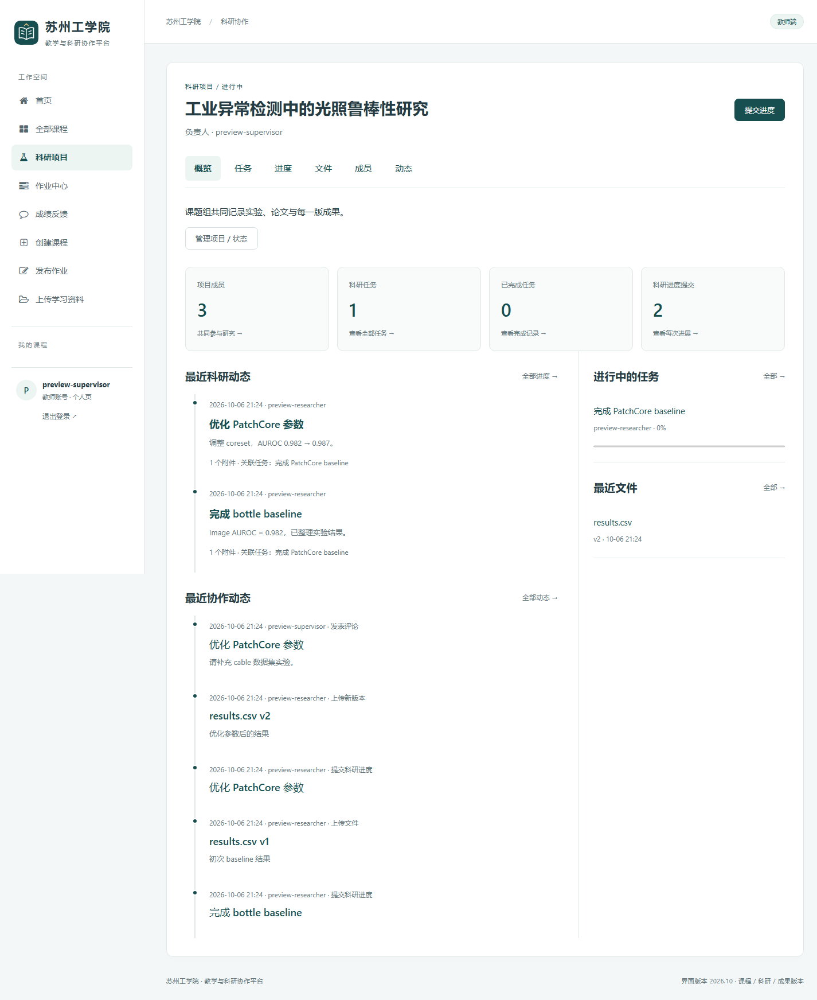
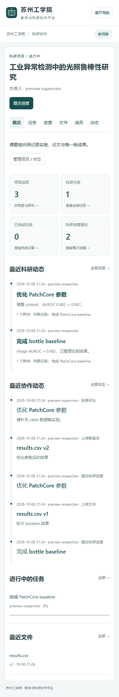
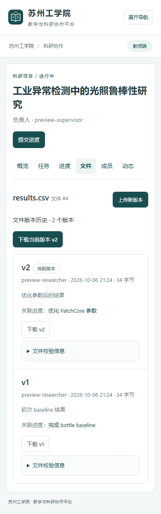

# 科研协作升级：阶段与验收记录

日期：2026-10-06。P0 审计见 [CURRENT SYSTEM AUDIT](research-upgrade-audit.md)。

## [PHASE COMPLETE] Phase 1

- 完成：项目创建/编辑、四种项目状态、成员与只读角色、任务和进度更新、进度提交、父记录修正、详情与历史。
- 新增模型：ResearchWorkspace、WorkspaceMember、ResearchTask、ProgressCommit。
- 修改文件：research/models.py、permissions.py、forms.py、views.py、urls.py、tests.py、templates；settings、总路由、主导航。
- 数据库迁移：research/0001_initial，仅新增表。
- 测试：PASS，35 项，包括原有 30 项。
- 兼容性：不改变 User、Course、Assignment 或既有师生权限；进度记录不提供编辑/删除入口，模型实例及默认查询集禁止覆盖。
- 发现的问题：无阻塞问题。
- 下一阶段：复用 Resource，实现文件版本。

## [PHASE COMPLETE] Phase 2

- 完成：多文件上传、同名新版本/独立文件选择、历史下载、版本说明/作者/时间/大小/SHA-256、进度关联新版本或已有版本。
- 新增模型：LogicalFile、FileVersion、CommitFileChange。
- 修改文件：research/models、forms、services、views、urls、tests、templates；resources/models、admin、views；django_lms/files；research-upload.js。
- 数据库迁移：research/0002、resources/0002；Resource.course 可空，新增可空 workspace 和唯一归属约束，无文件搬迁。
- 测试：PASS，41 项。覆盖两份文件原始内容、跨项目拒绝、版本引用、同名选择、失败回滚、旧资料迁移。
- 兼容性：沿用现有 FileField、MEDIA_ROOT、默认 storage、上传校验和受保护下载；科研版本通过 PROTECT 引用 Resource，后台列表排除不可编辑科研附件。
- 发现的问题：旧状态迁移测试最初未包含 courses 最新状态，修正测试目标后通过。
- 下一阶段：动态、评论、成员进度。

## [PHASE COMPLETE] Phase 3

- 完成：提交、文件/新版本、任务创建/完成/更新、成员加入/角色调整、评论等动态；成员最近提交和本周提交；成员活动页。
- 新增模型：Activity、CommitComment。
- 修改文件：research/models、forms、services、views、urls、tests、templates。
- 数据库迁移：research/0003，仅新增表。0004 追加历史动态回填，兼容先部署前两个阶段的项目。
- 测试：PASS，43 项。动态和业务变更在同一事务中创建；空白评论、只读成员写入拒绝。
- 兼容性：科研角色独立于全局师生身份；本周从北京时间周一零点开始，成员按名单展示，不做排名。
- 发现的问题：无阻塞问题。
- 下一阶段：Dashboard、搜索筛选和界面验收。

## [PHASE COMPLETE] Phase 4

- 完成：真实数据 Dashboard；项目/文件搜索；进度按关键词/成员/任务组合筛选；任务状态筛选；列表、版本历史、动态和成员进度分页；响应式导航及手机布局。
- 新增模型：无。
- 修改文件：research/views、forms、services、tests、templates；主导航/首页、master.css；README、审计及验收文档；upgrade_research 管理命令。
- 数据库迁移：无额外结构改动；本机已经成功应用 research/0001–0004 和 resources/0002。
- 测试：最终全套 47 项 PASS，check 0 个问题，makemigrations --check --dry-run 无变更。
- 兼容性：本机 MySQL 迁移前后，七张旧业务表的行数和全部旧业务字段 SHA-256 一致；原有 4 份附件 SHA-256 一致。备份在 `.local/research-upgrade/20261006-211848-690298/`（SQL、media.zip、before.json、verification.json），不进入 Git。
- 发现的问题：备份 ZIP 校验最初使用 Windows 反斜杠，备份阶段中止且未迁移；改用 POSIX 归档路径后重新备份与迁移成功。明确拒绝同时选择「独立文件」和「更新指定文件」的冲突选项。周统计边界测试发现 Django 3.1 默认排序参与分组会拆分同一成员的统计，清空聚合查询默认排序后修正。
- 下一阶段：用户在现有账号下创建真实科研项目并使用。

## 浏览器验收

使用本机无界面 Edge，独立 SQLite、临时账号及临时 media，未向 MySQL 插入演示账号或科研记录。

实际完成：负责人创建项目 → 添加 Member 和 Viewer → 创建并分配任务 → 成员提交进度并上传 CSV v1 → 同名文件确认新版本并提交 v2 → 从两次进度中分别下载、核对 0.982 与 0.987 原始内容 → 导师评论 → 时间线展示 → Viewer 只读页面。

检查了 1440 px 桌面概览、390 px 手机概览和文件版本历史，无横向溢出；浏览器报告无未捕获脚本异常及 HTTP 500。

## 使用与边界

1. 激活 classroom，运行现有 runserver，从侧栏「科研项目」进入。
2. 项目负责人在「成员」输入已注册用户名并指定角色；此版本没有邮件邀请功能。
3. 在「任务」建立任务并指定负责人。任务负责人或项目负责人在任务页更新进度；进度提交可关联任务。
4. 在「提交进度」填写标题和说明，可多选上传文件或引用已有版本；同名时必须选择版本策略。多个同名独立文件存在时，在文件详情指定更新目标。
5. 原始提交、文件版本、评论和动态只追加；修正通过新进度及其父记录关联。没有历史删除入口，无需软删除字段。
6. 已归档项目只读，负责人可在管理项目中恢复状态；暂停和已完成状态仍允许补充阶段记录。

每个文件最多 20 MB，一次最多 10 个，沿用原文件白名单。版本分配通过项目行锁及唯一约束串行化；本次未进行并发压力测试。追加记录保护属于应用层，不限制拥有直接 SQL/文件系统管理权限的人。未加入 Git 协议、分支、合并、内容 diff 或在线 Office 编辑。

用户原有工业异常检测未跟踪文件未修改；本次平台源码、迁移、说明和截图按平台目录归档，业务数据库、用户附件与本机备份排除在 Git 外。
