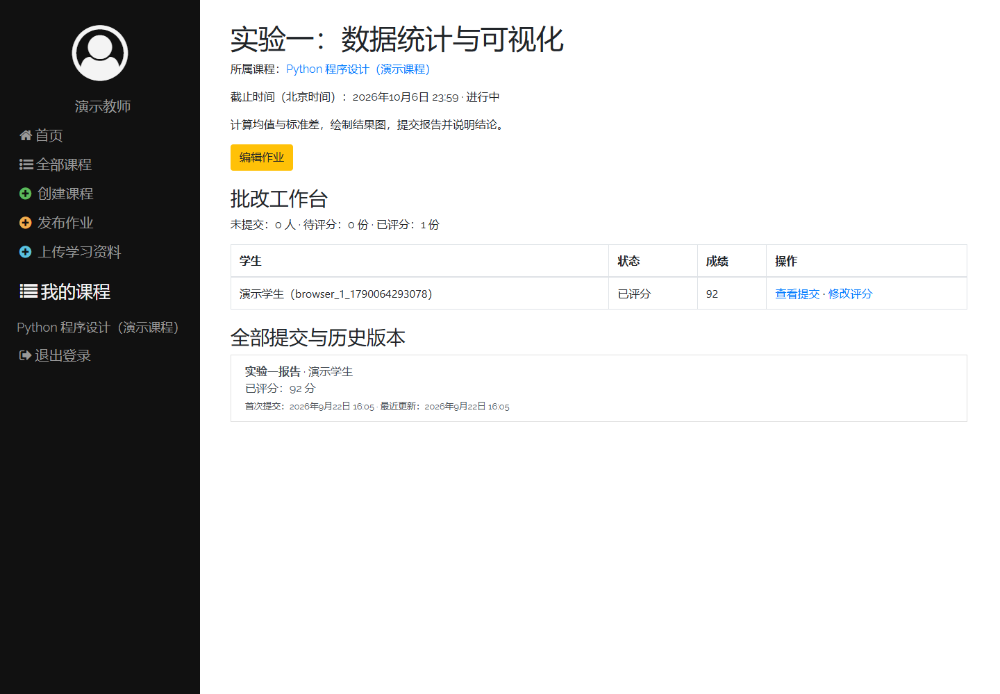
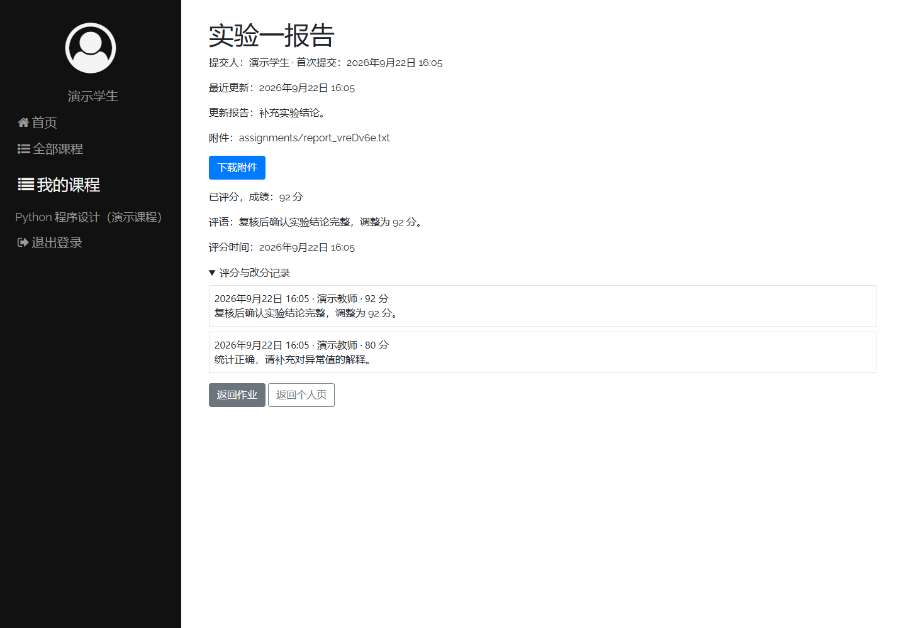

# research-experiments
研究生阶段的实验项目、论文复现与研究笔记。按年份和月份整理，记录项目来源、实现内容、运行方法与后续计划。

## 实验目录

| 时间 | 项目 | 实验内容 | 进度 |
| --- | --- | --- | --- |
| 2026-09 | [Django LMS 教学管理系统](2026/09/django-lms/README.md) | 开源部署、中文界面、课程管理、作业提交与评分 | 核心流程完善；22 项测试通过；本机 MySQL 新增迁移已执行成功 |

## Django LMS：课程与作业管理实验

基于 `adityagoyal222/django-lms` 学习与二次开发，围绕以下教学流程完善业务规则：

```text
教师创建课程、发布作业 → 学生选课、提交报告 → 教师评分与评语 → 学生查看成绩
```

本轮新增与完善：

- **课程管理**：编辑课程、查看成员、归档与恢复；退出课程后保留提交与成绩。
- **作业提交**：自动绑定学生和作业，截止前且未评分时可更新或撤回，每人每份作业只有一份有效提交。
- **批改反馈**：未提交／待评分／已评分名单，分数、评语、评分时间及改分历史。
- **权限与附件**：教师管理自己的课程，学生操作自己的提交；附件访问校验、格式限制与 20 MB 大小限制。
- **历史兼容**：保留旧重复提交和原有成绩，未记录的历史评分时间明确标注。

### 教师批改工作台

按课程成员查看提交状态和成绩，进入提交详情或评分页面。



### 学生查看成绩与反馈

展示最新分数、评语和历次评分记录。截图为独立演示数据库中的虚构师生数据。



查看 [完整项目介绍与运行步骤](2026/09/django-lms/README.md) · [功能规则与验证记录](2026/09/django-lms/docs/功能逻辑与验证.md)。

## 运行 Django LMS

已安装依赖、配置 `MYSQL_PASSWORD` 并完成迁移后，在 Windows CMD 中执行：

```bat
conda activate classroom
cd /d D:\Research\research-experiments\2026\09\django-lms
python manage.py runserver
```

PowerShell 中将第二行换成 `Set-Location D:\Research\research-experiments\2026\09\django-lms`。

打开 [本地学习平台](http://127.0.0.1:8000/)，运行时保持终端打开，按 `Ctrl + C` 停止服务。首次部署或代码新增迁移后，请按项目 README 完成环境配置并执行 `python manage.py migrate`。

## 当前验证与后续方向

系统检查、22 项自动化测试和独立 SQLite 环境的完整浏览器流程已通过。根据本机终端反馈，本轮 4 个 MySQL 新增迁移均已执行成功；MySQL 环境的完整页面流程仍待复验。

下一步完善实际教学场景验证，再探索自动批改与作业分析。各实验的上游来源、许可核实情况与具体限制见对应项目 README。
