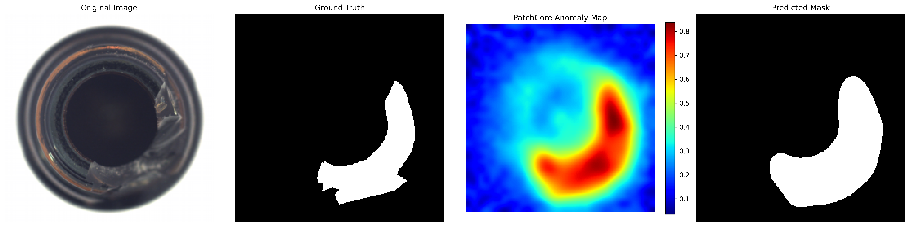

# Industrial Anomaly Detection

工业视觉异常检测学习与实验项目。

本项目用于研究生阶段探索 **工业视觉与视觉异常检测（Industrial Anomaly Detection）** 方向。

通过公开工业数据集、经典异常检测算法和小型对比实验，逐步完成：

- 基础知识学习
- Baseline 模型复现
- 实验结果分析
- 模型对比与消融实验
- 小型改进实验
- 论文方向探索

当前以 **MVTec AD + PatchCore** 作为第一个完整 Baseline，优先建立一套能够重复运行、记录和分析的工业异常检测实验流程。

---

## Environment

当前实验环境：

- Windows 11
- Python 3.11
- PyTorch 2.11.0 + CUDA 12.8
- NVIDIA GeForce RTX 5060 Laptop GPU
- Anomalib 2.6.2
- OpenCV
- Jupyter Notebook
- VS Code

Conda 环境：

```bash
conda activate industrial-ad
```

当前 GPU 已能够被 PyTorch 正常识别并用于 Anomalib 实验。

---

## Project Structure

```text
industrial-anomaly-detection/
├── data/                         # 数据集（不上传 Git）
│   └── mvtec_ad/
│
├── experiments/                  # 正式模型实验
│
├── notebooks/                    # 学习、分析与 Baseline Notebook
│   └── 01_patchcore_bottle.ipynb
│
├── results/                      # 实验结果、可视化图片、模型权重等
│   └── patchcore_bottle_broken_large.png
│
└── scripts/                      # 通用训练、测试和数据处理脚本
```

其中：

- `data/`：存放 MVTec AD 等实验数据，不提交至 Git；
- `notebooks/`：保存模型学习、Baseline 复现和结果分析过程；
- `results/`：保存正式实验结果和可视化图片；
- `experiments/`：后续用于更加规范的模型对比实验；
- `scripts/`：后续逐步抽离可重复使用的训练、测试和数据处理代码。

---

## Dataset

当前使用：

### MVTec AD

MVTec AD 是工业视觉异常检测常用公开数据集，包含多种工业物体和纹理类别。

当前首先使用：

```text
MVTec AD
└── Bottle
```

Bottle 实验数据：

- 训练集：209 张正常图片
- 测试集：83 张图片
- 训练阶段仅使用正常样本
- 测试集包含正常样本和异常样本
- 异常样本提供像素级 Ground Truth Mask

当前策略是：

> **先跑通单个类别 → 理解完整实验流程 → 再扩展到其他类别和其他模型。**

---

## Models

计划逐步实验以下工业异常检测方法：

- [x] PatchCore
- [ ] PaDiM
- [ ] EfficientAD
- [ ] 其他近期工业异常检测方法

当前第一个重点 Baseline：

### PatchCore

当前配置：

```text
Backbone: Wide ResNet-50-2
Feature Layers: layer2 + layer3
Coreset Sampling Ratio: 0.1
```

PatchCore 的基本思路是：

```text
正常训练图片
        ↓
预训练 CNN 提取局部特征
        ↓
layer2 + layer3 多尺度特征
        ↓
Coreset Sampling
        ↓
建立正常特征 Memory Bank
        ↓
测试图片特征
        ↓
与正常特征进行最近邻比较
        ↓
异常分数
        ↓
Anomaly Map
        ↓
Predicted Mask
```

与传统监督目标检测不同，PatchCore 不需要提前收集大量不同类型的缺陷样本。

它主要学习：

> **正常产品的局部特征应该是什么样子。**

测试时，如果某个区域的特征与正常 Memory Bank 中的特征差异较大，则该区域会获得更高的异常分数。

---

## Research Roadmap

当前研究路线：

- [x] 1. 搭建工业异常检测实验环境
- [x] 2. 熟悉 MVTec AD 数据集
- [x] 3. 跑通 Anomalib Baseline
- [x] 4. 初步理解 PatchCore 原理
- [ ] 5. 系统分析 Image-level / Pixel-level 评价指标
- [ ] 6. 在更多 MVTec AD 类别上进行实验
- [ ] 7. 对比不同异常检测 Baseline
- [ ] 8. 进行参数对比与消融实验
- [ ] 9. 尝试小型模型改进
- [ ] 10. 探索可形成论文的具体研究问题

当前原则：

> **先复现，再理解；先做小实验，再决定具体改进方向。**

---

# Experiment Log

## 2026-09-24｜环境搭建与异常检测入门

### 已完成

- [x] 创建 `industrial-ad` Conda 环境
- [x] 配置 PyTorch + CUDA
- [x] RTX 5060 Laptop GPU 测试成功
- [x] 安装 OpenCV / Jupyter
- [x] 安装 Anomalib 2.6.2
- [x] 创建工业异常检测实验目录
- [x] 明确使用 MVTec AD 作为第一阶段实验数据集
- [x] 初步理解工业异常检测与普通监督分类 / YOLO 检测的区别
- [x] 理解重建式异常检测的基本思想
- [x] 明确当前主线优先放在工业视觉异常检测

### 当日里程碑

> **完成工业异常检测实验环境搭建，并建立对工业异常检测任务的基本认识。**

---

## 2026-09-25｜PatchCore Bottle Baseline

### 已完成

#### 1. 数据集

- [x] 加载 MVTec AD Bottle 数据集
- [x] 确认训练集包含 209 张正常图片
- [x] 确认测试集包含 83 张图片
- [x] 理解训练集、测试集和 Ground Truth Mask 的作用

#### 2. PatchCore 模型

- [x] 确定 PatchCore 作为第一个重点 Baseline
- [x] 使用 `wide_resnet50_2` 作为 Backbone
- [x] 使用 `layer2 + layer3` 提取局部特征
- [x] 设置 `coreset_sampling_ratio=0.1`
- [x] 初步理解 PatchCore 的特征式异常检测思路

#### 3. Memory Bank

- [x] 使用正常 Bottle 图片执行 PatchCore Fit
- [x] 完成正常样本局部特征提取
- [x] 完成 Coreset Sampling
- [x] 建立正常特征 Memory Bank
- [x] 理解 PatchCore Fit 与普通神经网络训练的区别

#### 4. Test / Predict

- [x] 完成 Bottle 测试集 Test
- [x] 完成测试图片 Predict
- [x] 获取 Anomalib `ImageBatch` 预测结果
- [x] 学习读取以下模型输出：
  - `image`
  - `gt_mask`
  - `anomaly_map`
  - `pred_mask`
  - `pred_score`
  - `pred_label`

#### 5. 可视化

- [x] 选择 `broken_large` 异常样本
- [x] 完成 Original Image 可视化
- [x] 完成 Ground Truth Mask 可视化
- [x] 完成 PatchCore Anomaly Map 可视化
- [x] 完成 Predicted Mask 可视化
- [x] 完成图像反归一化，恢复正常 RGB 显示
- [x] 将四联图保存至 `results/`

实验结果文件：

```text
results/patchcore_bottle_broken_large.png
```

#### 6. Notebook 整理

- [x] 清理重复的 Fit / Predict / 可视化代码
- [x] 按完整实验流程重新组织 Notebook
- [x] 添加实验目的和方法说明
- [x] 添加各阶段 Markdown 实验记录
- [x] 添加实验结果与总结

当前 Notebook：

```text
notebooks/01_patchcore_bottle.ipynb
```

Notebook 当前结构：

```text
实验说明
   ↓
1. 实验环境与依赖
   ↓
2. MVTec AD Bottle 数据集
   ↓
3. PatchCore 模型
   ↓
4. Engine
   ↓
5. Fit：建立 Memory Bank
   ↓
6. Test：模型性能评估
   ↓
7. Predict：生成预测结果
   ↓
选择 broken_large 样本
   ↓
8. 异常检测结果可视化
   ↓
9. 实验结果与总结
```

### 当日里程碑

> **完成第一个 PatchCore + MVTec AD Bottle Baseline 的完整实验闭环。**

已经从：

```text
了解工业异常检测
```

推进到：

```text
数据集
→ 模型
→ Fit
→ Memory Bank
→ Test
→ Predict
→ Anomaly Map
→ Predicted Mask
→ 实验结果保存
```

---

## PatchCore Bottle Result

当前选择 `broken_large` 异常样本进行可视化。

结果包括：

1. **Original Image**
   - 输入模型的 Bottle 图片；

2. **Ground Truth**
   - 数据集提供的真实缺陷区域；

3. **PatchCore Anomaly Map**
   - PatchCore 输出的连续像素级异常分数；
   - 高响应区域表示该位置与正常特征差异较大；

4. **Predicted Mask**
   - 根据异常阈值得到的最终异常区域。

实验中可以观察到：

> PatchCore Anomaly Map 的主要高响应区域与 Ground Truth 缺陷位置基本一致。

同时，Predicted Mask 能够定位主要缺陷区域，但预测边界与 Ground Truth 仍存在一定差异。

### Result Image



---

# Current Progress

当前已经完成：

## 阶段 1：工业异常检测入门 ✅

理解：

- 工业异常检测任务
- 正常 / 异常样本
- Ground Truth
- 重建式异常检测
- 特征式异常检测

## 阶段 2：实验环境搭建 ✅

完成：

- Conda
- PyTorch
- CUDA
- Anomalib
- Jupyter
- MVTec AD

## 阶段 3：PatchCore Baseline ✅

完成：

- Dataset
- Model
- Fit
- Memory Bank
- Test
- Predict
- Anomaly Map
- Predicted Mask
- 结果保存
- Notebook 整理

## 阶段 4：实验分析与 Baseline 扩展 🚧

接下来开始从：

> **“把模型跑起来”**

逐渐进入：

> **“分析为什么得到这样的结果，并设计自己的实验。”**

---

# Next Step

下一阶段暂时不急着直接修改模型。

优先完成以下几个小任务：

1. **记录并理解 PatchCore 的评价指标**
   - Image AUROC
   - Image F1
   - Pixel AUROC
   - Pixel F1

2. **分析图像级检测与像素级定位的区别**
   - 为什么 Image-level 指标很高；
   - 为什么 Pixel-level F1 相对较低；
   - 结合 Ground Truth 和 Predicted Mask 分析误差。

3. **完成第一个 Mini Experiment**
   - 修改 `coreset_sampling_ratio`
   - 例如比较：
     - 0.05
     - 0.10
     - 0.20
   - 观察检测性能、运行时间和 Memory Bank 规模变化。

4. **逐步扩展 Baseline**
   - PatchCore
   - PaDiM
   - EfficientAD

最终逐渐形成：

```text
Baseline 复现
      ↓
指标分析
      ↓
参数实验
      ↓
模型对比
      ↓
发现问题
      ↓
提出小型改进
      ↓
论文方向探索
```

---

## Current Goal

当前短期目标：

> **从“能够跑通 PatchCore”推进到“能够独立分析 PatchCore 实验结果，并完成第一个小型对比实验”。**

暂时不追求复杂模型改进。

优先保证：

**每学一个方法，都留下一个能够运行、能够解释、能够复现的实验成果。**