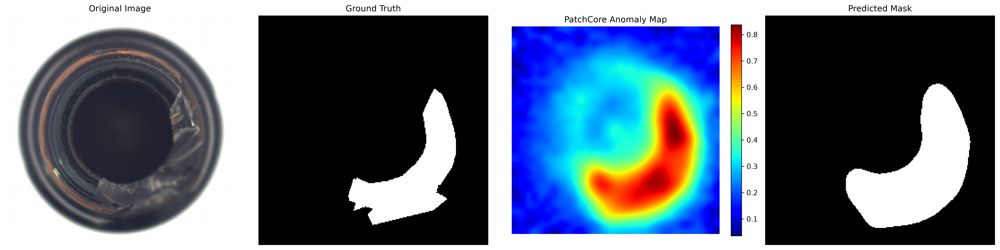

# Industrial Anomaly Detection

工业视觉异常检测研究项目（MVTec AD + PatchCore）。研究主线：**Defect-Preserving Illumination Robustness**
—— 面向光照扰动的特征归一化（α-IN，`F_α = (1−α)F + α·IN(F)`）可能同时**抑制 defect-relevant 信息**；
本项目用 1B→1J-B 建立机制证据，再用 5A→5C 把机制结论推进为可验证的方法。

> **当前状态**：几何引导路线已在 5D/6A/6B 连续三次被削弱并停止；今晚完成 **7A-O overnight 模块筛选**
> （92 GPU units，sanity 18/18）→ **CASE_C — NO USEFUL MODULE**：residual / dual / layer-selective /
> alternative-norm 四类简单模块**都无法超过 Uniform α=0.40091275**，只能沿既有 frontier 移动工作点；
> 唯一正面事实：**A3_lam050（energy-preserving residual fusion, λ=0.5）严格支配无 normalization 的 Original**
> （Δd′ +0.3700 且 Δ\|Δz\| −0.0352）。
> **STOP，不启动 6C / 7B / Final experiments / Method 2，等待人工 review。**

---

## 0. 当前状态快照（TL;DR）

| 项目 | 内容 |
|---|---|
| 论文阶段 | ① Problem ✅ · ② Theory/Literature ✅ · ③ Phenomenon ✅ · ④ Mechanism ✅ FROZEN · ⑤ Method Design ✅ · ⑥ Improvement Screening ✅ · ⑦ Method Validation ✅ · ⑧ Method Identity / Matched-Control Validation ✅ · ⑨ Trade-off 方法改进 ✅（6A pilot + 6B confirmatory：CASE_C） · **⑩ 模块筛选 ✅（7A-O overnight：CASE_C）** · **⑩-b 方法选型 ✅（8B 特征子空间探针：CASE_B，Plan C = HOLD，当前）** · **⑩-c 方法海选 ✅（9A M1–M6：无方法晋级；HOLD = M1/M2/M5；STOP = M3/M4；M6 = ORACLE）** · **⑩-d 第二批方法海选 ✅（9B M7–M11：无候选晋级；实测 coreset 噪声地板 0.020\|Δz\| / 0.054 d′）** · **⑩-e 评测协议修正 ✅（9C Matched-RNG Protocol V2：噪声地板 0.020224/0.054211 → **0.000000/0.000000**，equivalent pair 达到 embedding/coreset/memory bank/score 全面逐位一致）** · **⑩-f 用 V2 重审 9B ✅（9B-R：0 ADVANCE / 3 HOLD —— 9B 的 robustness 改善**不是** measurement artifact，三候选在 V2 下保留且同号；但全部仍是纯 trade-off 兑换，preservation 损失 0.25–0.59 d′ > EPS_DP=0.10）** · ⑪ Final baseline + ablation ⏸ · ⑫ Writing ⏸ |
| 研究载体 | PatchCore（`wide_resnet50_2`，layer2+layer3，coreset 0.1，k=9）+ α-IN 层级干预 |
| 数据规模 | MVTec AD 五类：bottle / cable / grid / hazelnut / screw × seeds {0,1,2}；train/good 209 / 224 / 264 / 391 / 320 |
| 扰动协议 | 冻结 synthetic photometric：brightness 0.7/1.3、gamma 0.7/1.3（`apply_photometric`） |
| 主指标（冻结） | robustness = `mean abs(ΔNormalScore_z)`（越低越好）；preservation = `mean defect d′`（越高越好）；ε = 0.10（d′ 非劣带，5A-H §2 冻结） |
| **Stage ④ 结论** | 机制证据链闭合：defect-specific α-IN 响应具有 **layer-specific 几何载体**；`geometry → NN` 为 intervention 级证据（`geometry → score` 为 proxy 级）。**机制探索已 FROZEN** |
| **Stage ⑤ 结论** | 固定的「几何引导层级 α 规则」G2 在 bottle 有效，但**跨 5 类不泛化 → CASE C，STOP frozen rule** |
| **Stage ⑥ 结论** | **仅用 normal training features 的几何即可预测 category 的 normalization tolerance（CASE_A FINAL）**；但 normalization-sensitivity 通道（Group C）**全部 null** → 机制性中介解释**未确立** |
| **Stage ⑦ 结论** | 用该几何做 adaptive α：**激进重分配（v1A）不优于 best fixed α**（事实上的 CASE_D）；**保守门控形式（v1B）达成 harm avoidance（CASE_B）**：negative transfer 0/5、high-damage recovery +0.824 |
| **Stage ⑧ 结论** | matched-control 证伪实验（零 GPU，sanity 18/18）：10 个同 budget gate 的 Δd′ 跨度 −0.033…+0.330 → **「随便 gate 都差不多」（CASE_C）被排除**；GC 在 10 个 gate 中 preservation / worst-category harm / negative transfer 均 **1/10**、**Pareto-efficient**，但 **robustness 10/10（最差）**；GC vs matched sensitivity control Δd′ **+0.1450 / +0.1540（≥ε、3/3 seeds）**，但优势**由单一类别（grid）驱动** → **literal CASE_D / 实质 CASE_B**，identity 未确立 |
| **Stage ⑨ 结论** | Soft-GC pilot（10 GPU units，sanity 18/18）：在**同一 category identity**下把 fragile 端 α 从 0 提到 **α_F=0.25** → d′ 4.9967→4.8782（仍比 fixed α=0.5 高 **+0.2112**）、\|Δz\| 0.2643→**0.2329**（比 Hard GC 改善 **0.0313**）、worst harm 0、neg transfer 0、**3/3 seeds** 同时满足 → **CASE_A**；保留 Hard-GC preservation gain **64.1%**、回收 robustness penalty **55.9%** |
| **Stage ⑩ 结论（7A-O 模块筛选）** | 92 GPU units、sanity 18/18、freeze `e046a89a…`：4 family × 14 config 的 simple module **无一达到预注册 Tier S/A/B**（Round 1 晋级集为空）；full panel 5×3 下 **A3_lam050** Δd′ **+0.5612** / Δ\|Δz\| **+0.0619**、B1_g100 +0.5104/+0.0717、D1 +0.1739/+0.1164、C3 +0.0219/+0.0115 → **CASE_C**；**无 candidate 与 Uniform 相互支配**，但 **A3_lam050 严格支配 Original** |
| **Stage ⑩ 结论（7A-O 模块筛选，overnight）** | **92 GPU units**、sanity 18/18、freeze `e046a89a…`：residual/dual/layer-selective/alternative-norm 四类共 14 个冻结 config **无一达到预注册 Tier S/A/B**（Round 1 晋级集为空，full panel 5×3 一致）。full panel vs Uniform(0.40091275) d′=4.7940 / \|Δz\|=0.2134：A3_lam050 Δd′ **+0.5612**/Δ\|Δz\| +0.0619、B1_g100 +0.5104/+0.0717、D1 +0.1739/+0.1164、C3 +0.0219/+0.0115 → **CASE_C**；**无 candidate 与 Uniform 相互支配**，唯一正面事实是 **A3_lam050 严格支配 Original**（+0.3700/−0.0352）→ 简单模块只能沿既有 frontier 移动，停止 feature-fusion 路线 |
| **Stage ⑨-b 结论（6B confirmatory）** | 27 GPU units + 1 smoke，sanity 20/20：在 α_F=0.25 周围补 {0.125, 0.20, 0.30} 后，**A∧B∧C∧D 只在 α_F=0.25 成立（region length = 1，孤立点）**；放宽到聚合级 A∧B∧C 也只有 [0.20, 0.25]（长度 2）→ **CASE_C**（6A 的 CASE_A 不构成区域，且任何口径下 CASE_A 都不可达）。**mean-α matched Uniform(0.40091275) 对照**：Soft(0.25) d′ +0.0842（< ε）但 \|Δz\| 反而差 +0.0195 → **优势主要来自整体 strength（60.1%）而非 selective allocation（39.9%）**，且 allocation 的 preservation/robustness 兑换率比 strength 差 **5.7 倍** |
| **Stage ⑩-b 结论（8B 特征子空间探针）** | 420 GPU units（+ 15 cells 特征提取）、sanity **13/13 PASS**、freeze `5f2bbd54…`、0 failed：**defect sensitivity 与 illumination sensitivity 在 pretrained channel 上近似无关**（pooled Spearman 0.0666；layer2 0.151 / layer3 0.023），15/15 cells 同时 D↑I↓，L2-only 与 L3-only **各自 15/15**（非 layer identity 效应）；但 score-level probe（复用 5A-H 完整路径）显示 **primary ratio 25% 下 C6b 失败**（胜 FULL 仅 5/15，mean Δd′ −0.2285）→ **CASE_B，Plan C = HOLD**；**secondary ratio 50% 出现预注册阈值外的正向信号**（PROPOSED50 Δd′ +0.1892 / Δ\|Δz\| −0.1610，胜 FULL 11/15、胜 matched-size random 15/15，d′ 5.1744 / \|Δz\| 0.1495），但 **cable 是系统性负迁移类别**（Δd′ −0.274），且该信号按冻结规则**不得**用于升级 verdict |
| 允许声称 | ① normal-only feature geometry 含有 category-level normalization tolerance 的预测信息（n=5，descriptive）；② 把该几何用于**门控式 safe normalization** 可避免高脆弱类别的归一化损伤；③ **gate 选择本身携带大量信息**（10 个同 budget gate 的 Δd′ 相差 0.36），且 geometry 的 top-2 = 唯一最优 gate；④ **hard gate（fragile 端 α=0）过于极端**：把 fragile 端 α 提到 0.25 可在同一 identity 下同时改善 robustness 并保留大部分 preservation（**但 6B 显示这一点不构成区域，且收益主要是 strength 效应**）；⑤ **单纯把全局 α 从 0.5 降到 ~0.40**（Uniform）在 preservation/robustness 兑换率上优于任何 geometry gating（Δd′ +0.1270 / Δ\|Δz\| +0.0052）；⑥ **在 PatchCore + α-IN 框架下，简单 feature fusion / residual / dual / layer-selective / alternative-norm 模块不能突破 Uniform 定义的 frontier**（7A-O）；⑦ A3_lam050（energy-preserving residual, λ=0.5）**严格支配无 normalization baseline** |
| 不允许声称 | 因果机制已被证明；"adaptive α 提升平均性能"；**geometry predictor identity 已确立**（5D：优势为单类别驱动、robustness 为 10 个 gate 中最差）；**6A 的 CASE_A 是 identity 证据**（6A 只改 fragile 端强度、不改 category identity，且 mean α 0.30→0.40 budget 不 matched、A 的余量仅 5.6%）；需要 category-specific continuous α；**6A 的 α_F=0.25 是稳定 knee region**（6B：region length = 1）；**6A/6B 的收益是 selective allocation 的证据**（6B：60.1% 来自 strength）；**7A-O 的 A3_lam050 是可用于论文的新方法**（它只支配 Original，未超过 Uniform）；结论可外推到其他 backbone / detector / 数据集 / 真实光照；**8B 的 channel-selection 是可用于论文的方法 / 是 Plan C 已被验证**（8B 的 ranking 使用 test defect mask，全部 score-level 结果只是 **oracle diagnostic**；CASE_B 意味着 Plan C 仅 HOLD）；**8B 的 50% ratio 信号是已确认结论**（negative 未确认、random 仅 10 draws、cable 负迁移） |
| 最新 commit | **`f1abbb8`（8B）**；关键历史 commit：`5951b75`(Q3/Q4 docs) · `b726476`(7A-O Q4) · `a53acaf`(Q3) · `7ffb3aa`(Q2) · `f118e1e`(7A-O) · `ad26ec5`(6B) · `1b3edd2`(6A) · `31150bd`(5D) · `fdd6fa9`(5C) · `5d6ee98`(5B-C) · `24d1b22`(5B) · `ff4a1b2`(5A-H) · `ba11038`(5A) |

---

## 1. 论文路线

```text
① Problem（现实问题）                          ✅
② Theory / Literature                          ✅
③ Phenomenon（α-IN 的 defect-specific 现象）    ✅
④ Mechanism Validation                         ✅ FROZEN / REPRODUCED（2026-10-06）
⑤ Method Design                                ✅（5A 有条件成功 → 5A-H 否定固定规则）
⑥ Improvement Method Screening                 ✅（5B / 5B-C：CASE_A FINAL）
⑦ Method Validation                            ✅（5C：CASE_B — Safe Normalization 方向）
⑧ Method Identity / Matched-Control Validation ✅（5D：literal CASE_D / 实质 CASE_B — identity 未确立）
⑨ Trade-off 方法改进（Soft-GC pilot + confirm）  ✅（6A：CASE_A → 6B：CASE_C）
⑩ 模块筛选（overnight，7A-O）                   ✅（CASE_C — 简单模块无法超过 Uniform；A3_lam050 仅支配 Original）
⑩-b 新方法选型（8B feature-subspace probe）     ✅（CASE_B — 子空间存在但 primary ratio 下无法变现；Plan C HOLD）
   Plan C（Illumination-Stable Anomaly Feature Selection）  ⏸ HOLD（需一次 confirmatory 实验才可继续）
   Plan A（Defect-Preserving Illumination Consistency）     ⏸ 备选（8B 未否定其必要性）
⑪ Final baseline + ablation                    ⏸ 需人工批准（未启动）
⑫ Writing                                      ⏸
```

---

## 2. 证据链（每一格：结论 + 关键数字 + 入口）

```text
【③ 现象】1B → 1E
  α-IN 对 defect 的影响存在稳定、跨 seed、跨 5 类别的异质性；
  缺陷面积不足以解释（1D matched-area 后 type 仍有 ΔR²=0.188）
        ↓
【③-排除】1F
  图像空间简单属性（size/contrast/frequency/morphology）无法解释（CASE_D，|ρ|≤0.24）
        ↓
【④ 传导】1G
  feature → NN-distance → score dispersion 强传导（matched ρ=+0.833，frozen ρ=+0.950）
        ↓
【④ 层级结构】1H / 1H-S
  shrink 家族由 layer2-IN 驱动（3/3）、neutral/expand 由 layer3-IN 驱动（6/6，45 units）；
  dispersion 口径下 expand 是真正 L3-dominant（LSI_std=+0.448），shrink 为双层同号
        ↓
【④ 排除混杂】1I
  L3 放大不能用 IN 统计量 spatial sample count 解释（matched-256 后 LSI 仅 −0.029，CASE C）
        ↓
【④ 几何载体】1J-A
  仅 expand 家族出现 Layer3 RMS-radius expansion（R_L3≈+0.45）；geometry 为确定性证据
        ↓
【④ 干预级证据】1J-B
  主动控制 Layer3 radius（β∈{0,0.5,1}）→ NN/score 单调联动（expand 3/3，TRR_NN +0.64/+0.82/+1.39）
        ↓
【复现审计 2026-10-06】1848 NPZ / 30 banks / 1386 intervention rows 全部重建；
  deterministic 指标舍入级一致（max|Δ|=0.000477），stochastic ≤0.03 → REPRODUCED
        ↓
【⑤ 方法设计】5A → 5A-H
  5A（bottle/seed0）：几何引导层级 α 规则 G2 进入 Pareto 前沿，有条件成功；
  5A-H（5 类 × 3 seeds × 5 configs = 75 runs）：**CASE C — bottle-specific**，
  excl-bottle 的 preservation 显著变差（Wilcoxon p=0.0024）→ **固定规则 STOP**
        ↓
【⑥ 方法筛选】5B → 5B-C
  仅用 normal training features 的几何预测 normalization tolerance：
  `radius_ratio_L3L2` / `eff_dim_L3` 与 C2 damage ρ=−0.90、LOCO 5/5、跨 seed 方向一致 → **CASE_A (FINAL)**；
  但补齐的 Group C（normalization sensitivity）8 个 predictor **全部 null** → 机制性解释不成立
        ↓
【⑦ 方法验证】5C
  把该几何变成 category-adaptive α：激进重分配（v1A）≈ best fixed α（0/15 pair-win、3/5 类别 d′ 损失 > ε）；
  保守门控（v1B：仅把 bottle/grid 的 α 降到 0）→ 负迁移 0/5、high-damage 恢复 +0.824 → **CASE_B（Harm Reduction Only）**
        ↓
【⑧ 方法身份验证】5D
  matched-control 证伪：全部 policy 同 budget（gate 2/5、mean α=0.30、α∈{0,0.5}），CPU-only 重组 5A-H frozen raw；
  10 个 exhaustive gate 的 Δd′ 跨度 −0.033…+0.330 → 「随便 gate 都差不多」被排除（6/10 无 harm，但只有 GC 同时 preservation 最大）；
  GC（bottle+grid，= 唯一最优 gate）在 10 个 gate 中 preservation / worst-harm / neg-transfer 均 1/10、Pareto-efficient，
  但 robustness 10/10（最差）；vs matched sensitivity control（SC-A bottle+cable / SC-B grid+screw）Δd′ +0.1450 / +0.1540
  （≥ε、3/3 seeds）却由单一类别（grid）驱动（LOCO 去掉 grid 后 −0.0117）→ literal CASE_D / 实质 **CASE_B：identity 未确立**
        ↓
【⑨ 方法改进】6A
  保持 identity 冻结，只把 fragile 端 α 从 0 插值到 0.5（α_F ∈ {0, 0.25, 0.40091275, 0.5}；10 个新 GPU unit）：
  Hard GC 的 robustness 代价（|Δz| 0.2643，10 gate 中最差）可被软化 —— **α_F=0.25** 同时做到
  Δd′ vs fixed = **+0.2112**（保留 Hard-GC gain 的 64.1%）与 Δ|Δz| vs Hard GC = **−0.0313**（回收 55.9%），
  worst-category harm 0、negative transfer 0、3/3 seeds 一致 → **CASE_A（Soft Geometry Gating Works）**；
  但 A 的余量仅 5.6%、mean α 0.30→0.40 budget 不 matched → 属 strength 效应，**不是 identity 证据**
        ↓
【⑨-b confirmatory】6B
  在 α_F=0.25 周围最小补采样 {0.125, 0.20, 0.30} + **mean-α matched Uniform(0.40091275)** 因果控制（27 units）：
  **A∧B∧C∧D 只在 α_F=0.25 成立 → region length = 1（孤立点）**，放宽到聚合级 A∧B∧C 也只有 [0.20, 0.25]；
  任何口径下 CASE_A 都不可达 → **CASE_C**（6A 的 knee 不构成区域）。G2：Soft(0.25) vs Uniform → Δd′ +0.0842（<ε）
  但 Δ|Δz| +0.0195（更差）→ 收益 **60.1% 来自整体 strength、39.9% 来自 allocation**；
  `Uniform(α=0.4009)` 相对 Best Fixed 的 Δd′ +0.1270 只付出 Δ|Δz| +0.0052 → **比任何 geometry gating 更划算**
        ↓
【⑩ 模块筛选】7A-O（overnight，EXPLORATORY）
  **92 GPU units**（2 smoke + 42 Round1 + 48 Round2），4 family × 14 个冻结 config；
  baselines B0/B1/B2/B3 **全部由 frozen raw 重组（0 GPU）**；smoke：α=0 与 Uniform 相对历史
  **`max|Δscore| = 0`**；sanity **18/18 PASS**；freeze `e046a89a…`
        Round1（3 cat × seed0）晋级集 **空**（14/14 tier = "—"）；Round2 full panel 5×3 同样无一达 Tier S/A/B
        full panel vs **Uniform(0.40091275) d′=4.7940 / |Δz|=0.2134**：
          A3_lam050 (energy-preserving residual, λ=0.5)  Δd′ **+0.5612** / Δ|Δz| **+0.0619**
          B1_g100  (dual concat, γ=1.0)                   Δd′ +0.5104 / Δ|Δz| +0.0717
          D1_ln_s040 (LayerNorm-like fusion)              Δd′ +0.1739 / Δ|Δz| +0.1164
          C3_l2_045_l3_035 (layer-selective)              Δd′ +0.0219 / Δ|Δz| +0.0115
        **无任何 candidate 与 Uniform 相互支配** → 简单模块只能沿既有 frontier 移动工作点
        **唯一正面事实：A3_lam050 严格支配 B0_original**（Δd′ +0.3700 且 Δ|Δz| −0.0352）
        → **CASE_C（NO USEFUL MODULE）**；Round 3 未运行（条件不满足）
        ↓
【⑩-b 方法选型】8B（Defect–Illumination Feature Separability Probe，2026-10-07）
  问题：pretrained representation 里是否存在「defect-sensitive 但 illumination-stable」的
  **feature/layer/channel 子空间**？（若存在 → Plan C；若不存在 → Plan A）
  Phase A：15/15 cells 重新提取 channel 级 D_c / I_c（无 fit/无 bank，524 s）；
           **S13（vs 1J 历史资产）240/240 PASS（corr ≥ 0.9999999）**，S6 identity Δ≡0
  Round 1（CPU，oracle/diagnostic）：**15/15 cells 同时 z_D ≥ +2 且 z_I ≤ −2**
           mean z_D 18.64 / z_I −9.94；**pooled Spearman(|D|, I) = 0.0666**（近似无关）
           L2-only 15/15、L3-only 15/15（**不是 layer identity 效应**）
           Pareto frontier 大小 ≈ i.i.d. 的 ln(n) 期望（frontier 本身不是特殊结构）
  Round 2（Phase B，420 units，复用 5A-H 完整评估路径 + channel mask；S4 `max|Δscore| = 0`）
           primary ratio 25%：胜 FULL **5/15**、mean Δd′ **−0.2285**、Δ|Δz| −0.1545
                             → **C6b FAIL（(i)(iii) 不成立）**
           secondary ratio 50%（**不参与判定**）：Δd′ **+0.1892**、Δ|Δz| **−0.1610**
                             → 胜 FULL **11/15**、胜 matched-size random **15/15**
           PARETO ranking 作 mask 失败（d′ 1.1712 / |Δz| 3.9865，0/15，因其为极值点集合）
           cable 是唯一系统性负迁移类别（Δd′ −0.909 @25% / −0.274 @50%）
  → **CASE_B（WEAK BUT STRUCTURED）**：**Plan C = HOLD**（只允许一次非常小的 confirmatory 实验）
     事实：子空间存在且稳定（metric level），但在预注册 primary ratio 下无法在
     PatchCore score 上同时保值与增益；50% ratio 的正向信号需确认（含 random 抽样噪声）
     最值得看的图：Fig 1（D–I 2D 结构）、Fig 4b（score-level 逐 cell 星/方/圆）、Fig 3b/Fig 4c
```

---

## 3. 实验总索引

| 编号 | 问题 | 关键结果 | 判定 | 状态 |
|---|---|---|---|---|
| [9C](results/experiment_9c_rng_calibration/README.md) | 消除「不同方法代码路径消耗不同 RNG → KCenterGreedy 选择不同 coreset」的评测不公 | **5 GPU unit-runs / 483 GPU·s**、P4 sanity **7/7**、0 failed：建立 **Matched-RNG Protocol V2**（两个 replay 点：`Engine.fit` 入口固定 train shuffle 行序 + `select_coreset_idxs` 入口固定 greedy 初始点）。V1 噪声地板 0.020224/0.054211 → **V2.1 = 0.000000/0.000000**（equivalent pair 的 embedding sum_abs / RNG state hash / coreset sha / memory bank sha / tau / per-image score **全部逐位一致**） | **CASE A**（Matched-RNG 成功） | DONE |
| [9B-R](results/experiment_9b_r_strict_replay/README.md) | 用 9C-v2b 校准好的尺子（Protocol V2）重新审查 9B 候选：候选优势是真实 method effect 还是 measurement artifact | **5 GPU unit-runs / 538.9 GPU·s**、Round 0 sanity **10/10 PASS**、0 failed：Control 1（Original 两次独立进程）embedding/coreset/bank sha 全同、`max\|Δscore\|=0.0`（而 runtime 52.4s vs 133.3s → 一致性非环境巧合）；Control 2 **逐元素 `max\|ΔF\|=0.0`（0/328,728,576 元素）**。Round 1：T1 \(\|Δz\|\) 0.5027→0.3322、T2 →0.3834、T3 →0.4378（改善全保留、与 9B 同号），但 preservation 同时降 0.245–0.590 d′ | **0 ADVANCE / 3 HOLD**（纯 trade-off 兑换）；另发现**既有**协议属性：fit 实际使用全部 209 张 train/good（val 20 张在 bank 内，`dm.setup` 重置了 runner 过滤） | DONE |
| [9B](results/experiment_9b_screening/README.md) | 9A 无晋级后，是否存在 deployable / normal-only / training-free 的第二批候选（M7–M11）能改善 trade-off | **29 GPU unit-runs / 3461 GPU·s**、sanity **12/12**、0 failed：**无候选 ADVANCE**；bottle 侧存在真实越界（M8_b100 **+0.937** d′、M11_b100 +0.804、M9_g1 +0.705，均 >> 噪声地板），但 cable 侧**无候选越界**且通道门方法 cable Δd′ −0.34…−0.76；M7 出现 **layer×category 交互**（bottle 偏好 L3、cable 偏好 L2，与预注册方向相反）；M10 = 7A-O `B1_g100` 复用；实测 **coreset 轨迹噪声地板 NF=0.020/0.054**（RNG 状态分歧机制已定位） | **无 ADVANCE**（M7–M11 全 HOLD） | DONE |
| [9A](results/experiment_9a_screening/README.md) | M1–M6 中哪些方法有希望更好地改善 robustness–preservation trade-off（最低 GPU 成本的快速海选） | **8 GPU units / 922.6 GPU·s**、sanity **10/10**、0 failed、B0 与 5A-H **逐位一致**：M1 bottle d′ 8.2904 / \|Δz\| 0.2850 **跑出 frontier**，但 cable \|Δz\| 0.6687（比 B0 恶化 +0.323）；M2/M3 仅单侧；M6 为 **ORACLE**（bottle 跑出、cable 被支配）；M4 表示层 ≡ α_eff（max\|ΔF\|=1.91e-06）→ 冗余 | **无 ADVANCE（9A 本轮无方法晋级）**；STOP = M3/M4，HOLD = M1/M2/M5，M6 = **ORACLE 参照** | DONE `73eb8be` |
| [8B](experiments/experiment8b/README.md) | pretrained representation 中是否存在「defect-sensitive 但 illumination-stable」的 feature/channel 子空间（决定 Plan C 是否值得做） | **420 GPU units** + 15 cells 特征提取、sanity **13/13**、freeze `5f2bbd54…`、0 failed：D 与 I **近似无关**（pooled ρ 0.0666），**15/15 cells 同时 D↑I↓**，L2-only/L3-only 各 15/15；score-level primary 25% **C6b FAIL**（胜 FULL 5/15、Δd′ −0.2285）；secondary 50% Δd′ +0.1892 / Δ\|Δz\| −0.1610（胜 FULL 11/15、胜 random 15/15）；PARETO mask 崩溃；cable 系统性负迁移 | **CASE_B**（Plan C = **HOLD**） | DONE |
| [7A-O Q4](results/experiment_7a_o_q4/README.md) | uniform normalization strength 响应图 + illumination condition × seed 补齐 | 9 个历史 α 点补齐到 **15/15**（5 cat × 3 seeds）：\|Δz\| 0.3105(α=0) → 0.1895(α=0.601) → 0.1902(α=0.802)，d′ 4.9852 → 4.5078；**α=0.20 支配 α=0**；**α=0.8018 被 α=0.6014 支配**；Q4-B 补 20 个 stress 单元 | **asset completion**（非方法） | DONE `b726476` |
| [7A-O Q3](results/experiment_7a_o_q3/README.md) | 最强 baseline 在更系统 illumination severity 下的退化 | 12 conditions（复用历史唯一实现 brightness/gamma，severity 扩展到 ±10/30/50%）：medium 档与历史 **`max\|Δscore\|=0`**；Uniform 12/12 条件 \|Δz\| 更低；slope **1.886 vs 2.825**（−33%） | **baseline stress-test** | DONE `b726476` |
| [7A-O Q2](results/experiment_7a_o_q2/README.md) | Original / invariant representation 的组合是否应发生在特定 layer | 4 个机械配置 × 3 cat × seed0：**0/4 达 Tier → STOP**；Q2L2（L2 residual + L3 uniform）+0.5793/+0.0429（兑换率 13.5）vs Q2L3 −0.0489/+0.1184 → **L2 槽位有效、L3 槽位有害** | **STOP** | DONE `7ffb3aa` |
| [7A-O](experiments/experiment7a_o/README.md) | 是否存在简单可插拔模块能超过 Uniform α=0.40091275（residual / dual / layer-selective / alternative-norm 四类） | **92 units**、sanity 18/18、smoke `max\|Δscore\|=0`：4 family × 14 config **无一达 Tier S/A/B**（Round1 晋级集空，full panel 5×3 一致）；A3_lam050 +0.5612 d′/+0.0619 \|Δz\|、B1_g100 +0.5104/+0.0717、D1 +0.1739/+0.1164、C3 +0.0219/+0.0115；**无 candidate 与 Uniform 相互支配**，但 **A3_lam050 严格支配 Original**（+0.3700/−0.0352） | **CASE_C**（NO USEFUL MODULE） | DONE `f118e1e` |
| [6B](experiments/experiment6b/README.md) | 6A 的 α_F=0.25 knee 是稳定区域还是孤立点；优势来自 allocation 还是 strength | 27 units confirm：**A∧B∧C∧D 仅 α_F=0.25（region length=1）**，放宽到 A∧B∧C 也只有 [0.20,0.25]；任何口径 CASE_A 不可达；vs **mean-α matched Uniform(0.4009)**：Δd′ +0.0842（<ε）但 \|Δz\| 差 +0.0195 → strength 占 60.1%、allocation 39.9%（兑换率差 5.7×） | **CASE_C** | DONE `ad26ec5` |
| [6A](experiments/experiment6a/README.md) | Hard GC 的 robustness 代价能否用 soft gating 回收 | 保持 identity 冻结、只插值 fragile 端 α：**α_F=0.25** → d′ +0.2112 vs fixed、\|Δz\| −0.0313 vs Hard GC、worst harm 0、neg transfer 0、3/3 seeds → 保留 64.1% gain、回收 55.9% penalty | **CASE_A**（Soft Geometry Gating Works） | DONE `1b3edd2` |
| [5D](experiments/experiment5d/README.md) | 5C 的收益是否来自 geometry 的**类别选择信息**（而非「随便 gate」） | CPU-only 重组：10 个同 budget gate 的 Δd′ 跨度 −0.033…+0.330（CASE_C 被排除）；GC preservation / worst-harm / neg-transfer 均 **1/10** 且 Pareto-efficient，但 **robustness 10/10**；vs matched sensitivity control **+0.1450/+0.1540（≥ε、3/3 seeds）** 且由 **grid 单类别**驱动 | **literal CASE_D / 实质 CASE_B**（identity 未确立） | DONE `31150bd` |
| [5C](experiments/experiment5c/README.md) | 5B 的预测结构能否真正改善 normalization policy | adaptive α 未在两轴同时优于 best fixed（pair-win 0/15）；v1B 零负迁移 + high-damage 恢复 +0.824 | **CASE_B**（Harm Reduction Only） | DONE `fdd6fa9` |
| [5B-C](experiments/experiment5b/README.md#17-experiment-5b-c--group-c-completion--final-verdict2026-10-06) | 补齐 Group C 后 verdict 是否改变 | 原 geometry 信号不变；Group C 8/8 null（\|ρ\|≤0.30，LOCO ≤ random） | **CASE_A (FINAL)** | DONE `5d6ee98` |
| [5B](experiments/experiment5b/README.md) | normal-only geometry 能否预测 tolerance | `radius_ratio_L3L2` ρ=−0.90 / LOCO 5/5；Group C 资产缺失 | CASE_A (interim) | DONE `24d1b22` |
| [5A-H](experiments/experiment5a_h/README.md) | 冻结几何规则是否跨类别泛化 | 否：G2 仅在 bottle 有效；screw 全缺陷受损；grid 对任何 α 极敏感 | **CASE_C**（STOP） | DONE `ff4a1b2` |
| [5A](experiments/experiment5a/README.md) | bottle 上几何引导 α 是否值得继续 | G2 在 Pareto 前沿、逃出 fixed-α 前沿 | CASE_A（conditional） | DONE `ba11038` |
| [1J-B](experiments/experiment1j_b_transmission/README.md) | geometry 是中介还是伴随现象 | β 干预下 NN/score 单调联动（TRR_NN 0.64–1.39） | CASE A（intervention 级） | REPRODUCED |
| [1J-A](experiments/experiment1j_feature_geometry/README.md) | layer3 是否有几何扩张 | 仅 expand 家族 R_L3≈+0.45 | CASE A | REPRODUCED |
| [1I](experiments/experiment1i_spatial_statistics_control/README.md) | L3 放大是否统计粒度假象 | 否（matched-256 后 LSI 几乎不动） | CASE C | DONE |
| [1H-S](experiments/exp1hs_dispersion_layer/README.md) | dispersion 口径下的层偏好 | expand = L3-dominant（LSI_std +0.448） | CASE B | DONE |
| [1H](experiments/exp1h_layer_selectivity/README.md) | α-IN 是否有层级选择性 | shrink=L2 驱动、neutral/expand=L3 驱动 | 层级选择性成立 | DONE |
| [1G](experiments/exp1g_feature_space/README.md) | 机制在哪个空间传导 | feature→NN→score（ρ≈0.95） | CASE_A | DONE |
| [1F](experiments/exp1f_mechanism_screening/README.md) | 图像空间属性能否解释 | 不能（\|ρ\|≤0.24） | CASE_D | DONE |
| [1E](experiments/exp1e_cross_category/README.md) | 现象是否跨类别 | 25/25 types 3/3 seed 稳定 | CASE_A | DONE |
| [1D](experiments/exp1d_size_control/README.md) | size confound 是否解释响应 | 控制面积后 type 仍有 ΔR²=0.188 | CASE_A | DONE |
| [1C](experiments/exp1c_multiseed/README.md) | 现象是否 seed 稳定 | Δd′ large −5.87±0.39 / cont +0.50±0.09 | CONTINUE | DONE |
| [1B](results/experiment_1b/README.md) | 是否存在 defect-specific α 响应 | d′ large 13.63→7.32、small 稳、cont 反升 | 偏 A（含 C 限定） | DONE |
| [1](results/experiment1_illumination_tradeoff/README.md) | synthetic 光照 × α-IN 苗头 | robustness↑ 与 pixel-level cost 温和 trade-off | CASE A（苗头） | DONE |

**Stage ④ = FROZEN**：`geometry → NN` = intervention-level；`geometry → score` = proxy-level + natural correlation。

> **机制阶段停止声明（仍然有效）**：Mechanism exploration is frozen. Do NOT continue adding
> 1J-C / 2A / additional mechanism probes，除非 Stage ⑦ 之后暴露出具体的证据缺口。

---

## 4. Stage ⑤ 方法设计：5A / 5A-H

### 4.1 [5A](experiments/experiment5a/README.md) — 用 Stage ④ 的 sensitivity 排序做 α 分配（bottle/seed0，11 configs）

- **规则**（冻结，`results/experiment_5a/geometry_rule.json`，md5 `dd08ed5e…`）：inverse-sensitivity max-rescale
  —— `α_L3 = A`，`α_L2 = A × (s_L3/s_L2) = 0.603651 A`，其中 `s_L2 = 0.267031 > s_L3 = 0.161193`
  （1J-A family-level `|radius_response|`）。
- **配置**：B0(0,0) / B1(0.25) / B2(0.5) / B3(0.75) / B4(1.0) + 几何组 G1–G3 + 等 budget 均值对照
  C1(0.400913) / C2(0.601369) / C3(0.801826)。
- **结果**：G2 = (0.45273825, 0.75) 在 bottle 上 4/4 shifts 优于等 budget 对照 C2，并"逃出"fixed-α Pareto 前沿
  → **CASE A（conditional）**。
- **限定**：bottle 上 image AUROC 饱和、`FPR@τ_val = 1.0`，结论由 d′ / \|Δz\| 承载；单类别、单 seed。

### 4.2 [5A-H](experiments/experiment5a_h/README.md) — 跨类别验证（5 类 × 3 seeds × 5 configs = 75 runs，sanity 23/23）

- **目的**：只验证冻结 G2 是否泛化，零 α search、零新方法。
- **主要结果**：
  - excl-bottle 12 units：robustness wins **8/12**，但 median Δ = **−0.007**、Wilcoxon **p = 0.29**（不显著、量级微小）；
  - preservation non-inferior 仅 **4/12**，Wilcoxon **p = 0.0024**（G2 对 bottle 以外类别**系统性损伤** defect evidence）；
  - beyond frontier 仅 **1/12**；**12/25** defect types 退化（screw 的全部缺陷类型受损）；
  - **grid 对任何 α 都极敏感**：d′ B0 3.136 → B2 2.364 / C2 2.134 / C3 1.802（同时 \|Δz\| 改善）；
  - **hazelnut** 在 B2 下 d′ 反而略升（5.964 → 6.175）；screw/C3 最差（2.593 → 2.204）；
  - `FPR@τ_val` 退化（train/good 与 test/good 系统性分布 gap）是**全部 5 类**共同现象。
- **判定**：**CASE C — BOTTLE-SPECIFIC → STOP frozen G2**（5A 的优势是 bottle/seed0 sweet spot，不是通用规则）。
- **副产物（5C 的 baseline 来源）**：冻结的 `ε = 0.10` PAIR-WIN 规则 + 4 个 uniform α 的全 5 类结果
  （B0=0 / B2=0.5 / C2=0.601369125 / C3=0.8018255），构成后续「best fixed α」与 α grid 的唯一合法来源。

### 4.3 该阶段的教益

> **"用机制结论直接写死一条全局规则" 失败**：sensitivity 排序（由 defect 特征估计）不能跨 category 复用。
> 这直接引出 Stage ⑥ 的问题：**normal training data 本身是否含有 tolerance 信息**。

---

## 5. Stage ⑥ 方法筛选：5B / 5B-C

### 5.1 [5B](experiments/experiment5b/README.md) — predictive structure probe（CPU-only）

- **问题**：只看 normal training features 的 geometry，能否预测某 category 对 normalization 的 tolerance？
- **X**：1J 冻结的 30 个 normal coreset bank（5 类 × 3 seeds × {layer2, layer3}，α=0 原始特征，KCenterGreedy 0.1）+
  train/good 图像统计（negative control）。
- **Y（primary）**：`C2 damage = d′(B0) − d′(C2)`（来自 5A-H，同一 split 协议）；secondary：C3 / G2 damage。
- **预注册 predictor**：15 个（Group A magnitude / Group B geometry / Group D cross-layer ratio / controls）。
- **Category damage（3 seeds 平均）**：bottle **+1.207** > grid **+1.001** > cable +0.249 > screw +0.113 > hazelnut **−0.183**。

| predictor | group | ρ(C2) | ρ_seed | LOCO |
|---|---|---:|---:|---:|
| eff_dim_L3 | B geometry | **−0.90** | −0.875 | 4/5 |
| radius_ratio_L3L2 | D cross-layer | **−0.90** | −0.832 | **5/5** |
| nn_dist_ratio_L3L2 | D cross-layer | **−0.90** | −0.804 | 4/5 |
| img_pixel_std | control | +0.90 | +0.818 | 3/5 |
| nn_dist_rel_L3 | B geometry | −0.80 | −0.739 | 4/5 |
| eff_dim_L2 | B geometry | −0.80 | −0.768 | **5/5** |
| rms_radius_L3 | B geometry | −0.60 | −0.564 | **5/5** |
| random_control | control | — | — | 3/5 |

- **其它检查**：15/15 predictor 逐 seed 方向一致；leave-one-category-out（对全部 15 个 predictor 都报告）后 top predictor \|ρ\| 仍 ≥ 0.8；
  geometry 预测器在 LOCO 上明显优于 controls（5/5 vs 3/5、2/5）。
- **实现记录**：首次运行的 NN 距离展开式漏 `||x||²` 导致 `nn_dist_rel = 0`，修复后 sanity A–E 全 PASS（属实现 bug，非科研结果）。
- **判定**：**CASE_A (interim)** —— 预测结构存在，但 Group C（normalization sensitivity）资产缺失，机制通道未验证。

### 5.2 [5B-C](experiments/experiment5b/README.md#17-experiment-5b-c--group-c-completion--final-verdict2026-10-06) — 补齐 Group C 后的 FINAL verdict

- **新增资产**：8 个 normalization-sensitivity predictor（`sens_radius/mdc/effrank/pca1` × L2/L3），
  复用 1J-A 冻结 `geometry_of` 与 1E/1H/1J 冻结 IN（`_alpha_mix(α=1) == instance_norm`），
  forward-only、只读 normal train 图（3924 张），定义在读取 target 前写入 `group_c_freeze.json`（`targets_read=false`）。
- **sanity**：S-C1…S-C7 **7/7 PASS**（含与 1J-A 冻结 per_image CSV 的定义一致性对照 `max_rel_dev = 1.11e-05`）；
  主分析链 **19 checks / 0 FAIL**。

| Group C predictor | ρ(C2) | LOCO | 留一 category ρ 范围 |
|---|---:|---:|---|
| sens_radius_L2 | −0.30 | 2/5 | [−0.8, **+0.4**]（剔 bottle 反号） |
| sens_radius_L3 | +0.10 | 3/5 | [−0.4, +0.6] |
| sens_mdc_L2 | −0.30 | 2/5 | [−0.8, +0.4] |
| sens_mdc_L3 | −0.10 | **0/5** | [−0.6, +0.4] |
| sens_effrank_L2/L3 | −0.20 | 1/5 | [−0.8, +0.2] |
| sens_pca1_L2/L3 | +0.20 | 1/5、2/5 | [−0.2, +0.8] |

- **结论**：**CASE_A (FINAL)** —— 原 geometry 信号（`eff_dim_L3` / `radius_ratio_L3L2`，ρ=−0.90、LOCO 5/5）
  加入 Group C 后**完全不变**；但 **Group C 8/8 null**（\|ρ\|≤0.30、LOCO ≤ random 0.60、留一可反号）
  → **「normalization 敏感度中介 tolerance」的机制解释不被支持**，存活的是**通用 normal-feature 分散度几何**。
- **限定**：n = 5 categories，全部 descriptive；`img_pixel_std` 在 \|ρ\| 上与 top geometry 并列（0.90），
  仅 LOCO 可区分（3/5 vs 5/5）。

---

## 6. Stage ⑦ 方法验证：[5C](experiments/experiment5c/README.md) — Geometry-Guided Category-Adaptive α v1

### 6.1 冻结设计（运行前写入 `geometry_policy_freeze.json`，sha256 `05dc6c37…`）

| 项 | 值 |
|---|---|
| primary predictor | `radius_ratio_L3L2`（5B FINAL：ρ=−0.90，LOCO 5/5） |
| control predictor | `sens_radius_L2`（Group C primary，5B：ρ=−0.30、LOCO 2/5） |
| α grid（只能取自历史） | `[0.0, 0.5, 0.601369125, 0.8018255]`（= 5A-H B0/B2/C2/C3；唯一具备 5 类 × 3 seeds 全覆盖的 uniform α） |
| best fixed α | **0.5（B2）**：用 5A-H 冻结 PAIR-WIN 规则（ε=0.10）统计，B2 在 **7/15** units 战胜 α=0，远高于 C2/C3（各 3/15） |
| conservative ceiling | **0.5 = best fixed α**（零新参数的机械规则） |
| mapping | `α(r) = grid[min(K−1, ceil(r·K/n)−1)]`，r = predictor 升序 rank，n=5；rank-monotonic、deterministic、category-name blind |
| 方向 | higher geometry → higher α |

| policy | predictor | α 分配（bottle / grid / cable / hazelnut / screw） | mean α |
|---|---|---|---|
| A. Original | — | 0 / 0 / 0 / 0 / 0（复用 5A-H B0） | 0.000 |
| B. Best Fixed | — | 0.5 ×5（复用 5A-H B2） | 0.500 |
| **C. Geometry Full (v1A)** | `radius_ratio_L3L2` | 0 / **0.5** / 0.6014 / 0.8018 / 0.8018 | 0.541 |
| **D. Geometry Conservative (v1B)** | `radius_ratio_L3L2` | 0 / **0** / 0.5 / 0.5 / 0.5 | 0.300 |
| E. Sensitivity-Guided | `sens_radius_L2` | 0 / 0.8018 / 0.5 / 0.6014 / 0.8018 | 0.541 |

### 6.2 执行与等价性

- **45/45 config runs 完成**（3 policies × 5 categories × 3 seeds，3 workers，约 40 min）；A/B 复用 5A-H 冻结结果。
- **raw score 级等价性**：5C 与 5A-H 在相同 α 上的 **33 个 (cat, seed, α) key、9273 行 per-image 分数逐位一致**
  （`max|Δscore| = 0.000e+00`，`max|Δτ_val| = 0.0`）——因为 5A-H 已覆盖全部 4 个 uniform α × 5 类，
  **5C 本质是冻结 α grid 上的重组**，同时构成一条强复现性检查。
- **sanity S1–S15 全 PASS**（含 6 个历史冻结文件 md5 前后不变）。

### 6.3 主要结果（5 categories × 3 seeds 平均）

| policy | mean α | mean defect d′ ↑ | mean \|ΔNormalScore_z\| ↓ | gain vs best fixed (d′) | Δrobust vs best fixed |
|---|---:|---:|---:|---:|---:|
| A. Original（α=0） | 0.0000 | 4.9852 | 0.3105 | +0.3182 | +0.1023 |
| B. Best Fixed（α=0.5） | 0.5000 | 4.6670 | 0.2082 | 0（参照） | 0（参照） |
| C. Geometry Full（v1A） | 0.5410 | 4.7019 | 0.2277 | +0.0349 | **+0.0195（更差）** |
| D. Geometry Conservative（v1B） | 0.3000 | **4.9967** | 0.2643 | **+0.3297** | **+0.0560（更差）** |
| E. Sensitivity-Guided | 0.5410 | 4.6679 | 0.2364 | +0.0009 | +0.0282 |

逐 category（d′ / \|Δz\|，3 seeds 平均）：

| category | A Original | B Best Fixed | C GF | D GC | E SG |
|---|---|---|---|---|---|
| bottle | 8.179 / 0.442 | 7.302 / 0.286 | 8.179 / 0.442 | 8.179 / 0.442 | 8.179 / 0.442 |
| grid | 3.136 / 0.224 | 2.364 / 0.100 | 2.364 / 0.100 | **3.136 / 0.224** | 1.802 / 0.105 |
| cable | 5.055 / 0.331 | 5.008 / 0.271 | 4.806 / 0.238 | 5.008 / 0.271 | 5.008 / 0.271 |
| hazelnut | 5.964 / 0.214 | 6.175 / 0.151 | 5.958 / 0.138 | 6.175 / 0.151 | 6.147 / 0.143 |
| screw | 2.593 / 0.341 | 2.487 / 0.232 | 2.203 / 0.221 | 2.487 / 0.232 | 2.203 / 0.221 |

**Harm analysis（相对 best fixed α=0.5）**：

| policy | mean gain | worst category | high-damage recovery (bottle+grid) | negative transfer | pair-win units |
|---|---:|---|---:|---:|---:|
| C. GF（v1A） | +0.0349 | screw **−0.2831** | +0.4384 | **3/5** | **0/15** |
| D. GC（v1B） | +0.3297 | cable **0.0000** | **+0.8243** | **0/5** | 0/15 |
| E. SG | +0.0009 | grid **−0.5617** | +0.1576 | 2/5 | 2/15 |

**Seed 稳定性**（d′ mean ± std over 3 seeds；robustness 同向）：

| policy | d′ s0/s1/s2 | mean ± std | \|Δz\| mean ± std |
|---|---|---|---|
| A Original | 5.020 / 4.956 / 4.980 | 4.9852 ± 0.0321 | 0.3105 ± 0.0164 |
| B Best Fixed | 4.664 / 4.670 / 4.667 | 4.6670 ± 0.0032 | 0.2082 ± 0.0071 |
| C GF | 4.739 / 4.677 / 4.690 | 4.7019 ± 0.0327 | 0.2277 ± 0.0066 |
| D GC | 5.019 / 5.018 / 4.953 | 4.9967 ± 0.0378 | 0.2643 ± 0.0075 |
| E SG | 4.698 / 4.696 / 4.609 | 4.6679 ± 0.0511 | 0.2364 ± 0.0097 |

- 方向在 3/3 seeds 一致：GF/GC 的 d′ 全胜 best fixed，但 robustness 全败（seed_pair_wins = [0,0,0]）→ **无 seed 反转**。
- **LOCO**：去掉任一类别、用剩余 4 类重算 rank→α 后，gain 仍为正（+0.098 … +0.142），robustness 代价 +0.026…+0.034
  → **不是单一 category 驱动**。
- **Predictor identity（GF vs SG，同 budget 0.5410）**：聚合上 GF 两轴都不劣（Δd′ **+0.0341**、Δ\|Δz\| **−0.0087**），
  但优势集中在 **grid 单类别**（+0.562），在 cable（−0.202）/hazelnut（−0.189）落后
  → **identity directionally consistent，但未确立**（且 v1B 没有 matched sensitivity 对照）。

### 6.4 判定与限定

**CASE_B — Harm Reduction Only**（driver = v1B / Geometry Conservative）：

- **v1A（激进全范围）实质是 CASE_D**：Δd′ +0.035 但 robustness 更差 +0.0195、pair-win **0/15**、
  3/5 类别 d′ 损失 > ε（screw −0.283 / hazelnut −0.217 / cable −0.202）→ **"更激进地重分配 α" 不优于 best fixed α**。
- **v1B（保守门控）成立**：等于「best fixed α 保持不变，仅把 bottle + grid 的 α 降到 0」→
  high-damage recovery **+0.824**、worst-category gain **0.000**、negative transfer **0/5**；
  且 5 类平均在两轴上都不劣于 Original PatchCore（Δd′ +0.0115、Δ\|Δz\| −0.0462，后者 3/3 seeds 一致）。
- **限定**：n=5；v1B 的收益只来自 2 个类别且以这两类的 robustness 为代价；predictor identity 未确立；
  未做未预注册的显著性检验；不做 causal claim。

---

## 7. Stage ⑧ 方法身份验证：[5D](experiments/experiment5d/README.md) — Matched-Control Gate Validation

**实验目的**：检验 5C 的 GC 收益是否真的来自 geometry 提供的**类别选择信息**，而不是「随便关两个类别」。
5D 是**证伪实验**，唯一自由量是「**谁**决定哪 2 个 category 的 α=0」。

**为什么必须做**：5C 只证明了「保守 gate 可以避免 fragile 类别的 normalization 损伤」，
未排除「任何 ranking 只要把 fragile 类别降到 0 就能拿到同样收益」这一替代解释。

**Frozen protocol**（`results/experiment_5d/reference/policy_freeze.json`，sha256 `30150bc4…`；
运行前冻结、`target_results_read=false`；**全部 policy 同 budget**：gate 2/5、α∈{0, 0.5}、mean α = 0.30）

| 角色 | policy | predictor | orientation | gate | α 分配（bottle/cable/grid/hazelnut/screw） |
|---|---|---|---|---|---|
| primary method | **GC** | `radius_ratio_L3L2` | low→fragile（5C 冻结，逐类一致 hard assertion） | bottle+grid | 0 / 0.5 / 0 / 0.5 / 0.5 |
| primary matched control | **SC-A** | `sens_radius_L2` | low→fragile（5C 冻结 mechanical rule） | bottle+cable | 0 / 0 / 0.5 / 0.5 / 0.5 |
| secondary control | SC-B | `sens_radius_L2` | high→fragile（5B registry 假设） | grid+screw | 0.5 / 0.5 / 0 / 0.5 / 0 |
| reference / baseline | A / B | — | — | — | α=0 全体（5A-H B0）/ α=0.5 全体（5A-H B2） |
| exhaustive controls | 10 个 gate | — | 全部 C(5,2) | 任意 2 类 | **EVALUATION-ONLY**，禁止用其结果替换冻结 policy |

**Protocol ambiguity（运行前发现并上报，人类裁决）**：`sens_radius_L2` 的 conservative direction 在历史记录中
**不唯一** —— 5B registry 预注册 `high->fragile`，而 5B 实测 ρ(C2)=−0.30（负）与 5C 冻结的 rank→α 机械方向
都指向 `low->fragile`。裁决：**两者都预注册**，SC-A 为 primary、SC-B 对称全量报告；不依据 target 结果选方向。

**执行**：**零 GPU**（CPU-only 重组 5A-H 已冻结 raw per-image 分数，30/30 condition key 齐备）；
sanity **S1–S18 = 18/18 PASS**；5C↔5A-H 同 α raw 等价性 `max|Δscore| = 0`。

**关键结果**

| policy | gate | mean α | defect d′ ↑ | \|Δz\| ↓ | Δd′ vs fixed | Δ\|Δz\| | worst-cat gain | neg transfer | HD recovery |
|---|---|---|---|---|---|---|---|---|---|
| A. Original | — | 0.00 | 4.9852 | 0.3105 | +0.3183 | +0.1023 | −0.2107 | 1 | +0.8243 |
| B. Best Fixed | — | 0.50 | 4.6670 | 0.2082 | 0 | 0 | 0.0000 | 0 | 0 |
| **GC** | bottle+grid | 0.30 | **4.9967** | 0.2643 | **+0.3297** | +0.0560 | **0.0000** | **0** | **+0.8243** |
| SC-A | bottle+cable | 0.30 | 4.8517 | 0.2514 | +0.1847 | +0.0432 | 0.0000 | 0 | +0.4384 |
| SC-B | grid+screw | 0.30 | 4.8427 | 0.2547 | +0.1757 | +0.0465 | 0.0000 | 0 | +0.3859 |

- **Exhaustive**：10 个同 budget gate 的 Δd′ 跨度 **−0.0328 … +0.3297**（6/10 做到 worst-cat gain = 0，
  4/10 因 gate 了 hazelnut 产生 **−0.2107** harm）。GC 排 **1/10**（次优 bottle+screw +0.1967，gap +0.133 > ε），
  且**只有 GC 自己**落在 GC − ε 之内。
- **GC 位置**：preservation **1/10**、worst-category harm **1/10**、negative transfer **1/10**、
  **robustness 10/10（最差）**、**Pareto-efficient**。
- **GC vs matched controls**：Δd′ **+0.1450**（SC-A）/ **+0.1540**（SC-B），worst-harm 与 neg-transfer 均相同（0 / 0），
  **3/3 seeds 方向一致**；但 robustness 更差（+0.0128 / +0.0095），且优势**由单一类别驱动**
  （LOCO 去掉 grid → −0.0117；去掉 bottle → GC−SC-B −0.0267）。
- 结构性事实：gate 排序完全由「被 gate 类别的 α=0 收益」决定
  （bottle +0.877 > grid +0.772 > screw +0.107 > cable +0.047 > hazelnut −0.211）；
  **geometry 的 top-2 = 唯一最优 gate**，两个 sensitivity orientation 都漏掉最优组合的一半
  （SC-A 把 grid 排最后，SC-B 把 bottle 排最后）。

**Final verdict**

- **预注册判定链（literal）：CASE_D** —— 且**仅**由 LOCO「单类别驱动」条件触发；CASE_D 其余三条显式为 false。
- **预注册缺陷披露（未修改协议、未重跑）**：**(D1)** CASE_D 的 driver 判据用了严格 `> 0` 而非冻结 ε 带，
  在 **−0.0117（0.12 ε）** 上触发，对任意一对 gate 近乎必然触发；**(D2)** CASE_A 条件 5（seed-level pair-win，
  蕴含 `Δ|Δz| < 0`）与条件 2（容许 `Δ|Δz| ≤ +0.02`）互相矛盾 → **CASE_A 结构性不可达**（实测 0/3）。
  按 §18 原文口径（seed-level **d′ 方向** ≥2/3）应为 **true**（实测 3/3）。
- **实质结论 = CASE_B（Geometry Useful but Identity Weak）**：CASE_A 条件 1–7 成立、**仅条件 8（非单一 category 驱动）
  不成立**；CASE_C 两条判据均显式排除（`|Δd′| = 0.1450 ≥ ε`、n_ge = 1）；CASE_D 的实质含义与
  「GC 是 10 个同 budget gate 中唯一同时做到无 harm 且 preservation 最大」不符。
- **最终 CASE 归属请人工裁决**（literal = CASE_D / 实质 = CASE_B）。**不得**据此声称 CASE_A。

**对论文证据链的贡献 / 假设的支持与否定**

- **支持**：gate 选择携带大量信息 —— 10 个同 budget gate 的 Δd′ 相差 0.36；geometry 的 top-2 = 唯一最优 gate
  （= target 侧 high-damage 子集 {bottle, grid}，仅用 normal images 复现）。
- **否定**：**CASE_C（"随便 gate 都差不多"）被排除**；同时否定「GC 在两轴同时更优」（GC 的 robustness 是
  10 个 gate 中最差）。
- **削弱**：**geometry identity 的排他性证据弱** —— 优势为单类别（grid）驱动、n=5、gate size=2，
  且 GC 的 gate 恰好等于历史 target-derived high-damage 子集。

**是否停止方案①**：**不由本实验单独决定**。5D 排除了 CASE_C，但未能确立 identity（CASE_A 不可声称），
实质落在 CASE_B。按 §27 **STOP，等待人工 review**。

---

## 8. Stage ⑨ 方法改进：[6A](experiments/experiment6a/README.md) — Geometry-Guided Soft Gating / Adaptive α Pilot

**实验目的**：5D 的 Hard GC（fragile 端 α=0）最大化 preservation 但牺牲 robustness（|Δz| 0.2643，10 个 gate 中最差）。
6A 是 **METHOD PILOT**，问的是：

> 保持 category identity 完全冻结（fragile = bottle+grid，tolerant = cable/hazelnut/screw @ 0.5），
> 只把 **fragile 端的 α（α_F）** 从 0 向 0.5 插值，能否在**保留大部分 preservation** 的同时**恢复 robustness**？

**Frozen protocol**（`results/experiment_6a/reference/policy_freeze.json`，sha256 `d4364457…`，运行前冻结）

| 项 | 值 |
|---|---|
| fragile / tolerant（冻结自 5D，未改） | `bottle, grid` @ **α_F** ｜ `cable, hazelnut, screw` @ **0.5** |
| candidate grid | **{0, 0.25, 0.5}**（0.25 = 历史 5A B1；0 = Hard GC；0.5 = Best Fixed） |
| 预注册条件扩展 | **0.40091275**（历史 5A C1），人类批准后启用 → 实际评估 4 点 |
| mean α | (2·α_F + 3·0.5)/5 → **0.30 / 0.40 / 0.4604 / 0.50**（budget 不 matched，须披露） |
| 历史/GPU provenance | α_F=0 / 0.5 端点与 tolerant 端复用 5A-H frozen raw；α_F=0.25 / 0.40091275 由 **10 个新 GPU unit** 产生（bottle s1/s2 + grid s0/s1/s2 ×2 α） |
| 执行方式 | tmux 不可用 → **screen detached 3 workers**，逐 unit 落盘 + PID lock + resume；单 unit 46–111 s、~2.9 GB |

**成功判据（预注册 A–D，读取任何 6A target 前冻结）**
A 保留 `Δd′ vs fixed ≥ +0.20`；B 恢复 `|Δz| ≤ HardGC|Δz| − 0.02 = 0.2443`；C `worst gain ≥ −ε` 且 `neg transfer ≤ 0`；
D ≥2/3 seeds 同时满足 A&B。

**关键结果**

| policy | α_F | mean α | d′ ↑ | \|Δz\| ↓ | Δd′ vs fixed | Δ\|Δz\| vs HardGC | worst gain | neg transfer | A/B/C/D |
|---|---|---|---|---|---|---|---|---|---|
| **Hard GC** | 0 | 0.300 | **4.9967** | 0.2643 | +0.3297 | 0 | 0.0000 | 0 | ✅❌✅❌ |
| **Soft-GC** | **0.25** | **0.400** | 4.8782 | **0.2329** | **+0.2112** | **−0.0313** | **0.0000** | **0** | **✅✅✅✅** |
| Soft-GC | 0.40091275 | 0.460 | 4.7522 | 0.2133 | +0.0852 | −0.0509 | 0.0000 | 0 | ❌✅✅❌ |
| Best Fixed | 0.5 | 0.500 | 4.6670 | **0.2082** | 0（参照） | −0.0560 | 0.0000 | 0 | ❌✅✅❌ |
| （参照）Original | — | 0.000 | 4.9852 | 0.3105 | +0.3183 | +0.0462 | — | — | — |

- **等价性**：smoke 重跑 `bottle:seed0 @0.25`（5A B1 既有条件）→ **183 keys、`max|Δscore| = 0`**；
  重算 `α_F=0` 与 5D 冻结 GC 差 `|Δd′| = 2.9e-07`（6 位小数舍入）。**sanity S1–S18 = 18/18 PASS**。
- **Pareto**：前沿在 α_F∈[0, 0.25] 向外凸出；`SoftGC(0.25)` 与 Hard GC / Best Fixed 同为 Pareto-efficient
  （Original 被 Hard GC 支配）。
- **per-category**：bottle d′ 8.1785→7.7383→7.4469→7.3017、|Δz| 0.4422→0.3352→0.2982→0.2860；
  grid d′ 3.1356→2.9833→2.6444→2.3638、|Δz| 0.2244→0.1747→0.1138→0.1004；tolerant 端按构造完全不变。

**FINAL VERDICT：CASE_A — Soft Geometry Gating Works**（存在 α_F=0.25 使 A+B+C+D 全部满足）。
**量化**：保留 Hard-GC preservation gain 的 **64.1%**（0.2112/0.3297），回收 robustness penalty 的 **55.9%**（0.0313/0.0560）。

**必须同时声明的限定**

1. **A 的余量很薄**：+0.2112 对阈值 +0.20，余量仅 **5.6%**（B 余量 +0.0114）→ knee 的成立依赖预注册阈值。
2. **budget 不 matched**：Soft-GC(0.25) mean α = **0.40** > Hard GC **0.30** → 它用了**更强** normalization；
   6A **只改强度、不改 category identity**，所以这是 **normalization-strength 效应，不是 identity 证据**；
   历史中也没有 budget-matched 的 uniform α≈0.40 对照。
3. **Q4**：bottle/grid 的 knee **位置相同**（都在 α_F∈[0,0.25]），但**幅度不同**
   （该区间每损失 1 单位 d′ 换回的 robustness：grid 0.326 vs bottle 0.243，差 ~34%）
   → 仅记录为 **未验证假设**「category-specific continuous tolerance may be required」，本实验**不**为类别单独调 α。
4. n=5、gate size=2、只有 2 个中间点、单 backbone、synthetic illumination 协议；descriptive，不做 causal claim。

**下一步（建议，未启动）**：6B refined validation（更多 α_F 点 + budget-matched 对照 + 检验 tolerant 端是否也应软化），
需人工批准新协议。

---

## 9. Stage ⑨-b 方法改进（confirmatory）：[6B](experiments/experiment6b/README.md) — Confirmatory Validation of Soft Geometry Gating

**实验目的**：验证 6A 的 α_F=0.25 是**稳定 Pareto knee region** 还是**孤立点**；并用
**mean-α matched Uniform baseline** 做因果控制，区分 **selective allocation** 与 **整体 normalization strength**。

**Frozen（全部继承 6A，未重选）**：fragile=`bottle+grid`、tolerant @ 0.5、ε=0.10、primary metrics、
success criteria A–D（A: Δd′ vs fixed ≥ +0.20；B: \|Δz\| ≤ Hard GC − 0.02 = 0.244255；C: worst gain ≥ −ε 且
neg transfer ≤ 0；D: ≥2/3 seeds 同时 A&B）、illumination 协议、seed aggregation。
freeze `1b4d1e5…`；sanity **S1–S20 = 20/20 PASS**。

**GPU（审计后最小补跑）**：27 units（G1 confirm:{0.125, 0.20, 0.30} × bottle+grid × 3 seeds = 18；
G2 Uniform: cable/hazelnut/screw × 3 seeds × 0.40091275 = 9）+ 1 个等价性 smoke
（重跑 5A C1 既有条件 → **183 keys、`max\|Δscore\| = 0`**）。screen 3 workers。

**关键结果**

| policy | α_F | mean α | d′ ↑ | \|Δz\| ↓ | Δd′ vs fixed | Δ\|Δz\| vs fixed | A/B/C/D |
|---|---|---|---|---|---|---|---|
| Hard GC | 0 | 0.300 | 4.9967 | 0.2643 | +0.3297 | +0.0560 | ✅❌✅❌ |
| Soft-GC | 0.125 | 0.350 | 4.9308 | 0.2488 | +0.2638 | +0.0406 | ✅❌✅❌ (1/3) |
| Soft-GC | 0.20 | 0.380 | 4.9309 | 0.2423 | +0.2639 | +0.0341 | ✅✅✅❌ (**1/3**) |
| **Soft-GC** | **0.25** | **0.400** | 4.8782 | 0.2329 | **+0.2112** | +0.0247 | **✅✅✅✅ (3/3)** |
| Soft-GC | 0.30 | 0.420 | 4.8220 | 0.2230 | +0.1550 | +0.0148 | ❌✅✅❌ (0/3) |
| Soft-GC | 0.40091275 | 0.460 | 4.7522 | 0.2133 | +0.0852 | +0.0051 | ❌✅✅❌ |
| Best Fixed | 0.5 | 0.500 | 4.6670 | 0.2082 | 0 | 0 | ❌✅✅❌ |
| **Uniform(matched)** | — | **0.4009** | 4.7940 | **0.2134** | **+0.1270** | +0.0052 | ❌✅✅❌ |

- **knee region = {0.25}，长度 1（孤立点）** → 6A 的 CASE_A **不构成区域**；
  放宽到聚合级 A∧B∧C 也只有 **[0.20, 0.25]**（长度 2，因为 0.125 处 B 失败、0.30 处 A 失败）。
- **任何口径下 CASE_A 都不可达**（连续 3 点不可能同时满足 A∧B）。
- **G2 因果控制**：Soft(0.25) vs Uniform(0.4009) → Δd′ **+0.0842**（< ε）、Δ\|Δz\| **+0.0195（Soft 更差）**。
  分解 vs Best Fixed 的 +0.2112 = **strength +0.1270（60.1%）+ allocation +0.0842（39.9%）**；
  allocation 的 preservation/robustness 兑换率（4.3）比 strength（24.6）**差 5.7 倍**。
- **附带事实**：`Uniform(0.4009)` 相对 Best Fixed 的 **Δd′ +0.1270 只付出 Δ\|Δz\| +0.0052**，
  worst-category gain +0.0159、neg transfer 0 → **单纯把全局 α 从 0.5 降到 ~0.40 比任何 geometry gating 更划算**。

**FINAL VERDICT：CASE_C — 6A 的 knee 不复现为区域（α_F=0.25 是孤立点）。**

**必须同时披露的预注册敏感性**：region 口径决定 CASE_B/CASE_C（预注册的 A∧B∧C∧D → CASE_C；
聚合级 A∧B∧C → CASE_B）；**未回改判定**。6A 的**数值本身完全复现**，被否定的是「它是 knee region」。

**对论文证据链的贡献**：第 9 格由「6A：存在 CASE_A 的 soft-gating knee」修正为
「**6A 的 CASE_A 是预注册阈值下的窄交叉点，不构成区域；且其收益主要来自整体 strength，而非 selective
allocation**」→ 与 5D 的 identity 未确立一起，**显著削弱 geometry-guided 方法叙事**。

**下一步（建议，未启动）**：换判据/换目标（前沿效用率或 budget-matched 下的 Pareto 支配），并把
「global α 0.5 → ~0.40」列为必须并列的最强 baseline。

---

## 10. Overnight 模块筛选：[7A-O](experiments/experiment7a_o/README.md) — Overnight Module Screening（**EXPLORATORY**）

**为什么做**：6B 判 CASE_C（geometry-guided category gating 停止）后，问题变为
「是否存在**简单、可插拔**的 feature intervention / fusion module，能相对强 baseline
**Uniform α=0.40091275** 取得更好的 preservation–robustness trade-off？」

**协议（运行前冻结，SHA256 `e046a89a…`；零 baseline 重跑）**
- baselines 全部由 frozen raw 重组（B0=5A-H B0、B1=5A-H B2、**B2=Uniform 0.40091275**（5A C1+6A+6B）、
  B3=Soft-GC（6A+5A-H B2））→ 0 GPU。
- 4 个 family 共 **14 个冻结 config**：A residual/energy-preserving fusion（λ 固定网格）、
  B dual representation（concat，γ 固定网格）、C layer-selective（mean α 与 Uniform 同 budget）、
  D alternative normalization（LayerNorm-like / GroupNorm-like，strength=0.40091275）。
  **A2 = NOT IMPLEMENTED**（无可训练自由度的固定投影只能是 α-interpolation 的伪装或无原则算子）；
  **B2 = NOT RUN**（B1 已验证可跑）。
- successive halving：Round 0 smoke → Round 1（3 cat × seed0）→ Round 2（5 cat × 3 seeds）→ Round 3（条件组合）。

**执行**：**92 GPU units**（2 smoke + 42 R1 + 48 R2）；screen detached 3 workers；
**Family B 的 concat 使 embedding 1536→3072、峰值显存 ×2，Round 2 期间触发 2 次 OOM →
按 §26 自动降级为 2 workers + 内存感知分组**（B1 独立 lane），未等待人工。sanity **18/18 PASS**。
smoke：α=0 与 Uniform 相对历史均为 **`max|Δscore| = 0`**。

**关键结果（full panel 5 cat × 3 seeds，vs Uniform d′=4.7940 / \|Δz\|=0.2134）**

| config | family | d′ | \|Δz\| | Δd′ | Δ\|Δz\| | worst cat Δ | negTr | tier |
|---|---|---|---|---|---|---|---|---|
| **A3_lam050** | A | **5.3552** | 0.2753 | **+0.5612** | +0.0619 | −0.0493 | 0 | — |
| B1_g100 | B | 5.3044 | 0.2850 | +0.5104 | +0.0717 | −0.0001 | 0 | — |
| D1_ln_s040 | D | 4.9678 | 0.3298 | +0.1739 | +0.1164 | −0.2796 | 1 | — |
| C3_l2_045_l3_035 | C | 4.8159 | 0.2248 | +0.0219 | +0.0115 | −0.0538 | 0 | — |

- **14/14 candidate 在 Round 1 全部 tier = "—"（晋级集空）**；Round 2 的 4 个 family representative
  在 5×3 上同样无一达到 Tier S/A/B → **CASE_C 被加强**。Round 3 未运行（条件不满足）。
- **没有任何 candidate 与 Uniform 相互 Pareto 支配** → 模块**只是沿既有 frontier 移动**，
  没有把 frontier 向外推；A/B/D 族全部是"以 robustness 换 preservation"。
- **唯一正面事实**：**A3_lam050 严格支配 B0_original**（Δd′ +0.3700 且 Δ\|Δz\| −0.0352），
  即"叠加尺度匹配的 normalized residual"严格优于"不做 normalization"；且 3/3 seeds 同向、
  worst-category Δ = −0.049（ε 内）、negTr 0。
- Family C（layer-selective）在 5×3 上与 Uniform 差异 ≤ 0.022 d′，**没有 layer 偏好信号**；
  Family D（LayerNorm/GroupNorm-like）**被 Original 支配** → 明确否定。

**FINAL VERDICT：CASE_C — NO USEFUL MODULE**
（机械口径 §14 = 空晋级；full-panel 口径一致。→ **停止"简单 feature fusion"路线**。）

**对证据链的贡献**：新增一条**负结果边界** —— 在 PatchCore + α-IN 框架下，
简单 residual / dual / layer-selective / alternative-norm 模块**不能**突破
`Uniform α≈0.40` 所定义的 preservation–robustness frontier；它们只能沿 frontier 移动工作点。
真正 push frontier 需要改变**目标轴本身**（把 illumination robustness 与 defect 表达解耦）。

**下一步（建议，未启动）**：① 不继续调 λ/γ/per-category 权重；② 若要继续，需新预注册协议 +
新 baseline（inference-time illumination 校正 或 显式 illumination-invariance 目标）；
③ A3_lam050 保留为"最强的弱归一化参考点"。

---

### 10.1 Overnight continuation queue（Q1–Q5，2026-10-06 22:17 → 2026-10-07 02:07）

| Queue | 状态 | GPU units | 关键结果 | 入口 |
|---|---|---|---|---|
| **Q0** 7A-O 模块筛选 | DONE | 92 | **CASE_C**（14 config 无一达 Tier）；A3_lam050 严格支配 Original | `experiments/experiment7a_o/README.md` |
| **Q1** winner local robustness | **SKIPPED** | 0 | 启动条件不满足（Q0 = CASE_C，无 CASE_A/B/D candidate） | `overnight_status.json` |
| **Q2** layer × representation composition | DONE（**STOP**） | 12 | 0/4 达 Tier；**强 L2/L3 非对称**：residual 放 L2 → +0.5793 d′/+0.0429 \|Δz\|（兑换率 13.5，全项目最高）；放 L3 → −0.0489/+0.1184（两轴都差） | `results/experiment_7a_o_q2/README.md` |
| **Q3** illumination stress-test | DONE | 10 (+20 in Q4-B) | 12 conditions（brightness/gamma × ±10%/±30%/±50%）；medium 档与历史 **`max\|Δscore\|=0`**；Uniform \(\|Δz\|\) 在 12/12 条件更低，**degradation slope 1.886 vs 2.825（−33%）** | `results/experiment_7a_o_q3/README.md` |
| **Q4** strong-baseline extended validation | DONE | 56 | 9 个历史 α 点补齐到 **15/15**；\(\|Δz\|\) 随 α 单调降到 α≈0.6 后饱和；**α=0.20 Pareto 支配 α=0**；**α=0.8018 被 α=0.6014 支配** | `results/experiment_7a_o_q4/README.md` |
| **Q5** CPU paper assets | DONE | 0 | registry(22) / evidence map / negative results / figure inventory(108) / main results table draft | `results/experiment_7a_o/summary/` |

**总 GPU units：170**（Q0 92 + Q2 12 + Q3 10 + Q4 36 + Q4-B 20），wall-clock ≈ 3h50m（预算 8–10h，提前结束符合 §17）。

**Overnight 的三条可写进论文的新事实**
1. 简单 representation 模块（residual / dual / layer-selective / alternative-norm，14 个冻结 config）
   **不能**把 Uniform α≈0.40 的 preservation–robustness frontier 往外推（7A-O CASE_C）。
2. **干预槽位有强非对称性**：把 representation 干预放在 **layer2** 是有效且高效的，
   放在 **layer3** 会同时损害两个轴（Q2）。
3. **strength 有甜点区间**：\(\|Δz\|\) 随 α 单调下降并在 α≈0.6 饱和，**α=0.20 同时优于 α=0**
   （d′ 5.0094 vs 4.9852 且 \|Δz\| 0.2777 vs 0.3105），α≥0.8 反而被 α≈0.60 支配（Q4-A）。

## 11. Mini Experiment 8B — Defect–Illumination Feature Separability Probe（2026-10-07）

**入口**：[experiments/experiment8b/README.md](experiments/experiment8b/README.md)（PRE-RUN PLAN + A1 amendment + POST-RUN）·
完整报告 [`results/experiment8b/final_report.md`](results/experiment8b/final_report.md) ·
机械判定 [`results/experiment8b/verdict.json`](results/experiment8b/verdict.json) ·
sanity [`results/experiment8b/sanity/sanity_report.md`](results/experiment8b/sanity/sanity_report.md)

### 11.1 实验目的

回答一个决定后续路线的问题：**PatchCore pretrained representation 中是否存在一组对 defect/anomaly 高敏感、
但对 illumination variation 相对稳定的 feature/layer/channel 子空间？** 存在 → Plan C（Illumination-Stable
Anomaly Feature Selection）；不存在 → 立即 STOP Plan C，转 Plan A（Defect-Preserving Illumination Consistency）。
本实验**不是**新方法，也**不**以 AUROC 为目标；它只测「可选择性」是否存在。

### 11.2 执行规模与冻结

| 项 | 值 |
|---|---|
| 冻结协议 | `results/experiment8b/reference/protocol_freeze.json` sha256 `5f2bbd54…`（阈值/ranking/ratio/CASE 规则先于结果冻结） |
| 预注册修正 | A1：S13 判据由 bit-exact 改为数值容差（触发早于任何目标结果；原因＝`feature_pooler` 缺失 + GPU batch 相关非确定性） |
| Phase A（特征提取） | 15/15 cells（5 cat × 3 seeds），524 s，无 fit / 无 bank；defect 图 1203 张；fallback l2 24 / l3 393 |
| Phase B（score-level probe） | **420 units**（15 cells × 28 masks），0 failed；single-unit 累计 19.67 GPU·hour，wall-clock 6.64 h（3 workers，**预注册估计 ~2 h，实际 3.3×**） |
| sanity | **13/13 PASS**（S1–S13；S5 曾因分析脚本键名 bug 误判 FAIL，全 15 cells 复算后 PASS；S4 `max\|Δscore\| = 0`） |
| leakage | ranking 使用 **test defect mask**（oracle）→ 所有 score-level 结果标 `oracle_probe_only`，**不得**作为方法性能主张 |

### 11.3 核心结果（事实）

| 层 | 结果 |
|---|---|
| Metric level | **15/15 cells 同时 z_D ≥ +2 且 z_I ≤ −2**；mean z_D 18.64 / z_I −9.94 |
| 相关性 | **pooled Spearman(\|D\|, I) = 0.0666**（layer2 0.151 / layer3 0.023）→ 两轴近似无关 |
| Layer control | L2-only **15/15**、L3-only **15/15** → **不是 layer identity 效应**（C7 = True） |
| 稳定性 | 5/5 categories × 3/3 seeds 全胜；pooled-3-seed 后 5/5 仍胜；剔除 degenerate channel 不变 |
| 结构 | Pareto frontier 占比 l2 1.6% / l3 0.6% ≈ i.i.d. 的 ln(n) 期望 → frontier 本身不是特殊结构；D_abs 重尾（top 1% channel 占 34% 质量） |
| Score level（primary 25%） | 胜 FULL **5/15**、Δd′ **−0.2285**、Δ\|Δz\| **−0.1545**、胜 matched-size random 12/15 → **C6b FAIL** |
| Score level（secondary 50%） | Δd′ **+0.1892**、Δ\|Δz\| **−0.1610**、胜 FULL **11/15**、胜 random **15/15**（**不参与判定**） |
| Negative results | PARETO ranking 作 mask 崩溃（0/15，d′ 1.171）；D-ONLY 无稳健性收益；I-ONLY 有明显 d′ 损失；**cable 为唯一系统性负迁移类别** |

### 11.4 判定（机械执行）→ CASE_B，Plan C = **HOLD**

C1–C5、C6a、C7 全部成立，**C6b（score-level probe）FAIL**（(i) 胜 FULL ≥10/15 与 (iii) mean Δd′ ≥ 0 均不成立）
→ 按 §4.2 判定顺序落 **CASE_B（WEAK BUT STRUCTURED）**。

- **事实**：可选择的子空间在 metric level 上确实存在且极稳定（近似无关的两轴、两个 layer 独立成立、无失败类别/seed）。
- **解释**：该子空间在 **primary ratio（25%）** 下无法在 PatchCore score 上同时保值与增益；
  但在 **50% ratio** 下出现了相对 α=0 的 Pareto 改善信号（须用 7A-O 历史口径注意：C1_l2_030_l3_050 也支配 α=0，
  且二者互不支配，故不能称为「第一次推动 frontier」）。
- **假设（未验证）**：50% 信号是否稳定（random 仅 10 draws）、是否能由 **normal-only proxy** 近似复现该 channel 排序。

### 11.5 本实验推进了论文证据链的哪一格 / 下一格是什么

- **完成/推进的格子**：Phase 5（Solution Selection）中「**Plan C 是否有科学依据**」这一前置格 —— 由
  「未知」变为「**子空间存在，但 primary 口径下不可变现 → 需一次确认实验**」。
- **没有推进**：没有产生任何方法性能主张（oracle diagnostic）；没有改变 7A-O 的 CASE_C 结论。
- **下一格（建议，未执行）**：**8C-a**（最小确认：把 50% 的 random 基线从 10 扩到 ≥100 draws 并单独报告 cable）；
  或 **8C-b**（真正关键：检验 normal-only proxy 能否复现 8B 的 desirable channel 排序）。
  **禁止**直接进入大规模 feature-selection 方法开发（CASE_B 规则）。
- **若 8C 失败**：Plan C 停止，转 **Plan A（Defect-Preserving Illumination Consistency）**。

---

## 12. Experiment 9A — M1–M6 Method Screening Round-1（2026-10-07）

**为什么做**：进入「方法改善阶段 → 多候选快速海选」。用最低 GPU 成本回答唯一问题：M1–M6 中哪些方法有希望比现有 baseline 更好地改善 robustness–preservation trade-off（是**筛选**，不是证明某个方法）。

**设计与规模**：bottle/cable × seed0；评价管线完全复用 5A-H `run_config`（同一 bank / coreset 0.1 / kNN 9 / illumination / scoring / 指标口径），仅在 `fit_dual_model` 处注入新模型。真跑 **8 GPU units（922.6 GPU·s ≈ 15.4 min，0 failed）**：M1 bottle+cable、M3 bottle+cable、M4 direct-α_eff / 组合形式（+1 次同配置重复）、B0 管线对照。历史复用 **0 GPU**：M2（7A-O `B1_g100`）、M6（8B `PROPOSED25/50`）、B0/B2 与全部 uniform-α frontier（5A-H / 6A / 6B / Q4）。

**M1–M6 结果（bottle / cable seed0；robustness = mean\|Δz\| 低好，preservation = mean d′ 高好）**

| 候选 | type | bottle d′ / \|Δz\| | cable d′ / \|Δz\| | Verdict |
|---|---|---|---|---|
| M1 illumination-robust representation | NEW | **8.2904 / 0.2850**（B0 = 8.2650 / 0.4782）→ **跑出 frontier** | 4.8428 / **0.6687**（robustness 恶化 +0.323） | 🟡 **HOLD — category-dependent / cross-category unstable** |
| M2 dual concat（复用 7A-O） | REUSE | 8.1708 / 0.3379 → 跑出 frontier | 5.1008 / 0.3275 → 被支配 | 🟡 HOLD |
| M3 nuisance 子空间抑制 k=16 | NEW | 8.3909 / 0.4695（Δ\|Δz\| = −0.009，无实质 robustness 改善） | 5.2094 / 0.3808 → 被支配（Δ\|Δz\| = +0.035） | 🔴 **STOP — 两类别均无 robustness 改善** |
| M4 residual compensation | SANITY | 表示层 ≡ α_eff=(1−λ)α′（max\|ΔF\|=1.91e-06） | — | 🔴 **STOP — algebraically redundant** |
| M5 selective bypass | HOLD | — | — | 🟡 **HOLD — implementation unresolved** |
| M6 channel-selective 25%/50% | REUSE | 7.7321 / 0.1276 · 8.8594 / 0.1622（bottle 跑出 frontier） | 4.1392 / 0.2140 · 4.7743 / 0.1750（被支配） | **ORACLE_REFERENCE — ORACLE UPPER BOUND**（selection 用 test mask；**不是 deployable 方法，不计入晋级**） |

- **M4 补充事实**：两种等价实现的 **score** 并不逐位相同（max\|Δscore\|=1.773，r=0.99949，mean Δ=−0.033），但**同配置重复运行 bit-identical（max\|Δscore\|=0.0）** → score 差异来自 PatchCore fit 路径（KCenterGreedy coreset 顺序选择）对 1e-6 级表示扰动的放大，而非实现错误。sanity 判据据此由「score 逐位相等」修正为「表示层等价 + 管线确定性」（已在实验 README §9.2 完整披露）。

**淘汰了谁 / 晋级了谁（最终统一判定 ADVANCE / HOLD / STOP / ORACLE_REFERENCE）**：
- 🟢 **第一梯队（ADVANCE）= 空 → 9A 本轮无方法晋级**：没有任何候选在两类别上同时满足预注册 trade-off 条件并跑出既有 frontier（不强行选「最好看」的方法）。
- 🟡 第二梯队（HOLD）= **M1**（唯一有真实 frontier 越界幅度，但类别依赖：bottle 强越界 / cable 反向恶化）、**M2**（沿 frontier 移动）、**M5**（无公平 selection rule，本轮不实现）。
- 🔴 淘汰（STOP）= **M3**（两类别均无 robustness 改善 → 不构成 trade-off 改善）、**M4**（代数冗余，永久关闭）。
- 参照 = **M6**（oracle 25%/50%，不计入晋级）。
- 详细 10 列候选筛选表与梯队理由见 `results/experiment_9a_screening/README.md` §15–§16。10/10 sanity PASS，其中 `bottle:0 B0_original` 与历史 5A-H B0 **逐位一致（max\|Δscore\|=0.0）**，证明新 runner 未破坏 baseline 管线。

**推进了哪一格**：完成第 **⑩-c 格「M1–M6 统一海选结论」**；并第四次独立强化「改 representation 只能选择工作点、不能改变 frontier 形状」（唯一例外 M1-bottle 被 M1-cable 反向结果抵消）。**未推进方法贡献格**。

**下一步（未启动，需人工批准）**：仅建议 **M1 进入 Round-2 候选验证**（5 类别 × ≥2 seed；把「类别统计同质性」作为预注册调节变量检验 H1/H2）；M2/M3 已被本轮 + 7A-O 双重判定为沿 frontier 移动，建议不再投入；M6 仅作 oracle 参照；M4 永久 STOP；M5 视 Round-2 结果再定。

**入口**：`results/experiment_9a_screening/README.md`（P0 审计 / frozen protocol / **§15 候选筛选表 / §16 梯队 / §17 M1·M3·M4 专项记录** / 异常披露 / negative results / 复现命令）；产物 `summary/{raw_results, screening_summary, ranking, uniform_alpha_frontier, progress_units, runtime_summary, m4_equivalence, sanity_checks}` 与 `figures/fig1_robustness_preservation_plane.png`；代码 `scripts/experiment9a_{model,runner,analysis}.py`、`scripts/experiment_progress.py`、`monitor_progress.py`。

---

## 13. Experiment 9B — Second Method Screening（M7–M11，2026-10-07）

**为什么做**：9A 的 M1–M6 **无一晋级**（M3/M4 STOP、M1/M2/M5 HOLD、M6 仅 oracle），方法侧仍缺一个「可用」候选。9B 在**更严格的可用性约束**下测试第二批候选：全部必须 **deployable（无 oracle / 无 test defect mask / 无 test label）、normal-only（统计量只来自 train/good）、training-free（无梯度、无 learned fusion）**。

**候选（协议在读取任何 9B 结果前冻结于 `results/experiment_9b_screening/config.json`）**

| 候选 | 机制 | 冻结参数 |
|---|---|---|
| **M7** Layer-Selective Normalization | 逐层独立 α-IN | `α_L2, α_L3 ∈ {0, 0.25, 0.5}`，排除 `α_L2 = α_L3` → 6 configs |
| **M8** Normal-Only Channel Gate | 由 train-only `s_c` 构造软门 `F'_c=(1−a_c)F_c+a_c·IN(F)_c` | `a_c = clip(0.25 + β·z_c, 0, 1)`，β ∈ {0.5, 1.0} |
| **M9** Soft Channel Weighting | M3 hard projection 的温和替代（绝对标度映射） | `w_c = clip((s_c/p90_c)^γ, 0, 1)`，γ ∈ {1, 2} |
| **M10** Original + Robust Concat | fixed concat(original, robust) | **REUSE：与 7A-O Family B `dual_step(γ)` 定义等价 → 0 GPU** |
| **M11** Layer × Channel Gate | M7 层级强度 × M8 channel 门 | `(a_bar_L2, a_bar_L3) = (0.5, 0.0)`，β ∈ {0.5, 1.0} |

**规模与成本**：`smoke` 6 + `round0` 21 + `diag` 2 = **29 GPU unit-runs / 3461 GPU·s（串行 57.7 min；4 workers 墙钟 ≈ 21 min）**，failed = **0**；M10 与全部 baseline/frontier **0 GPU 复用**；峰值显存 2605–2785 MB；**sanity 12/12 PASS**。

**关键数字（bottle / cable seed0；robustness = mean\|Δz\| 低好，preservation = mean d′ 高好）**

| 候选 | bottle d′ / \|Δz\| | cable d′ / \|Δz\| | 越界 (bottle / cable) | Decision |
|---|---|---|---|---|
| M7_L2a000_L3a025 | 8.0216 / 0.3355 | 5.2912 / 0.3154 | +0.047 / +0.019（**均 ≤ 噪声地板**） | HOLD |
| M7_L2a000_L3a050 | 7.8422 / 0.2806 | 4.9804 / 0.2930 | +0.287 / −0.227 | HOLD |
| M7_L2a025_L3a000 | 7.8876 / 0.3756 | 5.3635 / 0.3594 | −0.169 / +0.091 | HOLD |
| M8_gate_ab025_b050 | 7.5498 / 0.2487 | 4.6218 / 0.1907 | **+0.690** / −0.174 | HOLD |
| M8_gate_ab025_b100 | 7.4397 / 0.1929 | 4.3830 / 0.2043 | **+0.937** / −0.413 | HOLD |
| M9_sw_gamma1 | 7.2072 / 0.2251 | 4.8089 / 0.2107 | **+0.705** / +0.013 | HOLD |
| M9_sw_gamma2 | 7.5761 / 0.2596 | 4.7507 / 0.2208 | +0.413 / −0.045 | HOLD |
| M11_L2heavy_b050 | 7.5118 / 0.2562 | 4.7732 / 0.2022 | +0.442 / −0.022 | HOLD |
| M11_L2heavy_b100 | 7.3069 / 0.2272 | 4.5688 / 0.1872 | +0.804 / −0.227 | HOLD |
| M10_concat_g100（复用） | 8.1708 / 0.3379 | 5.1008 / 0.3275 | +0.191 / −0.172 | HOLD |
| *B0 (α=0)* | 8.2650 / 0.4782 | 5.1463 / 0.3455 | — | BASELINE（与 5A-H **逐位一致**） |
| *B2 Uniform (α=0.4009)* | 7.4638 / 0.2703 | 5.0488 / 0.2641 | — | BASELINE |

**结论**：> **Experiment 9B: no candidate promoted.** 第一梯队（ADVANCE）为空；**M7/M8/M9/M10/M11 全部 HOLD**。
- bottle 侧存在**真实越界**（M8_b100 +0.937、M11_b100 +0.804、M9_g1 +0.705 d′，全部 >> 噪声地板）；
- cable 侧**无候选越界**，且通道门方法（M8/M9/M11）cable Δd′ = −0.34 … −0.76 → 严重跨类别不一致；
- 唯一两类别同时非支配的是 **M7_L2a000_L3a025**，但两侧越界均 ≤ 噪声地板；
- **M10 第三次独立确认**（= 9A M2 = 7A-O `B1_g100`）：bottle 越界、cable 被支配。
- **预注册方向假设被反驳**：1H 预测 α_L2-heavy 更优，实测 **bottle 偏好 L3 归一化、cable 偏好 L2 归一化**（layer × category 交互）。

**方法学副产物（重要）**：实测 **coreset 轨迹噪声地板 NF(\|Δz\|) = 0.0202、NF(d′) = 0.0542**，由「embedding 完全一致（max\|ΔE\| = 0.0）、仅 fit 路径 RNG 状态不同」的受控对照测得；机制已验证：**gate 分支比 α 分支多构造一个模型 → timm 权重加载消耗全局 torch RNG → KCenterGreedy 初始点不同**（`torch.rand` 0.9509 vs 0.5424、`randint` 78637 vs 3666）。这为所有「frontier 越界」结论提供了判读阈值，并**更正了 9A 对 M4 score 级差异的归因**（结论不变、无需重跑）。

**本轮推进了什么**：完成「第二批候选海选」格（deployable/normal-only/training-free 下 **无候选晋级**）+ 一个可复用的噪声地板判读框架 + 一条被反驳的预注册假设 + cable 弱侧的第三次独立证据。

**下一步（未启动，需人工批准）**：不启动 5 类别 full validation；若继续，先解决判读阈值（`engine.fit` 前重播 seed 或 matched-RNG 对照，二者均需新协议）；M7 的 layer × category 交互可作 H1/H2 检验对象；M8/M9/M11 需先在 cable 上解决 preservation 崩溃。

**入口**：`results/experiment_9b_screening/README.md`（§8 候选筛选表 / §9 事实-解释-假设 / §12 bug 与更正 / §14 下一步）；产物 `summary/*` 与 `figures/robustness_preservation_plane.png`；代码 `scripts/experiment9b_{model,runner,analysis}.py`。

---

## 14. Experiment 9C — Matched-RNG Calibration（2026-10-07）

**为什么做**：9B 发现评测方法学缺陷 —— 两个生成**完全相同 embedding** 的方法，因代码路径消耗的 RNG 数量不同，进入 `KCenterGreedy` 时 RNG state 不同 → 选择不同 coreset → 产生非零 score/robustness/d′ 差异（V1 噪声地板 **NF(\|Δz\|)=0.0202 / NF(d′)=0.0542**）。这使所有「frontier 越界」类结论都受一个本可消除的噪声限制。9C **只做一件事**：建立公平、可复现的 **Matched-RNG Protocol V2**。

**审计结论（P0/P2，实测）**：coreset 的 RNG 消费者有两个，且都在 `fit_dual_model` 入口 seed **之后**：
- **R2** `KCenterGreedy.select_coreset_idxs`：`SparseRandomProjection`（torch Binomial + sklearn `sample_without_replacement`(numpy)）+ `torch.randint(device=features.device)`（CUDA）→ 决定 greedy **初始点**
- **R1** train `DataLoader(shuffle=True)`（无显式 generator）→ 行序由全局 RNG 决定 → 决定 **embedding 行序**

**V2 冻结定义**：在两个点恢复 canonical RNG state（wrapper 注入，**不改 anomalib / 9B / 5A-H 源码**）：**R1 = `Engine.fit` 入口**，**R2 = `select_coreset_idxs` 入口**。canonical state 只由 `(category, seed)` 决定，不含任何 test/defect 信息。

**三方对照（bottle seed0；uniform α=0.25 vs constant-gate 0.25，数学等价）**

| 协议 | RNG state 一致 | coreset 一致 | score bit-exact | NF(\|Δz\|) | NF(d′) | CASE |
|---|---|---|---|---|---|---|
| V1（无 replay，9B raw 复用） | ✗ | ✗ | ✗（max\|Δscore\|=1.330） | 0.020224 | 0.054211 | B |
| V2.0（仅 R2） | ✓ | ✗（首个索引相同 51413，其后分叉） | ✗ | 0.027988 | 0.005269 | B（暴露 R1） |
| **V2.1（R1+R2）** | ✓ | **✓** | **✓（max\|Δscore\| = 0.0）** | **0.000000** | **0.000000** | **A** |

**V2.1 的逐位一致证据链**：embedding `sum_abs` 相等 + RNG state hash 全同（`torch_cpu 1ccf1725…` / `numpy 012a3189…` / `cuda 374708ff…`）+ coreset indices sha 相同（`a894c7b0c22302b1`）+ memory bank sha 相同（`cfe4ecff39d6a652`）+ tau 相同（18.88035774）+ **per-image score max\|Δ\| = 0.0** + AUROC/AUPRO 全 0 差异。

**结论**：**CASE A — Matched-RNG 成功**。9B 观察到噪声地板的根因是**未受控的 coreset RNG 轨迹分歧**，由 R2（初始点）与 R1（行序）两个消费者共同造成；两处 replay 后 equivalent pair 达到 bit-exact。
**H1/H2/H3** 全部支持（H2 需注意：**两个** replay 点，不是一个）。未放宽任何冻结阈值（A–E 五条标准全部满足）。

**Protocol V2 政策（写入仓库约定）**
> From Experiment 9C onward, new method comparisons use **Matched-RNG Protocol V2** for fair coreset selection. Historical Protocol V1 assets remain frozen and are not overwritten.

- 后续新方法筛选默认启用：`r9c.install_matched_rng(seed=…, out_dir=…, protocol="v2")` + `r9c.install_fit_replay()`。
- **V2 结果与历史 V1 raw 不可逐位比较**（coreset 不同）→ 与 V1 baseline 比较时必须同时报告 V1 噪声地板。
- **V1 raw / CSV / JSON 全部冻结**，不覆盖、不重算、不重跑。

**对 9A/9B 历史结论的处理（P13）**
- **不宣布 9A/9B 无效**。远大于 V1 噪声地板的强信号仍然成立：9B `M8_gate_b100` bottle 越界 **+0.937**、`M11_b100` +0.804、`M9_sw_g1` +0.705（≫ NF(d′)=0.0542）。
- **与噪声地板同量级的边际结果标记为 `requires V2 re-evaluation before promotion`**：9B `M7_L2a000_L3a025`（bottle +0.047 / cable +0.019）、`M9_sw_gamma1`（cable +0.013）。**本轮不重跑**。
- **对 9A M4 归因的最终确认**：score 差异来自未受控的 coreset 轨迹分歧（R1+R2），与「fit 路径放大 1e-6 级表示扰动」无关；9A 的 M4 代数冗余结论由 embedding 级等价确立，**不受影响、无需重跑**。

**成本**：5 GPU unit-runs / 483 GPU·s（`v2` 3 units + `v2b` 2 units），failed = 0；P4 CPU sanity 7/7 PASS；V1 对照 0 GPU（复用 9B raw）。

**入口**：`results/experiment_9c_rng_calibration/README.md`（§7 三方对照 / §8 CASE 判定 / §10 V2 定义 / §11 历史结论影响 / §12 后续协议）；产物 `summary/{rng_equivalence, rng_state_hashes, coreset_equivalence, score_equivalence, noise_floor_v1_vs_v2, sanity_checks, rng_audit, runtime_summary}` 与 `figures/noise_floor_v1_vs_v2.png`；代码 `scripts/experiment9c_{rng,runner,sanity,analysis}.py`。

---

## 15. Experiment 9B-R — Strict Replay Re-evaluation（2026-10-07）

**为什么重新审查 9B**：9B（M7–M11）**无候选晋级**，但其所有「frontier 越界」幅度都与当时的
**V1 coreset 噪声地板**（`NF(|Δz|)=0.0202`、`NF(d′)=0.0542`）同量级或接近 → HOLD 里混入了**不可判读**成分。
9C 随后证明该噪声来自**未受控的 coreset RNG 轨迹分歧**并建立 **Matched-RNG Protocol V2**
（equivalent pair 全链路逐位一致，NF → 0.000000/0.000000）。因此 9B 的 HOLD **必须**用 V2 重审。

**9C-v2b 发现了什么**：噪声地板由**两个**未受控 RNG 消费者造成 —— **R2** `KCenterGreedy` 初始点 /
**R1** train `DataLoader(shuffle=True)` 行序；修好两点后 equivalent pair 的
embedding / RNG state / coreset / memory bank / tau / per-image score **全部逐位一致**。

**协议**：9B-R **逐字复用** 9C-v2b 的 V2 实现（`experiment9c_rng` 的 `install_matched_rng` + `install_fit_replay`），
薄驱动重定向输出；未修改 anomalib / 9B / 7A-O / 5A-H 源码。候选机械选自 9B 冻结 ranking 的 **rank #1–#3**：
`T1_M7_L2a000_L3a025`、`T2_M10_concat_g100`（**≡ 7A-O Family B `B1_g100`**，去重后只跑一次，
用 7A-O 冻结实现）、`T3_M7_L2a025_L3a000`；外加 `Original α=0` 与理论等价 control。

**strict replay 是否成功**：**是（10/10 PASS）**。
- **Control 1**（Original 两次独立进程）：embedding sha `6594060903d165aa`、coreset sha `0c7270fb9cccfd68`、
  bank sha `4f3b8962df8dfbed` 全同，`max|Δscore| = 0.0`；而 runtime **52.4s vs 133.3s** → 一致性不来自相同条件。
- **Control 2**：**逐元素 `max|ΔF| = 0.0`**（`0 / 328,728,576` 元素，全 209 张训练图，逐 batch 记录）
  + 9C-v2b 的 coreset/bank/`max|Δscore| = 0.0`。
- **NF_strict = 0.000e+00 / 0.000e+00**（本轮尺子的零点）。

**Round 1 结果（bottle seed0；参考 `Strict Original α=0` = \|Δz\| 0.5027 / d′ 8.5328）**

| Candidate | Old 9B | Strict 9B-R | Δ\|Δz\| | Δd′ | Verdict |
|---|---|---|---|---|---|
| T1 `M7_L2a000_L3a025` | 0.3355 / 8.0216 | 0.3322 / 8.1784 | **−0.1705** | **−0.3544** | HOLD |
| T2 `M10_concat_g100` | 0.3379 / 8.1708 | 0.3834 / 8.2881 | **−0.1193** | **−0.2448** | HOLD |
| T3 `M7_L2a025_L3a000` | 0.3756 / 7.8876 | 0.4378 / 7.9432 | **−0.0649** | **−0.5897** | HOLD |

**哪些 improvement 消失 / 哪些保留**
- **没有任何 improvement 被证伪**：三候选 robustness 改善在 V2 下全部保留，与 V1 **同号同量级**
  （V1 Δ vs B0 = −0.143/−0.140/−0.103；V2 Δ vs Original = −0.171/−0.119/−0.065）。
- **V1 噪声地板没有制造这些改善**；它只是限制了**可判读性**。9B 的 HOLD 决定因此**没有被推翻**。
- 三者同时是**纯 trade-off 兑换**：preservation 损失 −0.245 ~ −0.590 d′，**远超** `EPS_DP = 0.10`
  → 不满足预注册强条件（也非对称条件）→ **0 ADVANCE / 3 HOLD**，**Round 2 未触发**（按 P7 规则）。

**顺带发现（既有协议属性，跨实验）**：`Engine.fit` 内部会再次 `dm.setup(stage="fit")`，
**重置** runner 的 train 过滤 → 实际进入 memory bank 的是**全部 209 张 train/good**（含 20 张 val 图，
与 `run_config` 注释「validation 不进 memory bank」矛盾）。证据：`len(train_data) 189 → 209`、
`training_step images = 209`、`val` 分数 18.27 ≪ 不在 bank 内的 `clean_good` 24.19。
**该属性对所有方法一视同仁**（robustness 目标 `shift_good` 不在 bank 内）→ 跨方法比较仍公平、9B-R 与 9C 结论不变；
它只影响绝对量级。**本轮不修**（修正会破坏与 5A-H→9C 全部历史 raw 的可比性，须作为单独的、经批准的协议变更）。

**当前论文阶段推进到哪里**：从「候选海选」推进到 **「用校准过的尺子复核既有海选结论」**——
方法侧仍是 **零晋级**，但把「9B 靠不靠谱」这一开放问题**关闭**了：结论是 9B 的 HOLD **正确**，
失败原因从「噪声不可判读」明确为「**preservation 代价 > robustness 收益**」。

**下一步**：见 §17。要点：0 ADVANCE → 不进入完整实验；若要救 T1/T2/T3，必须先解决 preservation（需机制性理由）；
并需先建立 **V2 参考 frontier** 才能回答「是否跑出 frontier」。

**入口**：`results/experiment_9b_r_strict_replay/README.md`（§8 sanity / §9 结果 / §11 协议发现 / §12 下一步）；
产物 `analysis/{sanity_checks,candidate_ranking,strict_vs_9b,cross_process_equivalence,equivalence_evidence,final_verdict,runtime_summary}`、
`figures/strict_vs_9b_bottle.png`；代码 `scripts/experiment9br_{runner,progress,equiv_check,analysis}.py`。

---

## 16. 已冻结的结论与边界（Fact / Interpretation / Hypothesis 分离）

**事实（实验直接观察到）**

1. α-IN 的 defect 响应存在稳定异质性，且不能被缺陷面积或图像空间简单属性解释（1B–1F）。
2. 该异质性在表征层传递：feature → NN-distance → score dispersion（1G，ρ≈0.95）。
3. 响应具有 layer-specific 结构：shrink=L2 驱动、neutral/expand=L3 驱动（1H，45 units）；expand 家族出现
   Layer3 RMS-radius expansion（1J-A）；主动控制 radius 可使 NN/score 单调联动（1J-B）。
4. 固定几何规则 G2 只在 bottle 有效，跨类别会系统性损伤 defect evidence（5A-H，p=0.0024）。
5. 仅用 normal training geometry 即可预测 category 的 C2 damage（5B/5B-C，ρ=−0.90、LOCO 5/5、跨 seed 一致）。
6. normal feature 的 normalization sensitivity（Group C）与 damage 无稳定关系（8/8 null）。
7. 5C：adaptive α 未在两轴同时优于 best fixed（pair-win 0/15、0/15、2/15）；conservative 门控形式
   可做到 negative transfer 0/5 与 high-damage 完全恢复。
8. 5D（matched-control 证伪，零 GPU，sanity 18/18）：10 个同 budget gate（gate 2/5、mean α=0.3、α∈{0,0.5}）的
   Δd′ 跨度 **−0.033…+0.330**；GC 在 10 个 gate 中 preservation / worst-category harm / negative transfer
   均 **1/10** 且 **Pareto-efficient**，但 **robustness 10/10（最差）**；GC 相对 matched sensitivity control
   Δd′ **+0.1450 / +0.1540**（≥ε、**3/3 seeds**），但优势**由单一类别（grid）驱动**（LOCO 去掉 grid 后 −0.0117）。
9. 6A（soft-gating pilot，10 GPU units，sanity 18/18）：保持 category identity 冻结、仅插值 fragile 端 α_F ∈ {0, 0.25,
   0.40091275, 0.5} → **α_F=0.25** 同时满足预注册 A–D：Δd′ vs fixed **+0.2112**、Δ|Δz| vs Hard GC **−0.0313**、
   worst-category gain **0**、negative transfer **0**、**3/3 seeds**；d′/\|Δz\| 单调整，tolerant 端按构造不变。
10. 6B（confirmatory，27 units + 1 smoke，sanity 20/20）：在 α_F=0.25 周围补 {0.125, 0.20, 0.30} 后，
   **A∧B∧C∧D 只在 α_F=0.25 成立（region length = 1，孤立点）**；放宽到聚合级 A∧B∧C 也只有 **[0.20, 0.25]**；
   **任何口径下 CASE_A 不可达**。**mean-α matched Uniform(0.40091275)**：Soft(0.25) Δd′ **+0.0842**（< ε）
   而 Δ\|Δz\| **+0.0195（更差）**；优势分解 = strength **+0.1270（60.1%）** + allocation **+0.0842（39.9%）**，
   allocation 的 preservation/robustness 兑换率比 strength **差 5.7 倍**；`Uniform(0.4009)` 相对 Best Fixed
   的 Δd′ +0.1270 只付出 Δ\|Δz\| +0.0052 且 worst-category gain 为正。
11. **7A-O（overnight 模块筛选，92 GPU units，sanity 18/18）**：residual / dual / layer-selective /
   alternative-norm 四类共 **14 个冻结 config 没有任何一个达到预注册 Tier S/A/B**
   （Round 1 晋级集为空；full panel 5×3 一致）。full panel vs Uniform(0.40091275)
   d′=4.7940 / \|Δz\|=0.2134：**A3_lam050** Δd′ **+0.5612** / Δ\|Δz\| **+0.0619**、
   B1_g100 +0.5104/+0.0717、D1(LayerNorm-like) +0.1739/+0.1164、C3(layer-selective) +0.0219/+0.0115。
   **无任何 candidate 与 Uniform 相互支配**（模块只沿既有 frontier 移动）；
   **A3_lam050 严格支配 B0_original**（+0.3700 d′ 且 −0.0352 \|Δz\|）。

**解释（基于事实的推断，且受限定）**

- 机制位于**表征空间的 layer3 几何**，而非图像空间属性。
- 5B 的预测信息是**通用分散度几何**，不是 normalization-specific 敏感度。
- 5C 表明 geometry 的可用价值是**"哪些类别不该被 normalization"的门控信息**，而非"更强的 α 分配"。
- 6A 表明 5D 的 hard gate 在 fragile 端**过于极端**：把 fragile 端 α 从 0 提到 0.25 落在
  preservation–robustness 前沿的凸起处（保留 64.1% 的 gain、回收 55.9% 的 penalty）。
  该改善是 **normalization-strength 效应**（mean α 0.30→0.40，identity 未变），**不能**当作 identity 证据。
- 6B 进一步表明：6A 的 α_F=0.25 只是**两条预注册阈值的窄交叉点**（A 要求 α_F ≲ 0.26、B 要求 α_F ≳ 0.195），
  不是稳定的方法学区域；且"fragile 端软化的收益"大部分可被**更简单的全局 α 下调（0.5→~0.40）**替代。

**假设（尚未被验证）**

- ~~v1B 的收益是否必须依赖 geometry rank~~ → **5D 已部分回答**：**不是**「随便 gate 都差不多」
  （CASE_C 被排除），但 geometry 相对 matched sensitivity control 的优势**由单一类别驱动**，
  **predictor identity 仍未确立**（CASE_A 不可声称）。
- "高脆弱类别 → α=0" 的规则是否能泛化到 MVTec 其余类别、其他 backbone/detector、真实光照。
- 6A 的 knee（α_F=0.25）是否在**更多 α_F 点 + budget-matched 对照**下稳定（当前 A 余量仅 5.6%）。
- bottle 与 grid 的 marginal trade-off 幅度不同（0.243 vs 0.326）是否意味着需要
  **category-specific continuous tolerance**（仅记录，未验证）。
- 7A-O 显示简单模块只能沿既有 frontier 移动 → **是否必须改变目标轴本身**（把 illumination robustness
  与 defect 表达解耦，例如 inference-time 校正或显式 illumination-invariance 目标）才能 push frontier，
  这**尚未被任何实验验证**（见 §12）。
- 6A/6B 的判据（A∧B∧C∧D）是否是**正确的目标函数**：6B 显示它在 7 个 soft 点上只有一个可通过点，
  且 allocation 的兑换率远差于 strength → 「换判据/换目标」是未验证的方法学问题（见 §11）。

---

## 17. 下一步（建议，均未启动，需人工批准）

0. **5D CASE 归属裁决（人工，仍未决）**：literal CASE_D vs 实质 CASE_B —— 见 §7 与
   [5D README §15](experiments/experiment5d/README.md)。
1. **方法学方向裁决（人工，必须）**：几何引导这一支的证据已连续三次被削弱
   （5D identity 未确立 → 6A 收益属 strength 效应 → 6B knee 不构成区域、allocation 兑换率差 5.7×），
   **7A-O 又证明 4 类简单 representation module 全部只能沿既有 frontier 移动**。
   可选方向（均需人工批准）：
   (a) **换判据/换目标**：以「前沿效用率（preservation per robustness）」或 budget-matched 下的 Pareto 支配
       替代 A∧B∧C∧D，并把「global α 0.5 → ~0.40」列为必须并列的 baseline；
   (b) **改做 layer/branch 级干预**（6A/6B 已多次指向：收益来自整体 strength，而不是类别级分配；
       7A-O 的 layer-selective family C 在 5×3 上差异 ≤ 0.022 d′，进一步否定了「层间分配」这一支）；
   (c) **改变目标轴本身**：把 illumination robustness 与 defect 表达解耦（例如 inference-time illumination
       校正，而非改 representation），或引入显式 illumination-invariance 目标 —— 需要新预注册协议 + 新 baseline；
   (d) **停止方案①**，转入 Final baseline + ablation（stage ⑪）。
2. **identity 与 strength 必须分开谈**：6A/6B 只改脆弱端强度，**不构成** identity 证据；identity 若要推进，
   需要 5D 之后的新证据（如扩大类别数使 gate size 与类别数不成比例）。
3. **限制声明先行**：任何后续结论都必须带限定（v1A 失败 / identity 未确立 / GC robustness 为 10 gate 中最差 /
   6A-6B 判据窄且收益主要是 strength / Uniform-0.4009 更强 / n=5）。
4. **不做**：post-hoc 调参救 6A、为每个类别单独调 α、dense α sweep、据 6B/7A-O 结果改 threshold / ε / metric、
   新造 predictor、新 backbone/dataset、无新证据的机制深挖（1J-C/2A）、启动 6C / 7B / Final experiments（均需人工批准）。
5. **7A-O 遗留资产**：`A3_lam050`（energy-preserving residual fusion, λ=0.5）严格支配 Original，
   可作为"最强的弱归一化参考点"保留用于未来方法对照；**不得**当作论文方法（它未超过 Uniform）。
6. **8B 之后的路线裁决（人工，必须）——Plan C 是否继续**：8B 结论为 **CASE_B / Plan C = HOLD**。
   按 CASE_B 规则**只允许一次非常小的 confirmatory experiment**，候选（均需人工批准，均未启动）：
   (a) **8C-a（最小确认）**：仅用已完成的 50% ratio 单元，把 matched-size random 基线从 10 draws 扩到 ≥100 draws，
       并对 cable 单独报告；只回答「50% 信号是否稳定」，仍是 oracle diagnostic；
   (b) **8C-b（真正关键）**：检验 **normal-only proxy**（synthetic anomaly / feature perturbation / RealNet-style）
       能否近似复现 8B 的 desirable channel 排序；若不能，Plan C 在方法层面不可实现，应转 Plan A；
   (c) **禁止**：直接进入大规模 feature-selection 方法开发、调 selection ratio / score weight / layer weight /
       threshold / ranking formula（这些正是 8B 冻结协议明令禁止的动作）；
   (d) **备选 Plan A**：Defect-Preserving Illumination Consistency（8B 未否定其必要性；它不依赖 channel 选择）。
   另：若 Plan C 启动，必须内建 category-adaptive 机制，否则 cable 会重演 7A-O 的 negative transfer（系统性负迁移）。

---

## 18. 复现与工程约定

- 2026-10-06 曾在 AutoDL 完成一次**全量资产恢复复现审计**（1848 NPZ / 30 banks / 1386 intervention rows），
  详见 [OVERNIGHT_REPORT.md](OVERNIGHT_REPORT.md)；**6A 的 10 个 GPU unit 亦在同一路径上运行，smoke 重跑 5A B1
  既有条件得到 `max|Δscore| = 0`**；此后 5B / 5B-C / 5C 均在新环境内完成并通过等价性检查
  （5C 与 5A-H 同 α 的 raw 分数逐位一致）。**5D 为纯 CPU 历史重组**（零 GPU、零新 inference），
  同样复现 `max|Δscore| = 0`（33 keys / 9273 行）。
- **Git 约定**：`results/` 默认忽略，仅对 `experiment_5a/`、`experiment_5a_h/`、`experiment_5b/`、
  `experiment_5b_final/`、`experiment_5c/`、`experiment_5d/`、`experiment_6a/`、`experiment_6b/` 开白名单
  （6A/6B 另外排除 `raw_new/**/fit/` 与 `run.lock`）；数据集、大 NPZ/bank/checkpoint、运行日志（`*.log`）不入库。
- **实验纪律**：每个正式实验先写预注册 README（四问 + 出口判据）→ 最小 sanity → 运行 → 结果/判定/限定
  写回 README 与根 README → commit（push 需授权）。预注册规则若在运行后发现缺陷，**如实披露并保留原判定**，
  不得回改协议（5D §15.1 为例）。

---

## Environment

### 当前正式实验环境（AutoDL 服务器，2026-10-05 验证 READY）

- Linux（AutoDL 容器）
- Conda **base** 环境（`/root/miniconda3`），Python 3.12.3
- PyTorch 2.8.0 + CUDA 12.8
- NVIDIA GeForce RTX 3090 24GB
- Anomalib 2.6.2
- OpenCV 5.0.0

运行 anomalib 模型时必须设置（服务器直连 huggingface.co 不可达）：

```bash
export HF_ENDPOINT=https://hf-mirror.com
```

### 历史环境（Windows 本地，已退役，仅作记录）

- Windows 11 / Python 3.11 / PyTorch 2.11.0 + CUDA 12.8 / RTX 5060 Laptop GPU
- Conda 环境 `industrial-ad`（服务器上不存在该环境）

---

## Project Structure

```text
industrial-anomaly-detection/
├── data/                         # 数据集（不上传 Git）
│   └── mvtec_ad/
│
├── experiments/                  # 正式模型实验
│
├── notebooks/                    # 学习、分析与 Baseline Notebook
│   └── 01_patchcore_bottle.ipynb
│
├── results/                      # 实验结果、可视化图片、模型权重等
│   └── patchcore_bottle_broken_large.png
│
└── scripts/                      # 通用训练、测试和数据处理脚本
```

其中：

- `data/`：存放 MVTec AD 等实验数据，不提交至 Git；
- `notebooks/`：保存模型学习、Baseline 复现和结果分析过程；
- `results/`：保存正式实验结果和可视化图片；
- `experiments/`：后续用于更加规范的模型对比实验；
- `scripts/`：后续逐步抽离可重复使用的训练、测试和数据处理代码。

---

## Dataset

当前使用：

### MVTec AD

MVTec AD 是工业视觉异常检测常用公开数据集，包含多种工业物体和纹理类别。

当前正式使用（Stage ③ 起）：

```text
MVTec AD
├── bottle
├── cable
├── grid
├── hazelnut
└── screw
```

| category | train/good | 说明 |
|---|---:|---|
| bottle | 209 | Stage ③ 起首个类别（1B–1D 均在此） |
| cable | 224 | 1E 起加入（跨类别验证） |
| grid | 264 | 1E 起加入；对 α-IN 最敏感 |
| hazelnut | 391 | 1E 起加入；部分 α 下 defect d′ 反而略升 |
| screw | 320 | 1E 起加入；strong α 下全缺陷类型受损 |

通用约定：

- 训练阶段**仅使用正常样本**（train/good 划 20 张作 validation，其余进 memory bank）；
- 测试集包含正常样本与异常样本，异常样本提供像素级 Ground Truth Mask；
- 随机性由 `make_validation_split(category, seed)` 控制，固定 seeds {0, 1, 2}；
- 早期（2026-09-24 ~ 2026-10-01）曾只用 bottle 跑通流程，历史记录见文末附录。

---

## Models

计划逐步实验以下工业异常检测方法：

- [x] PatchCore
- [ ] PaDiM
- [ ] EfficientAD
- [ ] 其他近期工业异常检测方法

当前第一个重点 Baseline：

### PatchCore

当前配置：

```text
Backbone: Wide ResNet-50-2
Feature Layers: layer2 + layer3
Coreset Sampling Ratio: 0.1
```

PatchCore 的基本思路是：

```text
正常训练图片
        ↓
预训练 CNN 提取局部特征
        ↓
layer2 + layer3 多尺度特征
        ↓
Coreset Sampling
        ↓
建立正常特征 Memory Bank
        ↓
测试图片特征
        ↓
与正常特征进行最近邻比较
        ↓
异常分数
        ↓
Anomaly Map
        ↓
Predicted Mask
```

与传统监督目标检测不同，PatchCore 不需要提前收集大量不同类型的缺陷样本。

它主要学习：

> **正常产品的局部特征应该是什么样子。**

测试时，如果某个区域的特征与正常 Memory Bank 中的特征差异较大，则该区域会获得更高的异常分数。

---

## Research Roadmap

研究路线已收敛为一条论文主线（详见上文 §1 / §2）：

- [x] 1. 实验环境（AutoDL / conda base / PyTorch 2.8.0+cu128 / anomalib 2.6.2）
- [x] 2. MVTec AD 五类数据集 + 冻结 split 协议
- [x] 3. PatchCore baseline 跑通并与 anomalib 指标对齐
- [x] 4. 现象层：α-IN 的 defect-specific 响应（1B–1E）
- [x] 5. 排除层：图像空间属性无法解释（1F）
- [x] 6. 机制层：传导链 / 层级结构 / 几何载体 / 干预验证（1G–1J-B，FROZEN）
- [x] 7. 方法设计：几何引导 α 规则的探索与否定（5A / 5A-H）
- [x] 8. 方法筛选：normal-only geometry 的预测性（5B / 5B-C，CASE_A FINAL）
- [x] 9. 方法验证：adaptive α vs fixed α（5C，CASE_B）
- [ ] 10. 方法 v2（Safe Normalization 门控形式）+ 更大规模验证（未启动，需批准）

当前原则：

> **先冻结协议，再跑实验；先做小实验，再决定方向；失败/否定的结果同样入库。**

---

# 附录 A：历史详细日志（2026-09-24 → 2026-10-02）

> 以下为分阶段实验的**原始详细记录**（环境搭建 / baseline 跑通 / 1 号实验 / 1B–1E）。
> 结论摘要已并入上文 §2–§5；1F–1J-B、5A–5C 的完整记录见各自 `experiments/*/README.md`。

## 2026-09-24｜环境搭建与异常检测入门

### 已完成

- [x] 创建 `industrial-ad` Conda 环境
- [x] 配置 PyTorch + CUDA
- [x] RTX 5060 Laptop GPU 测试成功
- [x] 安装 OpenCV / Jupyter
- [x] 安装 Anomalib 2.6.2
- [x] 创建工业异常检测实验目录
- [x] 明确使用 MVTec AD 作为第一阶段实验数据集
- [x] 初步理解工业异常检测与普通监督分类 / YOLO 检测的区别
- [x] 理解重建式异常检测的基本思想
- [x] 明确当前主线优先放在工业视觉异常检测

### 当日里程碑

> **完成工业异常检测实验环境搭建，并建立对工业异常检测任务的基本认识。**

---

## 2026-09-25｜PatchCore Bottle Baseline

### 已完成

#### 1. 数据集

- [x] 加载 MVTec AD Bottle 数据集
- [x] 确认训练集包含 209 张正常图片
- [x] 确认测试集包含 83 张图片
- [x] 理解训练集、测试集和 Ground Truth Mask 的作用

#### 2. PatchCore 模型

- [x] 确定 PatchCore 作为第一个重点 Baseline
- [x] 使用 `wide_resnet50_2` 作为 Backbone
- [x] 使用 `layer2 + layer3` 提取局部特征
- [x] 设置 `coreset_sampling_ratio=0.1`
- [x] 初步理解 PatchCore 的特征式异常检测思路

#### 3. Memory Bank

- [x] 使用正常 Bottle 图片执行 PatchCore Fit
- [x] 完成正常样本局部特征提取
- [x] 完成 Coreset Sampling
- [x] 建立正常特征 Memory Bank
- [x] 理解 PatchCore Fit 与普通神经网络训练的区别

#### 4. Test / Predict

- [x] 完成 Bottle 测试集 Test
- [x] 完成测试图片 Predict
- [x] 获取 Anomalib `ImageBatch` 预测结果
- [x] 学习读取以下模型输出：
  - `image`
  - `gt_mask`
  - `anomaly_map`
  - `pred_mask`
  - `pred_score`
  - `pred_label`

#### 5. 可视化

- [x] 选择 `broken_large` 异常样本
- [x] 完成 Original Image 可视化
- [x] 完成 Ground Truth Mask 可视化
- [x] 完成 PatchCore Anomaly Map 可视化
- [x] 完成 Predicted Mask 可视化
- [x] 完成图像反归一化，恢复正常 RGB 显示
- [x] 将四联图保存至 `results/`

实验结果文件：

```text
results/patchcore_bottle_broken_large.png
```

#### 6. Notebook 整理

- [x] 清理重复的 Fit / Predict / 可视化代码
- [x] 按完整实验流程重新组织 Notebook
- [x] 添加实验目的和方法说明
- [x] 添加各阶段 Markdown 实验记录
- [x] 添加实验结果与总结

当前 Notebook：

```text
notebooks/01_patchcore_bottle.ipynb
```

Notebook 当前结构：

```text
实验说明
   ↓
1. 实验环境与依赖
   ↓
2. MVTec AD Bottle 数据集
   ↓
3. PatchCore 模型
   ↓
4. Engine
   ↓
5. Fit：建立 Memory Bank
   ↓
6. Test：模型性能评估
   ↓
7. Predict：生成预测结果
   ↓
选择 broken_large 样本
   ↓
8. 异常检测结果可视化
   ↓
9. 实验结果与总结
```

### 当日里程碑

> **完成第一个 PatchCore + MVTec AD Bottle Baseline 的完整实验闭环。**

已经从：

```text
了解工业异常检测
```

推进到：

```text
数据集
→ 模型
→ Fit
→ Memory Bank
→ Test
→ Predict
→ Anomaly Map
→ Predicted Mask
→ 实验结果保存
```

---

## 2026-10-01｜Experiment 1: Synthetic Illumination × α-IN 机制筛查

### 实验性质（边界声明）

**Synthetic Illumination Mechanism Screening / Sanity Check**。

brightness / gamma 等简单数字变换**不能**模拟真实工业光照（specular reflection / highlight / shadow / local contrast / material response / defect visibility / illumination direction 均未覆盖）。因此本实验只能回答：

> 在简单 photometric perturbation 下，α-IN 是否表现出值得进一步验证的现象？

**不能**回答"在真实工厂光照变化下该方法是否有效"。任何结论只能表述为 "Synthetic illumination screening suggests..."。

### 启动前记录（四句话，预注册）

**① 我怀疑什么？**
增强特征归一化（α-IN）可能减少 PatchCore 对简单 photometric variation 的敏感性，使正常产品在亮度/曝光/gamma 改变后不易被误判为异常；但过强归一化也可能削弱真实缺陷相关的外观/纹理/局部对比度信息，且这种损失可能具有 defect-type dependence（structural defects 如 broken_* 相对稳定，appearance-related 如 contamination 更敏感）。**仅为待验证假设。**

**② 准备干什么？**
MVTec AD bottle + PatchCore，固定除 α 外全部条件，`F_alpha = (1-α)F + α·IN(F)`（InstanceNorm affine=False，复用 2026-09-30 归档实现），α ∈ {0, 0.25, 0.5, 0.75, 1.0}。A 组：正常 test 图 + 简单 synthetic photometric perturbation；B 组：原始真实 defect 图（不做人为光照修改）。

**③ 看什么结果？**
Robustness side：perturbation 后正常图 anomaly score 升高多少，随 α 是否减弱；Sensitivity side：各 defect type 的 score / 检测性能随 α 的变化。保留 defect-type level 结果，不只看 overall AUROC。

**④ 什么结果意味着继续？**
若 α 增大同时出现"perturbation 导致的正常样本响应下降"与"真实 defect 响应/检测能力稳定下降"，则存在值得用真实光照数据验证的 trade-off 苗头；若 α 对 photometric perturbation 无帮助或 defect sensitivity 完全不变或趋势混乱，则停止围绕 α 调参。

### 实验设置

- **Dataset**: MVTec AD Bottle（train 209 / test good 20, broken_large 20, broken_small 22, contamination 21）
- **Model**: PatchCore，backbone `wide_resnet50_2`，layers layer2+layer3，coreset_sampling_ratio=0.1，num_neighbors=9，seed=0（与归档 baseline 相同）
- **α**: 0, 0.25, 0.5, 0.75, 1.0（每 α 独立 fit 一次）
- **Synthetic perturbations**（只施加于正常 test 图）：
  - `brightness 0.7 / 1.3`：线性缩放后 clamp 到 [0,1]（brightness 1.3 时约 37% 像素被裁剪饱和）
  - `gamma 0.7 / 1.3`：output = input^(1/γ)，即 **gamma 0.7 变暗、gamma 1.3 变亮**（已实测确认：mean 0.54→0.47 / 0.54→0.60，无裁剪）
  - `original`：原图
- **评分**：原始 PatchCore pred_score（max-NN 距离）。跨 α 的绝对分数**不可直接比较**（IN 改变特征/分数尺度），跨 α 只比较：同 α 内配对差值、秩相关指标（AUROC/AUPR）、同 α 内 defect-normal 分离度。
- **阈值**：α=0 正常图 original 的 max score = 28.173（recall 全部 100%，饱和，不具区分力）。

### 结果

**α=0 baseline 校验：通过。** image AUROC=1.0000、pixel AUROC=0.98557、pixel F1=0.72704、pixel AUPR=0.77112，与 2026-09-30 归档 alpha=0 结果完全一致。

**Robustness side（正常图，配对 delta = perturbed − original，跨 α 可比）：**

| condition | α=0 | α=0.25 | α=0.5 | α=0.75 | α=1.0 |
|---|---:|---:|---:|---:|---:|
| brightness 0.7（变暗） | +1.28 | +0.81 | +0.80 | +0.86 | +1.04（U 型回升） |
| brightness 1.3（变亮，37% 裁剪） | +1.18 | +0.95 | +0.73 | +0.63 | +0.65（单调下降） |
| gamma 0.7（变暗） | +1.28 | +0.81 | +0.78 | +0.70 | +0.70（单调下降） |
| gamma 1.3（变亮） | +0.31 | +0.22 | +0.17 | +0.11 | +0.01（趋近 0，α=1 时 Wilcoxon p=0.31 不显著） |

α=0 时所有扰动都显著推高正常图分数（Wilcoxon p<1e-4，18-19/20 样本为正），即 baseline 确实受光度扰动影响；变暗类扰动（约 +1.28）远强于平滑变亮（+0.31）。

**Sensitivity side（真实 defect 图，无扰动）：**

| 指标 | α=0 | α=0.25 | α=0.5 | α=0.75 | α=1.0 |
|---|---:|---:|---:|---:|---:|
| image AUROC | 1.0000 | 1.0000 | 1.0000 | 1.0000 | 1.0000 |
| pixel AUROC | 0.98557 | 0.98541 | 0.98481 | 0.98376 | 0.98218 |
| pixel AUPR | 0.77112 | 0.77044 | 0.76287 | 0.74929 | 0.73129 |
| 分离度 d'（broken_large） | 17.6 | 15.1 | 14.0 | 13.2 | 11.5 |
| 分离度 d'（broken_small） | 16.3 | 14.6 | 14.0 | 13.7 | 12.4 |
| 分离度 d'（contamination） | 14.8 | 13.2 | 12.7 | 12.6 | 11.5 |

原始 defect 绝对分数呈 U 型（先降后升），但这是分数尺度混淆：α=1 时正常图 original 分数本身从 24.7 涨到 29.3（整体分数膨胀）。同 α 内的分离度 d' 与秩相关 pixel 指标才是跨 α 可比的量。

**六问回答：**

- **Q1** synthetic photometric shift 是否让 baseline normal score 上升？——**是**，α=0 下四种扰动均显著推高（+0.31 ~ +1.28）。
- **Q2** α 增大后 photometric sensitivity 是否下降？——**4 个条件中 3 个单调下降**（brightness 1.3、gamma 0.7、gamma 1.3；gamma 1.3 在 α=1 几乎被完全吸收）；**brightness 0.7 例外**，呈 U 型（α=1 回升到 +1.04）。
- **Q3** α 增大后真实 defect sensitivity 是否下降？——**image-level 无变化**（AUROC 饱和于 1.0）；**pixel-level 单调轻度下降**（pixel AUROC 0.9856→0.9822，pixel AUPR 0.7711→0.7313）；同 α 内 defect-normal 分离度 d' 单调下降（broken_large 17.6→11.5 最明显）。
- **Q4** defect type 趋势是否不同？——**没有明显分化**：三类 defect 的 d' 下降幅度接近（-3.3 ~ -6.1），未出现"contamination 独降、broken 稳定"的 defect-specific 行为。
- **Q5** 是否出现 robustness↑ + defect sensitivity↓ 的稳定趋势？——**苗头存在但温和**：robustness 改善（3/4 条件）伴随 pixel-level 指标单调轻度下降；image-level 检测在该单类别饱和设置下无可见代价。
- **Q6** 是否由极少数样本驱动？——**不是**：各条件下 13-19/20 样本 delta 为正，top-3 样本只贡献总正增量的 25-46%，且逐样本轨迹（fig4）显示 α=1 的分数上移是普遍模式。

### Observations

- α-IN 对平滑光度变换（gamma 类）的吸收效果最好；对带裁剪饱和的 brightness 1.3 和变暗类 brightness 0.7 仍有残余敏感性，后者在 α=1 回升，说明 IN 并未消除所有光度敏感成分。
- 变暗类扰动（+1.28）远强于平滑变亮（+0.31）：扰动强度本身不对称。
- α=1 出现整体分数膨胀（normal original 24.7→29.3），三类 defect 同步 U 型回升——这是跨 α 比较绝对分数时的主要混淆，已在分析中用同 α 内配对差值和秩指标规避。
- 本次未出现 OOM；RTX 5060 Laptop 8GB 顺序执行 5 个 α 正常完成（每 α 约 1.5 分钟）。
- 实现问题：Anomalib 在 Windows 下复用同一 default_root_dir 时第二次 fit 会因版本目录清理失败报 `SHFileOperationW 0x2`，已改为每 α 独立目录规避。

### Conclusion（Case 判定）

**属于 Case A（trade-off 苗头存在，需真实光照验证），附带两点保留**：(1) defect-side cost 主要体现在 pixel-level 指标与同 α 分离度上，image-level 在当前饱和设置下无可见变化；(2) 未观察到 defect-specific 分化，Case B 不成立。依据当前结果**不支持**继续围绕 α 精细调参（如 0.1/0.2/0.3 扫描）。

### Next Step

- 本探针的第一轮低成本筛查已完成，**停止扩展 synthetic 实验**（不做 defect × illumination 二维实验、不加扰动种类）。
- 若继续该方向：需要真实 multi-illumination 数据验证 trade-off 是否在真实光照下存在。此前调查的两个来源受阻（CSEM-MISD 下载失败；MVTec AD 2 光照划分不满足需求），需先解决数据问题再决定是否重启。
- 若不解决数据问题：当前探针暂停，与 2026-09-30 归档状态一致。

### 文件

- 脚本：`scripts/experiment1_illumination_tradeoff.py`（主实验）、`scripts/analyze_experiment1.py`（汇总+图）、`scripts/analyze_experiment1_supplementary.py`（Q6+分离度）
- 结果：`results/experiment1_illumination_tradeoff/`（raw_results.csv 815 条、summary_results.csv、metrics.json、analysis_summary.json、supplementary_analysis.json、figures/fig1-fig4）
- 复用实现：`experiments/2026-09-30_illumination_sensitivity_exploration/falpha_patchcore/falpha_patchcore.py`（未修改）

---

## 2026-10-01｜Experiment 1B: Defect-Specific α Sensitivity Screening

### 实验性质（边界声明）

**正式 Mini Experiment**，目的不是证明想法正确，而是快速、诚实地判断「不同 defect type 对 α-IN representation probe 是否存在稳定差异」。

- 本实验**不做任何 synthetic illumination perturbation**（无 brightness/gamma/exposure/shadow）。
- 只研究**内部 representation probe**：α-IN 对不同 defect type 的影响。
- α 只是「原始特征 F 与 IN 特征 F_IN 的线性混合权重」，**不是**「去除了多少光照信息」，也**不是**提出的创新方法。

### 预注册四句话（实验前记录）

- **① 怀疑什么？** 当 α 增大时，不同 defect type 的异常表示可能不同步变化：结构明显的大缺陷（broken_large）可能相对稳定，而较小、弱对比度、外观/纹理相关缺陷（contamination）可能更敏感。
- **② 干什么？** 在 MVTec AD bottle + 现有 PatchCore + α-IN 上，只改变 α ∈ {0, 0.25, 0.5, 0.75, 1.0}，其余条件不变，测试原始 good / broken_large / broken_small / contamination。
- **③ 看什么？** 三类 defect 随 α 的 image-level AUROC、Recall/TPR、raw score distribution、individual trajectory、d' 分离度，以及 pixel-level AUROC、anomaly map、defect area 分析。
- **④ 什么结果意味着继续？** 若不同 defect type 在多个 α 下出现稳定、明显、可重复、非少数样本导致的不同响应曲线，则继续；否则如实报告、暂停。

### 实验设置

- **Dataset**：MVTec AD bottle（train/good 209 → 划 20 作 validation、189 进 memory bank；test/good 20、broken_large 20、broken_small 22、contamination 21）
- **Model**：PatchCore，backbone `wide_resnet50_2`，layer2+layer3，coreset_sampling_ratio=0.1，num_neighbors=9，input_size 256×256
- **IN 位置**：`generate_embedding` concat 后、reshape 前；affine=False；α=0 直接返回原始 feature（bit-wise 一致）
- **Seed**：0（固定 python/numpy/torch CPU+CUDA 随机种子）
- **阈值规则**：`tau_alpha = max(validation normal scores)`（最保守，验证集 FPR=0），三类 defect 共享，不用 test 数据/defect 标签调阈值

### 结果（六问回答）

- **Q1 α=0 是否复现 baseline？** —— **是**。α=0 直接返回原始 feature（代码层 bit-wise 一致），test/good 分数（mean 24.7，range 21.5-28.2）与 Experiment 1 原始 PatchCore 分数量级完全一致。
- **Q2 是否出现 defect-specific 分化？** —— **是，且方向与假设相反**。同 α 内标准化分离度 d'：

| alpha | broken_large | broken_small | contamination |
|---|---:|---:|---:|
| 0 | **13.63** | 8.31 | 3.88 |
| 0.25 | 11.46 | 8.01 | 3.91 |
| 0.5 | 10.31 | 8.16 | 4.10 |
| 0.75 | 8.55 | 7.97 | 4.18 |
| 1.0 | **7.32** | 7.73 | **4.27** |

  - **broken_large**：d' 单调大幅下降 13.63→7.32（-46%，几乎腰斩）
  - **broken_small**：基本稳定 8.31→7.73（-7%）
  - **contamination**：反而缓慢上升 3.88→4.27（+10%）

  初始假设（contamination 最敏感）被推翻，实际最敏感的是 broken_large。

- **Q3 是否由少数样本驱动？** —— **否**。broken_large 的下降在 16/20 样本出现、contamination 的上升在 16/21 样本出现；类别均值曲线与个体曲线形态一致（普遍 U 型）。
- **Q4 是否 size confound？** —— **部分，但不完全**。broken_large 类内 corr(area, delta)=-0.747、broken_small=-0.725（面积越大下降越多，size 效应真实存在）；但 contamination 面积中等（0.085 > small 的 0.031）却反向上升，无法用 size 解释。回归 type-only R²=0.292 > area-only R²=0.130，defect type 是更强解释变量。
- **Q5 是否只是 scale 改变？** —— **否**。good mean 24.7→29.3（+19%）而 broken_large 63.9→58.5（-8%），方向相反，d' 变化无法用单一 scale 因子解释。
- **Q6 heatmap 是否一致？** —— **一致**。三类缺陷定位在所有 α 下保持准确（与 GT 重合，无漂移），变化在响应强度/范围。

### 如实记录的问题

- image-level AUROC 在所有 α 下全部饱和于 1.0，无区分度；分化只能靠 score-level 分离度 d' 观察。
- 预注册阈值规则导致 test/good FPR=1.0：validation（train 分布）分数系统性低于独立 test/good（val max ~20.4 < test min ~21.5），是「train-derived normal 与 test normal 存在分布 gap」的真实统计发现，非 bug，但使 Recall/FPR 失去区分度。
- 单类别、单 seed、每类 n=20-22，样本量小。

### Conclusion（Case 判定）

**A 与 C 之间，偏向 A（defect-specific difference 明确存在），附 C 限定**：三类 d' 曲线稳定分化（单调降 / 平稳 / 缓慢升）、跨样本普遍、阈值无关、可复现；但 broken_large vs broken_small 的差异部分可由 defect area 解释，contamination 的上升则是真正 type-specific 现象。

### Next Step（供决策，不自动执行）

1. **多 seed 验证**（seeds={0,1,2}）确认 d' 分化非 coreset 随机性——成本低，优先。
2. **跨类别验证**（cable/screw 等 defect 更多样的类别）检验分化是否普遍。
3. **size-controlled / matched-area 分析**彻底剥离 size confound。
4. 若多 seed + 跨类别稳定，则「defect-specific representation sensitivity」可作为正式研究问题推进；若 seed 敏感，按判据 D 暂停。

### 文件

- 脚本：`scripts/experiment1b_defect_sensitivity.py`（主实验）、`scripts/analyze_experiment1b.py`（汇总+图）
- 结果：`results/experiment_1b/`（README、config/、summary/、figures/、heatmaps/、raw/all_sample_scores.csv；`raw/anomaly_maps.npz` 约 89MB 不上传 Git）
- 数据集侦察：`docs/msc_dataset_analysis.md`、`docs/csem_dataset_analysis.md`、`docs/msc_download_guide.md`、`datasets/MSC-AD/access.md`（MSC-AD / CSEM-MISD / BGA 多光照数据集调查）

---

## 2026-10-02｜Experiment 1C: Multi-Seed Stability Validation

### 实验性质（边界声明）

**稳定性验证实验**。目的不是发现新结果，而是给 Experiment 1B 的 defect-specific α-IN response「办身份证」：排除 PatchCore coreset sampling / feature randomness 导致的偶然现象。

- 保持 1B **所有实验条件不变**（dataset/model/α-IN/阈值规则/split 规则），唯一允许变化的是 random seed。
- 复用 1B 的 `run_screening`（import 复用，实验逻辑零改动），仅按 seed 分结果目录。

### 预注册四句话（实验前记录）

- **① 怀疑什么？** 1B 观察到的 broken_large 大幅下降 / broken_small 稳定 / contamination 反向，可能只是 seed=0 的随机波动，需要排除 coreset sampling 随机性。
- **② 干什么？** 固定除 seed 外全部条件，seed ∈ {0, 1, 2}，重复 1B 全流程（每 seed 独立 validation split + 每 α 独立 fit）。
- **③ 看什么？** 每 seed × alpha × defect 的 d'；Δd' = d'(α=1) − d'(α=0) 的跨 seed mean/std；三类 defect 曲线是否跨 seed 保持形态。
- **④ 什么结果意味着继续？** broken_large 三个 seed 全部明显下降、broken_small 变化小、contamination 方向不同且 std 小 → 稳定存在，进入 1D；若 seed 间方向混乱 → 1B 可能是随机产物，重新设计。

### 实验设置

- **Dataset**：MVTec AD bottle（每 seed：209 train/good → 20 validation + 189 bank；test 20 good + 20/22/21 defect）
- **Model**：PatchCore，wide_resnet50_2，layer2+layer3，coreset 0.1，num_neighbors 9
- **Seeds**：0, 1, 2（固定 python/numpy/torch CPU+CUDA）
- **α**：0, 0.25, 0.5, 0.75, 1.0（每 α 独立 fit）
- **阈值规则**：tau_alpha = max(validation normal scores)，与 1B 一致

### Smoke 复现校验

seed=0 smoke（每类 5 张）的 α=0 阈值 = 20.433，与 1B 全量 validation max ~20.4 一致；seed=0 的 validation split 与 1B 完全相同。三个 seed 的 validation split 各不相同，确认多 seed 真实覆盖 split + coreset 两层随机性。

### 结果

**d' 曲线（三 seed 形态几乎重合，Figure 1）：**

| alpha | broken_large (s0/s1/s2) | broken_small (s0/s1/s2) | contamination (s0/s1/s2) |
|---:|---|---|---|
| 0 | 13.63 / 13.16 / 12.87 | 8.31 / 8.09 / 8.07 | 3.88 / 3.71 / 3.78 |
| 1.0 | 7.32 / 7.45 / 7.30 | 7.73 / 7.89 / 7.95 | 4.27 / 4.27 / 4.32 |

**Δd' = d'(α=1) − d'(α=0) 跨 seed 统计（sample std, ddof=1）：**

| defect | seed0 | seed1 | seed2 | mean | std |
|---|---:|---:|---:|---:|---:|
| broken_large | -6.31 | -5.71 | -5.57 | **-5.87** | **0.39** |
| broken_small | -0.58 | -0.20 | -0.12 | -0.30 | 0.24 |
| contamination | +0.40 | +0.56 | +0.54 | **+0.50** | **0.09** |

### 分析要点

- **现象跨 seed 高度稳定**：broken_large 三个 seed Δd' 全部 < -5.5，std 0.39（约效应量 7%）；contamination 三个 seed 全部为正，std 0.09。
- **方向完全一致**：不存在「seed0 降 / seed1 升 / seed2 平」的混乱模式；三类相对排序（large 降 >> small 平 >> cont 升）在所有 seed 中不变。
- **整条曲线逐 α 对齐**：不仅端点稳定，α-response 曲线在三 seed 间几乎重合，说明 α 的作用是确定性系统效应，随机性只带来 ±0.4 内的水平抖动。
- **效应量层级**：|Δd'(large)| ≈ 12 × |Δd'(cont)|，两组置信区间完全不重叠。

### Conclusion（Case 判定）

**CONTINUE —— defect-specific α sensitivity 稳定存在，不是 coreset/feature 随机性的偶然产物。** 预注册判断标准四条全部通过：

1. broken_large 三 seed 全部明显下降 ✅（-6.31 / -5.71 / -5.57）
2. broken_small 变化较小 ✅（|Δd'| ≤ 0.58）
3. contamination 方向不同或不下降 ✅（全部为正）
4. broken_large std 较小 ✅（0.39 << 1.0）

### Next Step

按协议进入 **Experiment 1D: Size Confound Analysis**：matched-area 比较彻底剥离 size confound，回答「控制面积后 type 效应是否仍存在」（1B 已知类内 corr(area, delta) ≈ -0.73~-0.75，size 效应真实存在）。

### 文件

- 驱动脚本：`scripts/experiment1c_multiseed.py`（seed 循环 + 目录隔离）
- 分析脚本：`scripts/analyze_experiment1c.py`（d' 表、Δd' 统计、Figure 1/2、verdict）
- 目录：`experiments/exp1c_multiseed/`（configs/seed_{0,1,2}.yaml + README）
- 结果：`results/experiment_1c/seed_{0,1,2}/` + `summary/`（verdict.json 等）+ `figures/`（dprime_curves_per_seed.png、delta_dprime_stability.png）；`raw/`（含大体积 npz）与 `logs/` 不上传 Git

---

## 2026-10-02｜Experiment 1D: Size-Controlled Defect Sensitivity Analysis

**解释实验**（非模型优化）。完整复用 1B/1C 逐样本 score 与 GT area，零 fit/predict，零模型/口径修改。核心问题：控制 defect area 后，defect type 是否仍能解释 α-IN sensitivity 的差异？

### 预注册口径（冻结，执行中未更改）

- normal reference = test/good 20 张，每 (seed, alpha) 独立 μ/σ
- PRIMARY（sample-level）：`Δz = z(α=1) - z(α=0)`，`z = (score - μ_good) / σ_good`
- SECONDARY：`slope_z`；GROUP-LEVEL CONTEXT：1B/1C 的 d'（不作单样本 sensitivity）
- 主分析 per-image 三 seed mean；禁止把 63×3 当 189 独立样本
- area = GT defect pixels / total pixels；matched-area caliper = 全样本 area 的 MAD（0.03744，看结果前锁定）

### 数据审计

63 样本（20/22/21），缺失 mask=0、area=0 defect=0、重复=0、三 seed test samples 完全一致、三对 type 面积 common support 充足（overlap 0.553/0.780/1.000）。无需重新运行任何模型部分。

### Metric decomposition sanity check（执行中追加的诊断）

Δz 与 1C Δd' 方向分歧（如 contamination Δz<0 而 Δd'>0）不是 bug：二者回答不同问题。分解（3-seed mean，α=0→1）显示 **defect variance 响应是类型分化的真正载体**：

| type | Δmean_gap | Δstd_good | Δstd_defect | Δmean_z | Δd' |
|---|---:|---:|---:|---:|---:|
| broken_large | -8.44 | +0.17 | **+1.73** | -4.56 | -5.72 |
| broken_small | -3.40 | +0.17 | **-0.50** | -2.44 | -0.30 |
| contamination | -2.44 | +0.17 | **-2.30** | -1.95 | **+0.48** |

α-IN 同时作用于 mean separation / within-defect variance / normal variance 三个分量，且对不同 type 的作用结构不同。d' 混合三者；Δz 只反映相对 contemporaneous good 分布的标准化距离。"敏感性"不是单一统计量可完全描述的——记录为实验发现。

### 六问回答

- **Q1 area 分布**：large(mean .117) > cont(.085) > small(.031)，但三对均有 common support。
- **Q2 area-Δz 关系**：type-dependent——两类 broken 类内强负相关（-0.76/-0.75），contamination 类内**弱正相关**（+0.21）。
- **Q3 area-only**：R²=0.115，解释有限。
- **Q4 +type**：R²→0.304，**ΔR²(type|area)=0.188**；反向 ΔR²(area|type)=0.025。type 不可被 area 替代，area 大部分被 type 吸收。
- **Q5 matched-area**：large vs contamination 15 对，同面积 Δz 仍差 **-2.23**；残差 large **-1.10** / small -0.06 / cont **+1.11**，控制面积后 type 分化清晰。
- **Q6 contamination**：面积匹配后仍整体高于 matched broken（-2.24 vs -3.18，28 对）；类内正相关与 broken 类反向，无法由 area 单独解释。注意 Δz 口径下其 Δz mean=-1.95（也下降，只是显著慢于 broken 类）；1C 中 d' 上升是 group-level 方差收缩驱动的现象。

### Multi-seed robustness

各 seed 独立重复主要分析：overall corr -0.33/-0.34/-0.35，type 均值排序三 seed 完全一致（large 最负、cont 最不负）。方向不依赖单一 seed。

### 判定：CASE_A — TYPE EFFECT REMAINS

控制 area 后 type 仍提供显著额外解释力；contamination 的响应模式无法由 size 单独解释。限定：d' 的 group-level 上升部分来自 within-defect variance 收缩，准确表述为 **defect type 影响 α-IN 对缺陷分布的完整作用结构（mean + variance）**。

### 局限

n=63 单类别；large-small 匹配仅 5 对（不可靠）；Δz 依赖 n=20 good 估计 μ/σ；matched-area 是观察性控制；单 backbone/detector 外推性未知。

### Next Step

**Experiment 1E — Cross-Category Validation**（cable/screw 等），检验 type effect 与 decomposition 结构是否跨类别成立。未自动开始，等待确认。

### 文件

- 脚本：`scripts/analyze_experiment1d_size_control.py`、`scripts/metric_decomposition_check.py`
- 目录：`experiments/exp1d_size_control/`（README + 全部口径/规则/结果记录）
- 结果：`results/experiment_1d/summary/`（audit/statistics/correlation/regression/matched_pairs/metric_decomposition/verdict）、`figures/`（6 张）、`tables/sample_level_response.csv`

---

## 2026-10-02｜Experiment 1E: Formal Cross-Category Pilot

**解释实验**（非模型优化）。验证 1B–1D 在 Bottle 上发现的 defect-dependent α-IN response heterogeneity 是否跨 MVTec AD 类别成立。预注册协议驱动，配置冻结后零修改。

### 设计（冻结于 results/experiment_1e/config.json）

- 5 categories（bottle/grid/cable/screw/hazelnut）× 3 seeds × 5 α = **75 conditions**；bottle 复用 1C raw + 1B area 重建（不重训），新增 60 fits 串行运行
- α-IN / backbone / coreset / z / d' 口径与 1B/1C/1D 完全一致；z 用 contemporaneous category×seed×α test/good（ddof=1）
- 每 category 完成后自动 sanity checkpoint（completeness/count/finite/good normalization/discovery/area/重复错位）——4 类全部 PASS，无 OOM 无中断
- 资源实测：coreset 22.9k–40.0k patches，peak GPU 2.8–4.8 GB（`max_memory_allocated()` 实测）

### Bottle 重建 equivalence check

9/9 PASS（3 defect types × 3 seeds 的 Δz/Δdefect_std/Δd' 与 1D 确认值完全一致，阈值 1e-6）。

### 核心结果

**Seed stability**：25/25 defect types 至少一个 response 维度 3/3 seeds 符号一致——现象普遍稳定，非随机产物。方向分化是关键：

- **Δdefect_std**：13 POS vs 11 NEG vs 1 MIXED——方差响应强烈类型分化
- 5/5 类别内部出现方向分化（cable/hazelnut 在 3 个维度分化；grid 全类型同向但幅度差 10 倍）

**方差收缩模式跨类别复现**（Δz<0 & Δdefect_std<0 & Δd'>0，全部 3/3 稳定）：

| pattern | Δz | Δstd | Δd' |
|---|---:|---:|---:|
| bottle/contamination | -1.95 | -2.30 | +0.48 |
| cable/bent_wire | -1.07 | -3.51 | +2.19 |
| hazelnut/print | -4.63 | -2.77 | +0.70 |

1D 发现的"α-IN 收缩 defect 方差 → sample z 降但 group d' 反升"模式有两个新增类别的正式确认实例（hazelnut print 即 smoke test 预测的正式验证）。

**Area control**（Phase 15，25 types）：

| response | A: log(area) | B: +category |
|---|---:|---:|
| Δz | R²=0.015 | R²=0.692 |
| Δdefect_std | R²=0.079 | R²=0.796 |
| Δd' | R²=0.052 | R²=0.246 |

area-only 解释力接近零 → **area contributes but is NOT sufficient**；异质性载体在 defect identity（Model C 饱和 R²=1.0 为 one-hot 饱和拟合，仅作方向参考）。

### 判定：CASE_A — CROSS_CATEGORY_HETEROGENEITY_SUPPORTED

A1（≥2 新增类别方向分化：cable/screw/hazelnut）+ A2（稳定覆盖 25/25）+ A3（area 不充分）+ A4（方差收缩模式复现 3 例）全部满足。

### 边界与局限

不做机制归因（texture/structure/frequency/clustering 属 1F）；单 backbone/detector/size；bottle 为重建数据（equivalence check 缓解）；grid texture 类方差普遍放大（Δstd 至 +11.4）现象记录待 1F 解释。

### Next Step

**停止，不自动进入 1F。** 人工判断：方差收缩模式与 grid texture 方差放大是否值得机制级研究。

### 文件

- 脚本：`scripts/experiment1e_{runner,orchestrator,bottle_reconstruct,analysis,figures_area,verdict}.py`
- 实验记录：`experiments/exp1e_cross_category/README.md`
- 结果：`results/experiment_1e/`（config.json 冻结配置、`<category>/seed_*/` 原始 schema、`analysis/`（含 verdict.json）、`figures/figure1~4`）

---

> ℹ️ 本节为 **2026-09-25 首个 baseline 里程碑**的历史记录（bottle / broken_large 四联图），
> 保留作为项目起点证据；研究阶段与当前结论见上文 §0–§11。

## PatchCore Bottle Result

当时选择 `broken_large` 异常样本进行可视化。

结果包括：

1. **Original Image**
   - 输入模型的 Bottle 图片；

2. **Ground Truth**
   - 数据集提供的真实缺陷区域；

3. **PatchCore Anomaly Map**
   - PatchCore 输出的连续像素级异常分数；
   - 高响应区域表示该位置与正常特征差异较大；

4. **Predicted Mask**
   - 根据异常阈值得到的最终异常区域。

实验中可以观察到：

> PatchCore Anomaly Map 的主要高响应区域与 Ground Truth 缺陷位置基本一致。

同时，Predicted Mask 能够定位主要缺陷区域，但预测边界与 Ground Truth 仍存在一定差异。

### Result Image



---

> ⚠️ **以下三节（Current Progress / Next Step / Current Goal）为 2026-09-25 baseline 阶段的原始记录，已过时。**
> 当前阶段、结论与下一步请以 **§0 当前状态快照 / §11 已冻结结论 / §12 下一步** 为准。

# （历史）Current Progress — 2026-09-25 阶段快照

当时已经完成：

## 阶段 1：工业异常检测入门 ✅

理解：

- 工业异常检测任务
- 正常 / 异常样本
- Ground Truth
- 重建式异常检测
- 特征式异常检测

## 阶段 2：实验环境搭建 ✅

完成：

- Conda
- PyTorch
- CUDA
- Anomalib
- Jupyter
- MVTec AD

## 阶段 3：PatchCore Baseline ✅

完成：

- Dataset
- Model
- Fit
- Memory Bank
- Test
- Predict
- Anomaly Map
- Predicted Mask
- 结果保存
- Notebook 整理

## 阶段 4：实验分析与 Baseline 扩展 🚧

接下来开始从：

> **“把模型跑起来”**

逐渐进入：

> **“分析为什么得到这样的结果，并设计自己的实验。”**

---

# （历史）Next Step — 2026-09-25 阶段

> 已过时；这些 baseline 阶段的小任务后来被并入 1B 起的正式实验链。

当时的原则是不急着直接修改模型。

优先完成以下几个小任务：

1. **记录并理解 PatchCore 的评价指标**
   - Image AUROC
   - Image F1
   - Pixel AUROC
   - Pixel F1

2. **分析图像级检测与像素级定位的区别**
   - 为什么 Image-level 指标很高；
   - 为什么 Pixel-level F1 相对较低；
   - 结合 Ground Truth 和 Predicted Mask 分析误差。

3. **完成第一个 Mini Experiment**
   - 修改 `coreset_sampling_ratio`
   - 例如比较：
     - 0.05
     - 0.10
     - 0.20
   - 观察检测性能、运行时间和 Memory Bank 规模变化。

4. **逐步扩展 Baseline**
   - PatchCore
   - PaDiM
   - EfficientAD

最终逐渐形成：

```text
Baseline 复现
      ↓
指标分析
      ↓
参数实验
      ↓
模型对比
      ↓
发现问题
      ↓
提出小型改进
      ↓
论文方向探索
```

---

## （历史）Current Goal — 2026-09-25

当时短期目标：

> **从“能够跑通 PatchCore”推进到“能够独立分析 PatchCore 实验结果，并完成第一个小型对比实验”。**

暂时不追求复杂模型改进。

优先保证：

**每学一个方法，都留下一个能够运行、能够解释、能够复现的实验成果。**